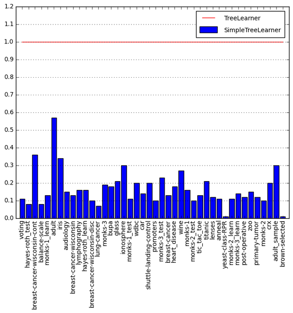

**SimpleTreeLearner** is an implementation of classification and regression trees that sacrifices flexibility for speed. A benchmark on 42 different datasets reveals that **SimpleTreeLearner** is **11 times faster** than the original **TreeLearner**.

The motivation behind developing a new tree induction algorithm from scratch was to speed up the construction of random forests, but you can also use it as a standalone learner. **SimpleTreeLearner** uses gain ratio for classification and MSE for regression and can handle unknown values.


### Comparison with TreeLearner


The graph below shows **SimpleTreeLearner** construction times on datasets bundled with Orange normalized to **TreeLearner**. Smaller is better.




The harmonic mean (average speedup) on all the benchmarks is 11.4.


### Usage


The user can set four parameters:


**maxMajority**

Maximal proportion of majority class.

**minExamples**

Minimal number of examples in leaves.

**maxDepth**

Maximal depth of tree.

**skipProb**

At every split an attribute will be skipped with probability skipProb. This parameter is especially useful for building random forests.

The code snippet below demonstrates the basic usage of **SimpleTreeLearner**. It behaves much like any other Orange learner would.

```
    import Orange

    data = Orange.data.Table("iris")

    # build classifier and classify train data
    classifier = Orange.classification.tree.SimpleTreeLearner(data, maxMajority=0.8)
    for ex in data:
        print classifier(ex)

    # estimate classification accuracy with cross-validation
    learner = Orange.classification.tree.SimpleTreeLearner(minExamples=2)
    result = Orange.evaluation.testing.cross_validation([learner], data)
    print 'CA:', Orange.evaluation.scoring.CA(result)[0]
```


