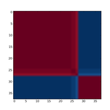
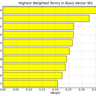
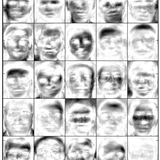

MF - Matrix Factorization Techniques for Data Mining is a Python scripting library which includes a number of published matrix factorization algorithms, initialization methods, quality and performance measures and facilitates the combination of these to produce new strategies. The library represents a unified and efficient interface to matrix factorization algorithms and methods.

The MF works with numpy dense matrices and scipy sparse matrices (where this is possible to save on space). The library has support for multiple runs of the algorithms which can be used for some quality measures. By setting runtime specific options tracking the residuals error within one (or more) run or tracking fitted factorization model is possible. Extensive documentation with working examples which demonstrate real applications, commonly used benchmark data and visualization methods are provided to help with the interpretation and comprehension of the results.

### Content of Current Release

#### Factorization Methods

- BD - Bayesian nonnegative matrix factorization Gibbs sampler [Schmidt2009]
- BMF - Binary matrix factorization [Zhang2007]
- ICM - Iterated conditional modes nonnegative matrix factorization [Schmidt2009]
- LFNMF - Fisher nonnegative matrix factorization for learning local features [Wang2004], [Li2001]
- LSNMF - Alternative nonnegative least squares matrix factorization using projected gradient method for subproblems [Lin2007]
- NMF - Standard nonnegative matrix factorization with Euclidean / Kullback-Leibler update equations and Frobenius / divergence / connectivity cost functions [Lee2001], [Brunet2004]
- NSNMF - Nonsmooth nonnegative matrix factorization [Montano2006]
- PMF - Probabilistic nonnegative matrix factorization [Laurberg2008], [Hansen2008]
- PSMF - Probabilistic sparse matrix factorization [Dueck2005], [Dueck2004], [Srebro2001], [Li2007]
- SNMF - Sparse nonnegative matrix factorization based on alternating nonnegativity constrained least squares [Park2007]
- SNMNMF - Sparse network regularized multiple nonnegative matrix factorization [Zhang2011]

#### Initialization Methods

- Random
- Fixed
- NNDSVD [Boutsidis2007]
- Random C [Albright2006]
- Random VCol [Albright2006]

#### Quality and Performance Measures

- Distance
- Residuals
- Connectivity matrix
- Consensus matrix
- Entropy of the fitted NMF model [Park2007]
- Dominant basis components computation
- Explained variance
- Feature score computation representing its specificity to basis vectors [Park2007]
- Computation of most basis specific features for basis vectors [Park2007]
- Purity [Park2007]
- Residual sum of squares - can be used for rank estimate [Hutchins2008], [Frigyesi2008]
- Sparseness [Hoyer2004]
- Cophenetic correlation coefficient of consensus matrix - can be used for rank estimate [Brunet2004]
- Dispersion [Park2007]
- Factorization rank estimation
- Selected matrix factorization method specific

### Plans for Future

General plan for future releases of MF library is to alleviate the usage for non-technical users, increase library stability and provide comprehensive visualization methods. Specifically, in algorithm sense addition of the following could be provided.

- Extending Bayesian methods with variational BD and linearly constrained BD.
- Adaptation of the PMF model to interval-valued matrices.
- Nonnegative matrix approximation. Multiplicative iterative schema.

### Usage

```python
# Import MF library entry point for factorization
import mf

from scipy.sparse import csr_matrix
from scipy import array
from numpy import dot
# We will try to factorize sparse matrix. Construct sparse matrix in CSR format.
V = csr_matrix((array([1,2,3,4,5,6]),array([0,2,2,0,1,2]),array([0,2,3,6])),shape=(3,3))

# Run Standard NMF rank 4 algorithm
# Returned object is fitted factorization model.
# Through it user can access quality and performance measures.
fit = mf.mf(V,method = "nmf",max_iter = 30,rank = 4,update = 'divergence',objective = 'div')

# Basis matrix. It is sparse, as input V was sparse as well.
W = fit.basis()
print "Basis matrix\n", W.todense()

# Mixture matrix. We print this tiny matrix in dense format.
H = fit.coef()
print "Coef\n", H.todense()

# Return the loss function according to Kullback-Leibler divergence.
print "Distance Kullback-Leibler", fit.distance(metric = "kl")

# Compute generic set of measures to evaluate the quality of the factorization
sm = fit.summary()
# Print sparseness (Hoyer, 2004) of basis and mixture matrix
print "Sparseness W: %5.3f  H: %5.3f" % (sm['sparseness'][0], sm['sparseness'][1])
# Print actual number of iterations performed
print "Iterations", sm['n_iter']

# Print estimate of target matrix V
print "Estimate\n", dot(W.todense(), H.todense())
```

### Examples

Examples with visualized results in bioinformatics, image processing, text analysis, recommendation systems are provided in [Examples section of Documentation.](http://helikoid.si/mf/)

Figure 1: Reordered consensus matrix generated for rank = 2 on Leukemia data set.



Figure 2: Interpretation of NMF - Divergence basis vectors on Medlars data set. By considering the highest weighted terms in this vector, we can assign a label or topic to basis vector W1, a user might attach the label liver to basis vector W1.



Figure 3: Basis images of LSNMF obtained after 500 iterations on original face images. The bases trained by LSNMF are additive but not spatially localized for representation of faces.



### Relevant Links

- [Extensive published documentation with examples](http://helikoid.si/mf/)
- [Orange wiki MF Project page](http://orange.biolab.si/trac/wiki/MatrixFactorization)
- [Github repository with source code](https://github.com/marinkaz/mf)
- [Short presentation in pdf format of MF library](http://helikoid.si/mf/GSoC_MF.pdf)
