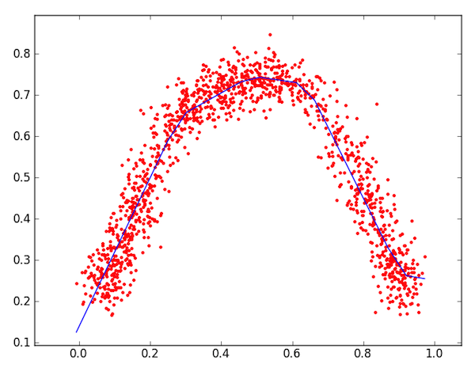

There have recently been some additions to the lineup of Orange learners. One of these is Orange.regression.earth.EarthLearner. It is an Orange interface to the [Earth](http://www.milbo.users.sonic.net/earth/) library written by Stephen Milborrow implementing [Multivariate adaptive regression splines](http://en.wikipedia.org/wiki/Multivariate_adaptive_regression_splines).

So lets take it out for a spin on a simple toy dataset ([data.tab](http://blog.biolab.si/wp-content/uploads/2011/12/13/data.tab) - created using the Paint Data widget in the Orange Canvas):

```
    import Orange
    from Orange.regression import earth
    import numpy
    from matplotlib import pylab as pl

    data = Orange.data.Table("data.tab")
    earth_predictor = earth.EarthLearner(data)

    X, Y = data.to_numpy("A/C")

    pl.plot(X, Y, ".r")

    linspace = numpy.linspace(min(X), max(X), 20)
    predictions = [earth_predictor([s, "?"]) for s in linspace]

    pl.plot(linspace, predictions, "-b")
    pl.show()
```

which produces the following plot:



We can also print the model representation using

```
    print earth_predictor
```

which outputs:

```
    Y =
       1.013
       +1.198 * max(0, X - 0.485)
       -1.803 * max(0, 0.485 - X)
       -1.321 * max(0, X - 0.283)
       -1.609 * max(0, X - 0.640)
       +1.591 * max(0, X - 0.907)
```

See [Orange.regression.earth reference](https://orange-multitarget.readthedocs.io/en/0.9.2/Orange.regression.earth.html) for full documentation.

(Edit: Added link to the dataset file)
