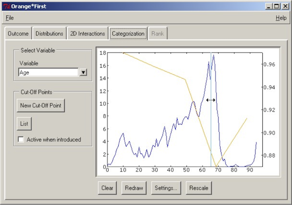
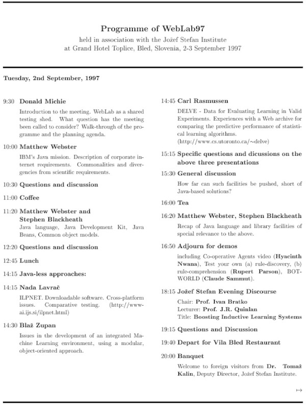

[Informatica](http://www.informatica.si/) has recently published [our paper on the history of Orange](http://www.informatica.si/PDF/37-1/09_Demsar%20-%20Orange%20-%20Data%20Mining%20Fruitful%20and%20Fun%20-%20A%20Historical%20Perspective.pdf). The paper is a post-publication from a [Conference on 100 Years of Alan Turing and 20 Years of Slovene AI Society](http://videolectures.net/is2012_turingslais2012/), where Janez Demšar gave a [talk](http://videolectures.net/is2012_demsar_orange/) on the topics.

History of Orange goes all the way back to 1997, when late [Donald Michie](http://en.wikipedia.org/wiki/Donald_Michie) had an idea that machine learning needs an open toolbox for machine learning. To spark the development, we co-organized WebLab97 at beautiful [Bled, Slovenia](http://en.wikipedia.org/wiki/Bled). Workshop's name reflected Michie's idea that tool should be a web application where people can submit data mining code, procedures, testing scripts, and data and share them in the joint web workspace. 

Donald Michie, a pioneer of Artificial Intelligence, was always ahead of time. (Check out [a great talk by Ivan Bratko](http://videolectures.net/is2012_bratko_ai_slovenia/) on their friendship and adventures in chess and machine learning). At WebLab97, Michie was actually very, very ahead of time. But despite the presence of IBM's Java team that could guide us in developments of the toolbox, the technology was not ripe and initiative of WebLab was gone as the conference ended. But, at least for us, the idea sparked interest of Janez and myself, and development of what is now Orange begun shortly after. 

Our paper gives brief account of Orange's history and its developments since WebLab97. For reasons of brevity it does not mention that prior to Qt we have experimented with other GUI platforms. Prior to Qt, we laid our hopes to [Pwm Python megawidgets](http://pmw.sourceforge.net/), a library that helped us to construct the first Orange graphical user interface. The GUI part of Orange was called Orange*First. Its screenshot shows a tab for interactive discretisation, thanks to [Noriaki Aoki](http://www.uthouston.edu/sbmi/faculty-and-staff/noriaki-aoki.htm) who then proposed that this kind of visualisation should be useful in medical data analysis:

PS Somehow, I have lost a latex file with a WebLab97 program. It should be on some backup tape, somewhere. The following scan of the first page (and a [weblab97.pdf](weblab97.pdf)), left in some PPT presentation, is all that I can retrieve. The program of the second day is missing, with keynotes from Tom Mitchell, and much talk about then already a success story of R.

