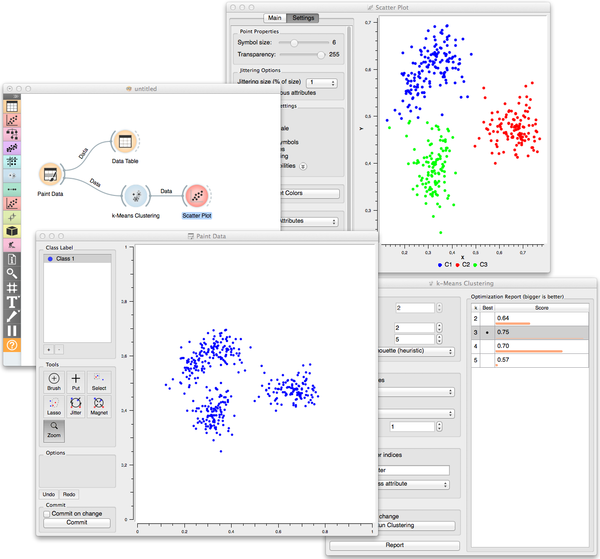
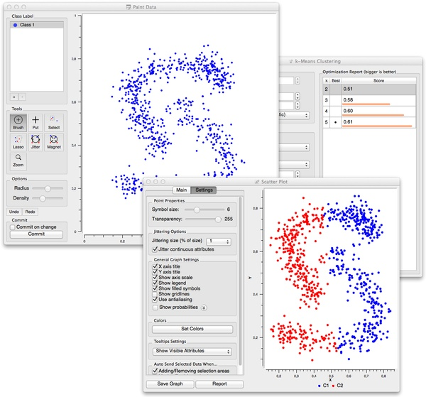
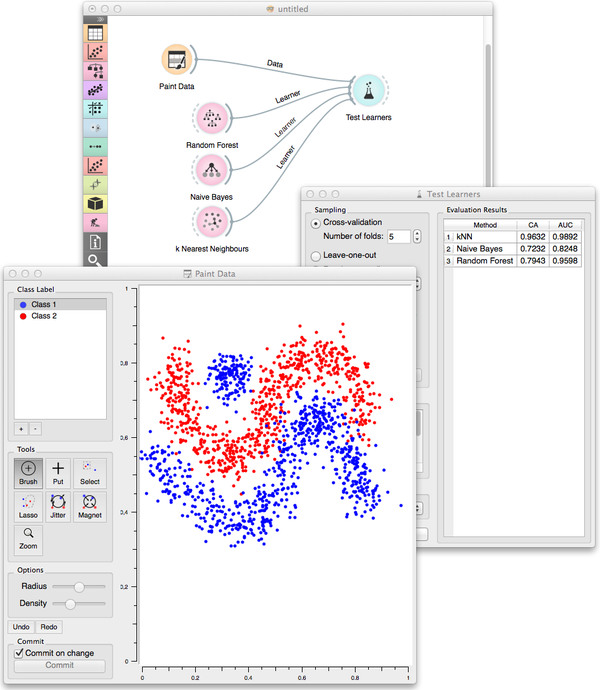

One of the widgets I enjoy very much when teaching introductory course in data mining is the [Paint Data](/widget-catalog/data/paintdata/) widget. When painting in this widget I would intentionally include some clusters, or intentionally obscure them. Or draw them in any strange shape. Then I would discuss with students if these clusters are identified by [k-means clustering](/widget-catalog/unsupervised/kmeans/) or by hierarchical clustering. We would also discuss automatic scoring of the quality of clusters, come up with the idea of a [silhouette](http://en.wikipedia.org/wiki/Silhouette_(clustering)) (ok, already invented, but helps if you get this idea on your own as well). And then we would play with various data sets and clustering techniques and their parameters in Orange.

Like in the following workflow where I drew three clusters which were indeed recognized by [k-means clustering](/widget-catalog/unsupervised/kmeans/). Notice that silhouette scoring correctly identified even the number of clusters. And I also drew the clustered data in the Scatterplot to check if the clusters are indeed where they should be.

Or like in the workflow below where k-means fails miserably (but someother clustering technique would not).

[Paint Data](/widget-catalog/data/paintdata/) can also be used in supervised setting, for classification tasks. We can set the intended number of classes, and then chose any of these to paint the data. Below I have used it to create the datasets to check the behavior of several classifiers.

There are tons of other workflows where [Paint Data](/widget-catalog/data/paintdata/) can be useful. Give it a try!
