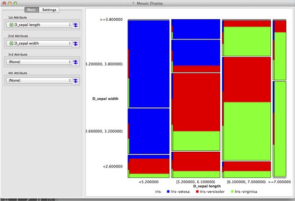

Orange 3.0 will also support working with data stored in a database.

While we have already talked about this some time ago, we here describe some technical details for anybody interested. This is not a thorough tecnical report, its purpose is only to provide an impression about the architecture of the upcoming version of Orange.

So, data tables in Orange 3.0 can refer to data in the working memory or in the database. Any (properly written) code that uses tables should work the same with both storages. When the data is stored in the database, the table is implemented as a "proxy object" with the necessary meta-data for constructing the SQL query to retrieve the data when needed. Operations on the data only modify the meta-data without retrieving any actual data. For instance, construction of a new table with some selected data subset, say all instances that match a certain condition, creates a new proxy with additional conditions for the WHERE clause. Similarly, selecting a subset of features only changes the domain (the list of features), which is later reflected in the columns of the SELECT clause.

Features in this model are no longer described just with their names but also with the part which goes into the query that retrieves or constructs their values. Discretization, for instance, constructs new features which wrap the representation of the continuous features into a CASE statement that assigns a value based on the boundaries of the bins.

Since the goal was to make the code in modules and widgets oblivious to the storage, we also needed separate implementation of the operations that need to be aware of how the data is stored. For instance, the code that computes the average values of attributes needs to be different for the two storages: for the in-memory data we need to use the corresponding numpy functions and for databases the average is computed on the server.

We went through the code of Orange 2.7 and identified the common operations on the data. We found that all data access belongs into the following types:

1. basic aggregates like mean, variance, median, minimal and maximal value,
2. distributions of discrete and continuous variables, values at percentiles,
3. contingency matrices,
4. covariance matrices,
5. filtering of rows based on various criteria, including random sampling,
6. selection of columns,
7. construction of variables from values of other variables,
8. matrices of distances (e.g. Euclidean) between all row pairs,
9. individual data rows.

Points 1 to 4 are typical examples of what cannot be done on client but can be efficiently done in the database. The storage (a class derived from Table) now provides specialized methods for computing aggregates, distributions and contingencies, which use numpy for in-memory data and SQL for the data on the database.

Points 5 to 7 are implemented “lazily”, by modifying the SQL query describing the data as described above.

Point 8 is difficult to implement efficiently in common relational databases and, besides, results in a data matrix that is larger than the actual data. Methods that require such a matrix will need to be reimplemented and be aware of the storage mechanism.

Point 9 requires some caution with regard to how the data is retrieved and what it is used for. Access to individual rows should be used sparingly. Sequential retrieval - especially of all rows - needs to be avoided. For efficiency, most methods that did so in the previous versions of Orange will need to be reimplemented to use aggregate data (possibly as approximations) or to be aware of the data storage and execute some operations directly through SQL.

We have already ported a number of visualizations and other widgets to the new Orange. Here is one nice example: Mosaic needs to discretize the variables and then compute contingency matrices for discrete variables. Within the above scheme, the widget does not care about the storage mechanism, yet its computation is still as efficient as possible.

The described activities were funded in part by the European Union's Seventh Framework Programme (FP7/2007-2013) under grant agreement n° 318633.
