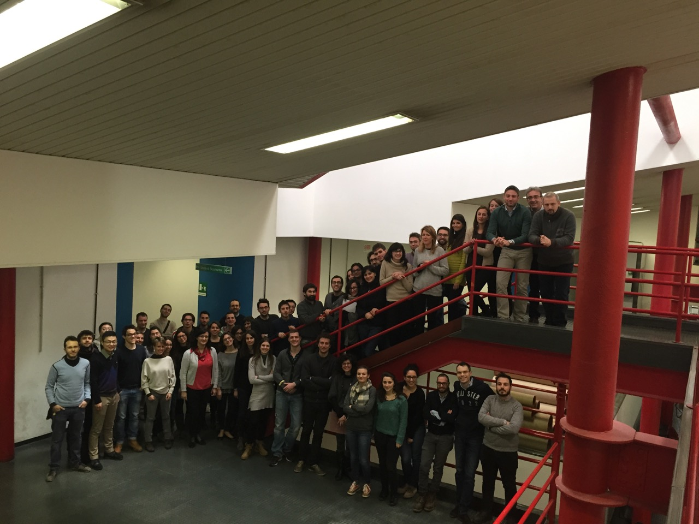
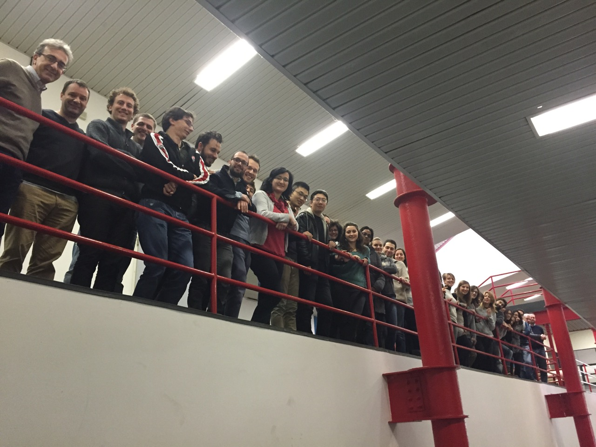
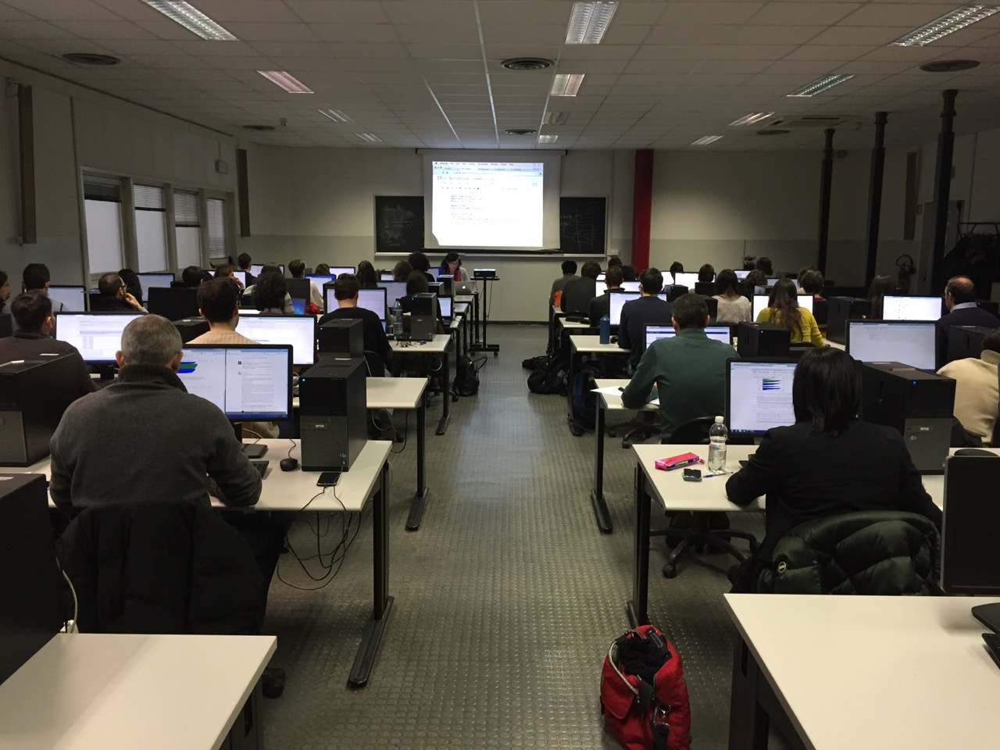

These days, we (Blaz Zupan and Marinka Zitnik, with full background support of entire [Bioinformatics Lab](http://www.biolab.si/en/)) are running a three-day course on Data Mining in Python. [Riccardo Bellazzi](http://www.labmedinfo.org/people/bellazzi), a professor at [University of Pavia](http://www.unipv.eu/), a world-renown researcher in biomedical informatics, and most of all, a great friend, has invited us to run the elective course for Pavia's grad students. The enrollment was, he says, overwhelming, as with over 50 students this is by far the best attended grad course at Pavia's faculty of engineering in the past years.

We have opted for the hands-on course and a running it as a workshop. The lectures include a new, development version of [Orange 3](http://orange.biolab.si/orange3/), and mix it with [numpy](http://www.numpy.org), [scikit-learn](http://scikit-learn.org/stable/), [matplotlib](http://matplotlib.org), [networkx](https://networkx.github.io) and bunch of other libraries. Course themes are classification, clustering, data projection and network analysis.

