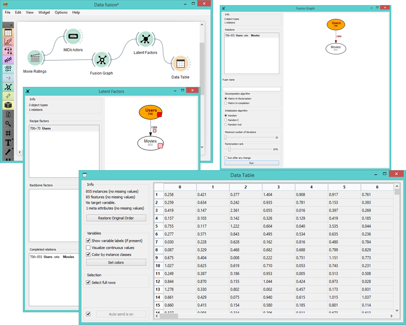

Orange is about to get even more exciting! We have created a prototype add-on for data fusion, which will certainly be of interest to many users. Data fusion brings large heterogeneous data sets together to create sensible clusters of related data instances and provides a platform for **predictive modelling** and **recommendation systems**.

This widget set can be used either to recommend you the next movie to watch based on your demographic characteristics, movies you gave high scores to, your preferred genre, etc. or to suggest you a set of genes that might be relevant for a particular biological function or process. We envision the add-on to be useful for predictive modeling dealing with **large heterogeneous data compendia**, such as life sciences.

The prototype set will be available for download next week, but we are happy to give you a sneak peek below.

Data fusion workflow

1. **Movie Ratings** widget is pre-set to offer data on movie ratings by users with 706 users and 855 movies (10% of the data selected as a subset).
2. We add **IMDb Actors** to filter the data by matching movie ratings with actors.
3. Then we add the **Fusion Graph** widget to fuse the data together. Here we have two object types, i.e. users and movies, and one relation between them, i.e. movie ratings.
4. In **Latent Factors** we see latent data representation demonstrated by red squares at the side. Let’s select a latent matrix associated with Users as our input for the Data Table.
5. In **Data Table** we see the latent data matrix of Users. The algorithm infers low-dimensional user profiles by collective consideration of entire data collection, i.e. movie ratings and actor information. In our scenario the algorithm has  transformed 855 movie titles into 70 movie groupings, i.e. latent components.

Data fusion visualized
