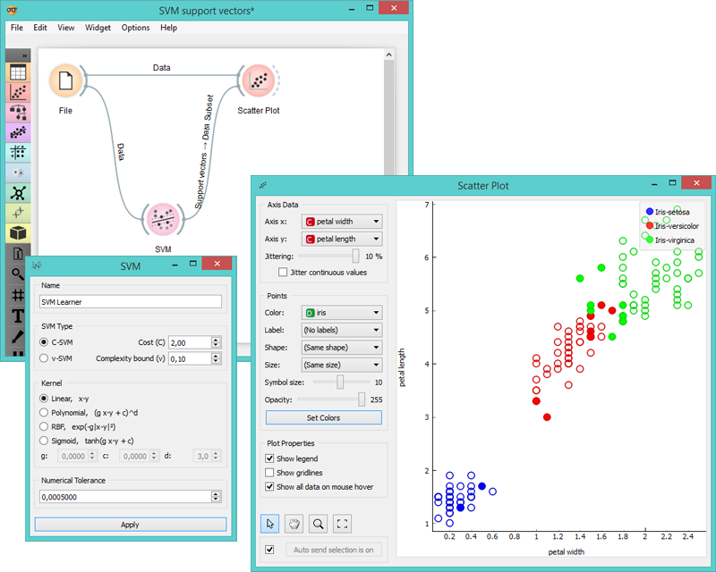

Did you know that the widget for **support vector machines** (SVM) classifier can output support vectors? And that you can visualise these in any other Orange widget? In the context of all other data sets, this could provide some extra insight into how this popular classification algorithm works and what it actually does.

Ideally, that is, in the case of linear seperability, support vector machines (SVM) find a **hyperplane **with the** largest margin **to any data instance. This margin touches a small number of data instances that are called support vectors.

In Orange 3.0 you can set the SVM classification widget to output also the support vectors and visualize them. We used _Iris_ data set in the _File_ widget and classified data instances with SVM classifier. Then we connected both widgets with _Scatterplot_ and selected _Support Vectors_ in the SVM output channel. This allows us to see support vectors in the _Scatterplot_ widget - they are represented by the bold dots in the graph.

Now feel free to try it with your own data set!

Support vectors output of SVM widget with Iris data set.
