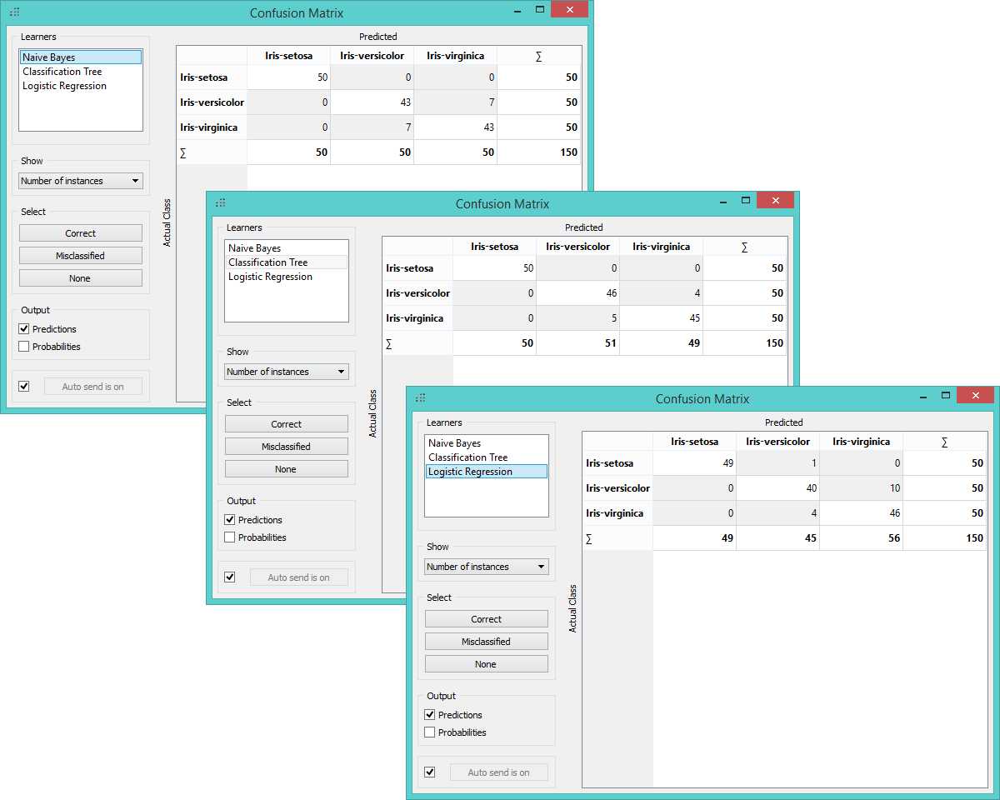
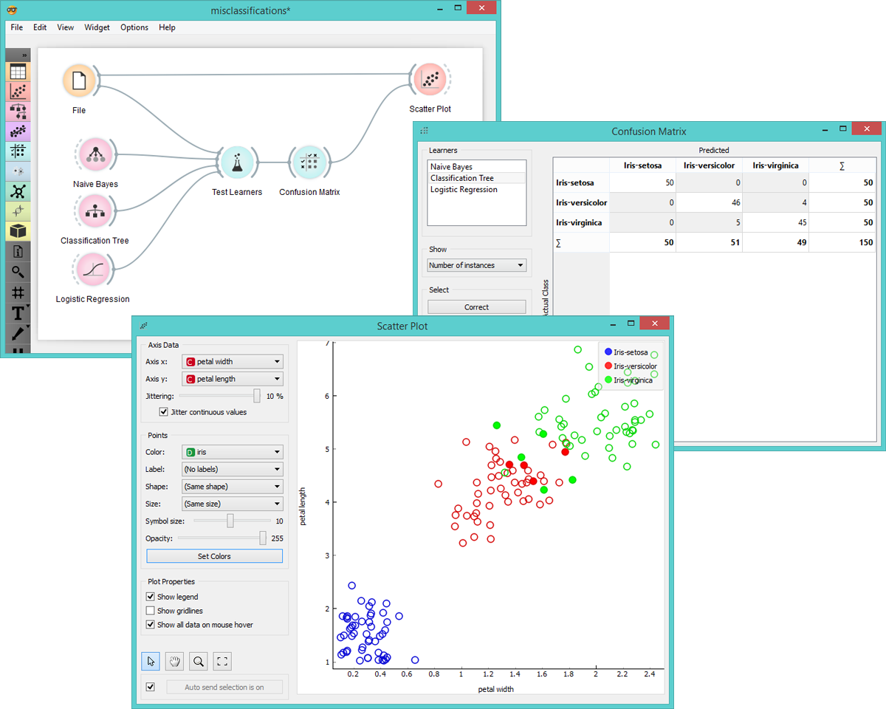

In data mining **[classification](https://en.wikipedia.org/wiki/Statistical_classification)** is one of the key methods for making predictions and gaining important information from our data. We would, for example, use classification for predicting which patients are likely to have the disease based on a given set of symptoms.

In Orange an easy way to classify your data is to select several **classification widgets** (e.g. Naive Bayes, Classification Tree and Linear Regression), compare the prediction quality of each learner with **Test Learners** and **Confusion Matrix** and then use the best performing classifier on a new data set for classification. Below we use Iris data set for simplicity, but the same procedure works just as well on all kinds of data sets.

Here we have three confusion matrices for **[Naive Bayes](https://en.wikipedia.org/wiki/Naive_Bayes_classifier)** (top), **[Classification Tree](https://en.wikipedia.org/wiki/Decision_tree_learning)** (middle) and **[Logistic Regression](https://en.wikipedia.org/wiki/Multinomial_logistic_regression)** (bottom).

Three misclassification matrices (Naive Bayes, Classification Tree and Logistic Regression)

We see that **Classification Tree** did the best with only 9 misclassified instances. To see which instances were assigned a false class, we select ‘_Misclassified_’ option in the widget, which highlights misclassifications and feeds them to the **Scatter Plot** widget. In the graph we thus see the entire data set presented with empty dots and the selected misclassifications with full dots.

Visualization of misclassified instances in scatter plot.

Feel free to switch between learners in **Confusion Matrix** to see how the visualization changes for each of them.

