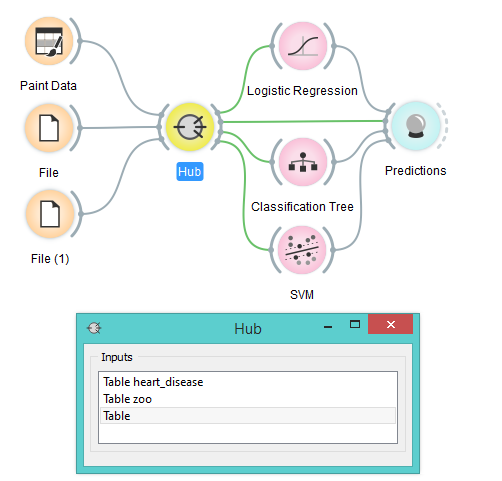
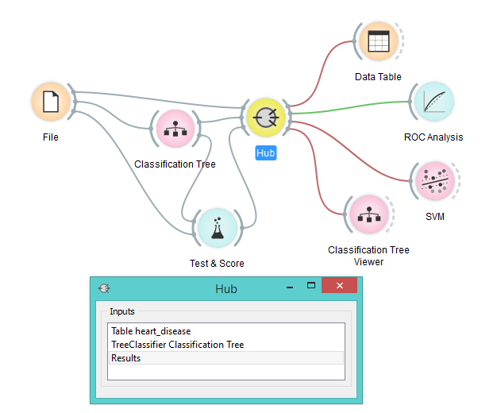

So you have painted two data sets and loaded another one from a file, and now you are testing predictions of logistic regression, classification trees and SVM on it? Tired of having to reconnect the **Paint data** widget and the **File** widget back and forth whenever you switch between them?

**Say no more! Look no further!** Here is the new **Hub widget**!

**Hub widget** is **the** **most versatile widget available so far**. It accepts several inputs of any type and outputs them to as many other widgets as you want.

The **Hub widget** treats all types with the strictest equality.

(It also adheres to all applicable EU policies with respect to gender equality, and does not use cookies.)

The **Hub widget** works like charm and is like the amazing _cast-to-void-and-back-to-anything_ idiom in C. This strongful MacGyver of widgets can (almost) convert classification tree into data, or preprocessor into experimental results without ever touching the data. With its amazing capabilities, the **Hub widget** has the potential to cause an even greater havoc in your workflows than the famous **Merge data** widget.

**[Download, install - and start hubbing today !!](https://github.com/biolab/orange3-prototypes)**

