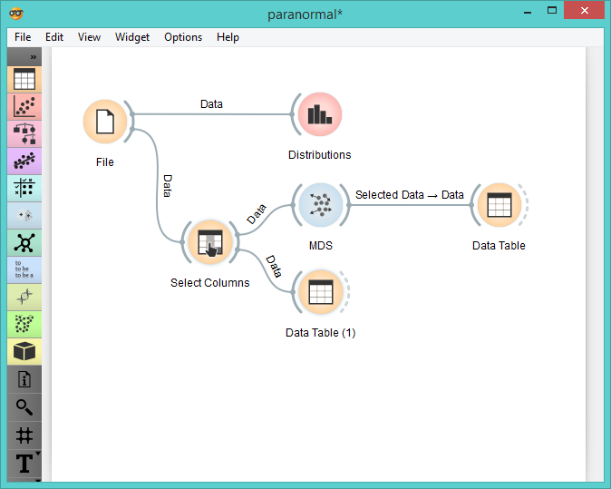
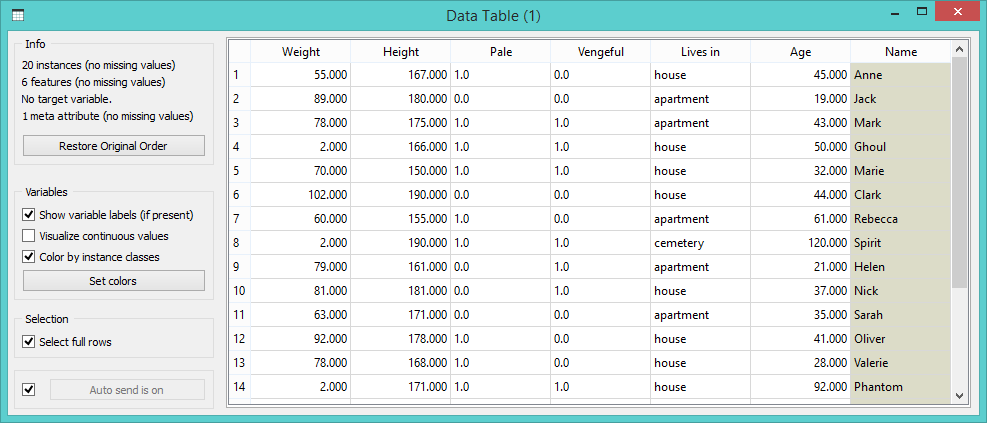
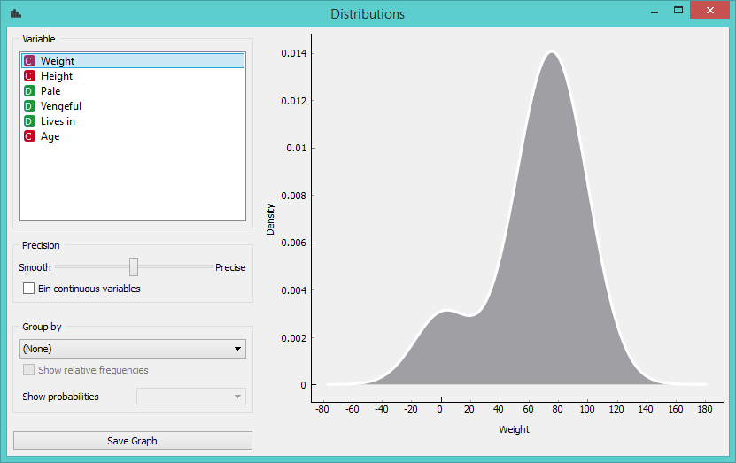
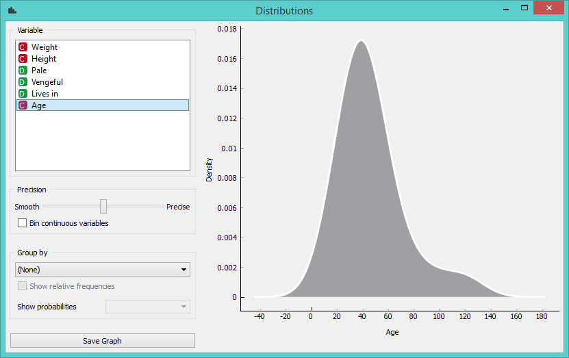
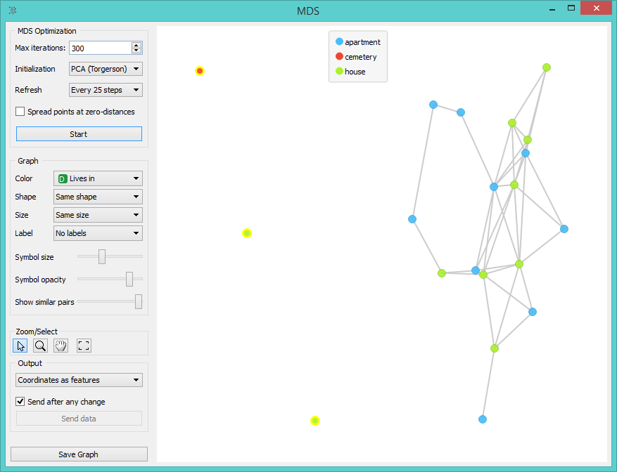
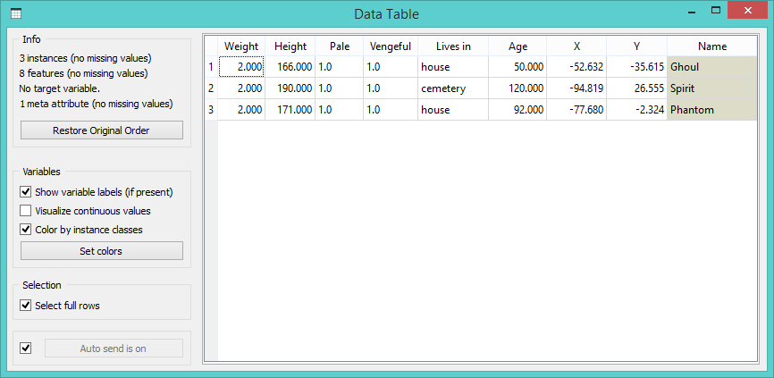
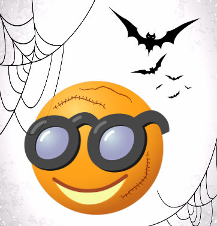

Ok, we’ve just recently stumbled across [an interesting article](http://www.isixsigma.com/tools-templates/normality/dealing-non-normal-data-strategies-and-tools/) on how to deal with non normal (non-Gaussian distributed) data.

We have an absolutely paranormal data set of 20 persons with weight, height, paleness, vengefulness, habitation and age attributes ([download](https://docs.google.com/spreadsheets/d/1KycPyD1KdX8NFCQhS6OnrOZqVds5nppljwFCesba3RA/edit?usp=sharing)).

Let’s check the distribution in Distributions widget.

Our first attribute is “_Weight_” and we see a little hump on the left. Otherwise the data would be normally distributed. Ok, so perhaps we have a few children in the data set. Let’s check the age distribution.

Whoa, what? Why is the hump now on the right? These distributions look scary. We seem to have a few reaaaaally old people here. What is going on? Perhaps we can figure this out with MDS. This widget projects the data into two dimensions so that the distances between the points correspond to differences between the data instances.

Aha! Now we see that three instances are quite different from all others. Select them and send them to the Data Table for final inspection.

Busted! We have found three ghosts hiding in our data. They are extremely light (the sheet they are wearing must weight around 2kg), quite vengeful and old.

Now, joke aside, what would this mean for a general non-normally distributed data? One thing is your data set might be too small. Here we only have 20 instances, thus 3 outlying ghosts have a great impact on the distribution. It is difficult to hide 3 ghosts among 17 normal persons.

Secondly, why can’t we use Outliers widget to hunt for those ghosts? Again, our data set is too small. With just 20 instances, the estimation variance is so large that it can easily cover a few ghosts under its sheet. We don’t have enough “normal” data to define what is normal and thus detect the paranormal.

Haven’t we just written two exactly opposite things? Perhaps.

Happy Halloween everybody! :)

