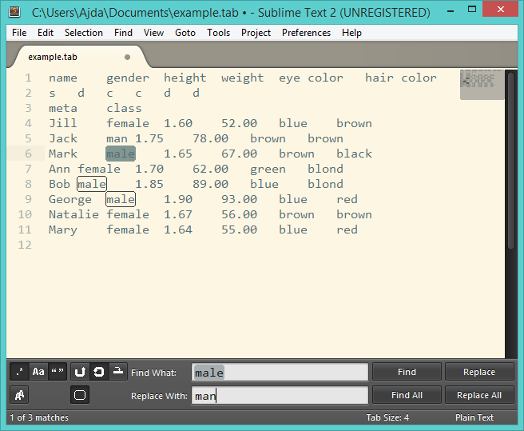
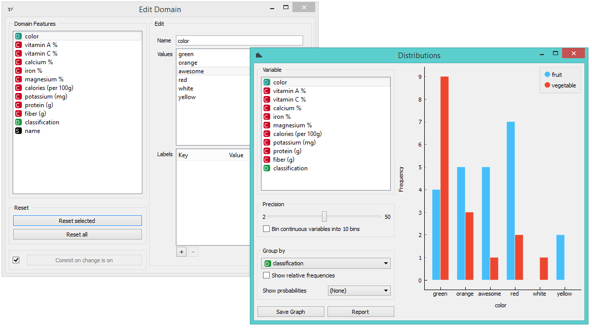

Probably the most crucial step in your data analysis is purging and cleaning your data. Here are a couple of cool tricks that will make your data preparation a bit easier. 

* **Use a smart text editor**. We can recommend [Sublime Text](https://www.sublimetext.com/) as it an extremely versatile editor that supports a broad variety of programming languages and markups, but there are [other great tools](http://lifehacker.com/five-best-text-editors-1564907215) out there as well. One of the best things you'll keep coming back to in your editor is 'Replace' function that allows you to replace specified values with different ones. You can also use regex to easily find and replace parts of text.
	
	
	We can replace all instances of 'male' with 'man' in one click.

* **Apply simple hacks.** Sometimes when converting files to different formats data can get some background information appended that you cannot properly see. A cheap and dirty trick is to manually select the cells and rows and copy-paste them to a new sheet. This will start with a clean slate and you data will be read properly.

* **Check your settings.** When reading .csv files in Excel, you might see all your data squished in one column and literally separated with commas. This can be easily solved with Data --> From Text (Get external data) and a new window will appear. In a Text Import Wizard you can set whether your data is delimited or not (in our case it is), how it is delimited (comma, tab, etc.), whether you have a header or not, what qualifies as text (" is a recommended option), what is your encoding and so on.

* **Manually annotate the data.** Orange loves headers and the easiest way to assure your data gets read properly is to set the header yourself. Add two extra rows under your feature names. In the first row, set your variable type and in the second one, your kind. [Here's](https://orange3.readthedocs.io/projects/orange-visual-programming/en/latest/loading-your-data/index.html) how to do it properly.

* **Exploit the widgets in Orange.** Select Columns is your go-to widget for organizing what gets read as a meta attribute, what is your class variable and which features you want to use in your analysis. Another great widget is Edit domain, where you can set the way the values are displayed in the analysis (say you have "grey" in your data, but you want it to say "gray"). Moreover, you can use Concatenate and Merge widgets to put your data together.

	
	Set domain with Edit domain widget.

What's your preferred trick?
