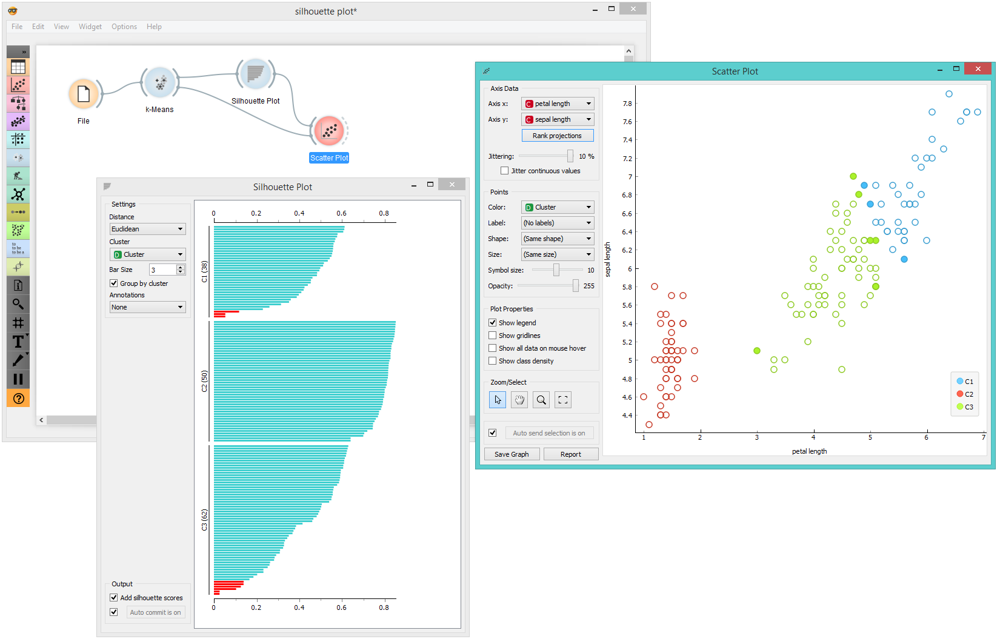
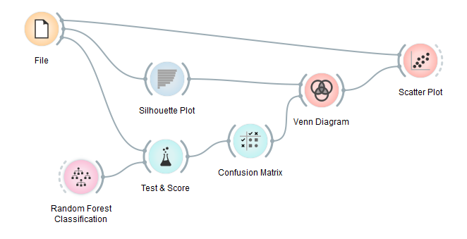
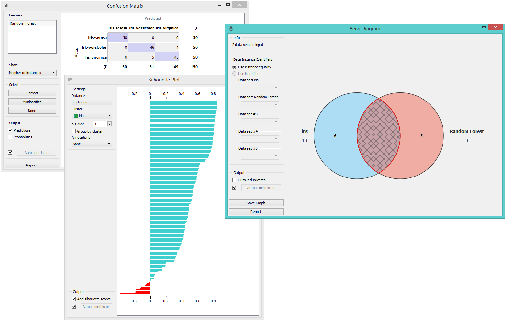
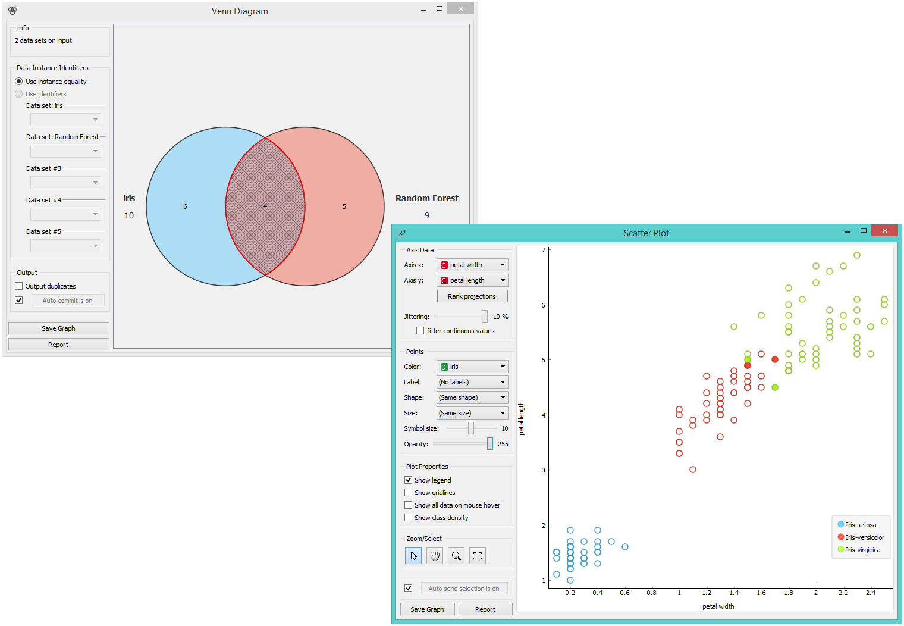

Silhouette plot is such a nice method for visually assessing cluster quality and the degree of cluster membership that we simply couldn't wait to get it into Orange3. And now we did.

What this visualization displays is the average distance between instances within the cluster and instances in the nearest cluster. For a given data instance, the silhouette close to 1 indicates that the data instance is close to the center of the cluster. Instances with silhouette scores close to 0 are on the border between two clusters. Overall, the quality of the clustering could be assessed by the average silhouette scores of the data instances. But here, we are more interested in the individual silhouettes and their visualization in the silhouette plot.

Using the good old iris data set, we are going to assess the silhouettes for each of the data instances. In k-means we set the number of clusters to 3 and send the data to Silhouette plot. Good clusters should include instances with higher silhouette scores. But we're doing the opposite. In Orange, we are selecting instances with scores close to 0 from the silhouette plot and pass them to other widgets for exploration. No surprise, they are at the periphery of two clusters. This is so perfectly demonstrated in the scatter plot.

Let's do something wild now. We'll use the silhouette on a class attribute of Iris (no clustering here, just using the original class values from the data set). Here is our hypothesis: the data instances with low silhouette values are also those that will be misclassified by some learning algorithm. Say, by a random forest.

We will use ten-fold cross validation in Test&Score, send the evaluation results to confusion matrix and select misclassified instances in the widget. Then we will explore the inclusion of these misclassifications in the set of low-silhouette instances in the Venn diagram. The agreement (i.e. the intersection in Venn) between the two techniques is quite high.

Finally, we can observe these instances in the Scatter Plot. Classifiers indeed have problems with borderline data instances. Our hypothesis was correct.

Silhouette plot is yet another one of the great visualizations that can help you with data analysis or with understanding certain machine learning concepts. What did we say? Fruitful and fun!

