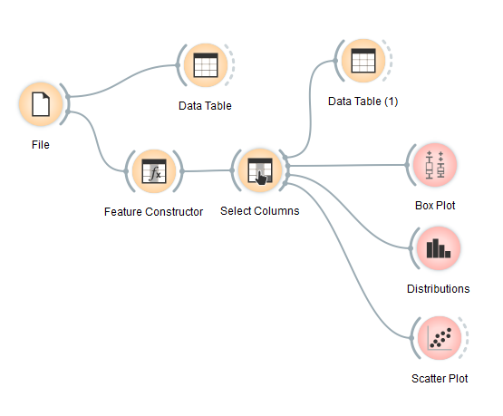
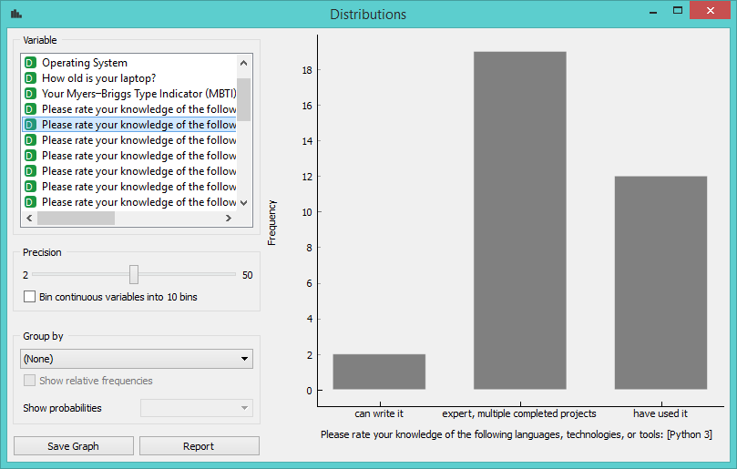
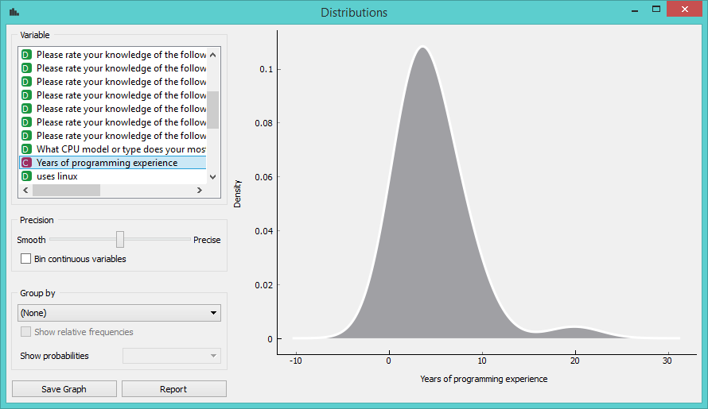
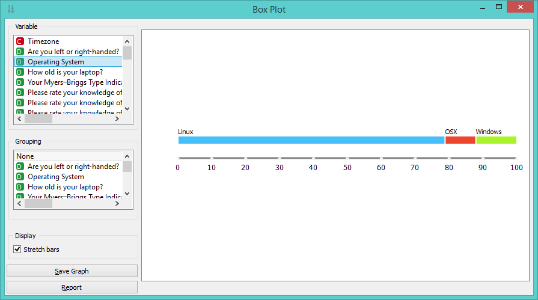
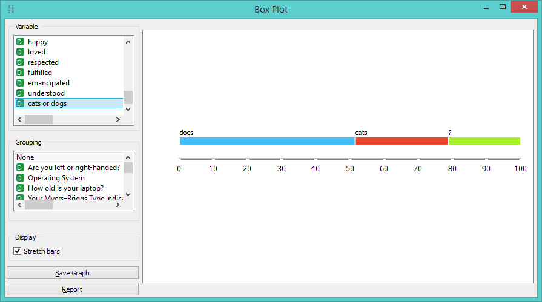

[Google Summer of Code](https://developers.google.com/open-source/gsoc/) application period has come to an end. We've received 34 applications, some of which were of truly high quality. Now it's upon us to select the top performing candidates, but before that we wanted to have an overlook of the candidate pool. We've gathered data from our Google Form application and gave it a quick view in Orange.

First, we needed to preprocess the data a bit, since it came in a messy form of strings. Feature Constructor to the rescue! We wanted to extract the OS usage across users. So we first made three new variables named 'uses linux', 'uses windows' and 'uses osx' to represent our three new columns. For each column we searched through 'OS_of_choice_and_why', looked up the value of the column, converted it to string, put the string in lowercase, found mentions of either 'linux', 'windows' or 'osx', and voila.... if a mention occurred in the string, we marked the column with 1, else with 0.


The expression is just a logical statement in Python and works with booleans (0 if False and 1 if True):

```
    'linux' in str(OS_of_choice_and_why_.value).lower() or 'ubuntu' in str(OS_of_choice_and_why_.value).lower()
```


Another thing we might want to do is create three discrete values for ''Dogs or cats'' question. We want Orange to display 'dogs' for someone who replied 'dogs', 'cats' for someone who replied 'cats' and '?' if the questions was a blank or very creative (we had people who wanted to be elephants and butterflies :) ).

To create three discrete values you would write:

```
    0 if 'dogs' in str(Dogs_or_cats_.value).lower() else 1 if  'cats' in str(Dogs_or_cats_.value).lower() else 2
```

Since we have three values, we need to assign them the corresponding indexes. So if there is 'dogs' in the reply, we would get 0 (which we converted to 'dogs' in the Feature Constructor's 'Values' box), 1 if there's 'cats' in the reply and 2 if none of the above apply.




Ok, the next step was to sift through a big pile of attributes. We removed personal information for privacy concerns and selected the ones we cared about the most. For example programming skills, years of experience, contributions to OSS and of course whether someone is a dog or a cat person. :) Select Columns sorts the problem. Here you can download a [mock-up workflow](http://s000.tinyupload.com/?file_id=18444941737485155585) (same as above, but without sensitive data).

Now for some lovely charts. Enjoy!


Python is our lingua franca, experts wanted!



20 years of programming experience? Hello outlier!



OSS all the way!



Some people love dogs and some love cats. Others prefer elephants and butterflies.


