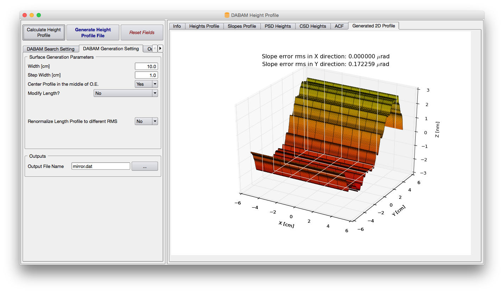

This week we’re hosting experts in optical physics from [Elettra Sincrotrone Trieste](https://www.elettra.eu/) and [European Synchrotron Radiation Facility](http://www.esrf.eu/) in our laboratory. For a long time they have been interested in developing a user interface that integrates different simulation tools and data analysis software within one environment. It all came true with Orange Canvas and the [OASYS system](http://www.elettra.eu/oasys.html). We’ve already [written about this](/blog/2014/08/26/orange-canvas-applied-to-x-ray-optics/) two years ago, when the idea first came up. Now the actual software is ready and is being used by researchers for everyday analysis and prototyping.

OASYS is basically pure Orange Canvas (Orange but no data mining widgets) that is reconfigured for the needs of optical physicists. What our partners from Italy did (with the help of our lab), was bring optic simulation software used in synchrotron facilities into a single graphical user interface. What is especially incredible is that they managed to transform Orange into a simulation platform for building synchrotron beamlines.

In essence, researches in synchrotrons experiment with actual physical objects, such as mirrors and crystals of different shape and size to transmit photons from several light sources of the synchrotron to the experimental endstations. They measure a broad array of material properties through the interaction with the synchrotron light and are trying to simulate different experiment settings before actually building a real-life experiment in the synchrotron. And this is where OASYS truly shines.

Widgets in this case become parts of the simulation pipeline. Each widget has an input and output beam of light, just like real life devices, and the parameters within the widget are physical properties of a particular experimental object. Thus scientists can model the experiment in advance and do it much quicker and easier than before.

Furthermore, Orange and OASYS provide a user-friendly GUI that domain experts can quickly get used to. There are anecdotal evidences of renowned physicists, who preferred to do their analysis with outdated simulation tools. However, after using OASYS for just a few days, they were already completely comfortable and could reproduce previously calculated results in a software without any problem. Moreover, they did it within several days instead of weeks as before.

This is the power of visual programming - providing a user-friendly interface for automating complicated calculations and quick prototyping.
