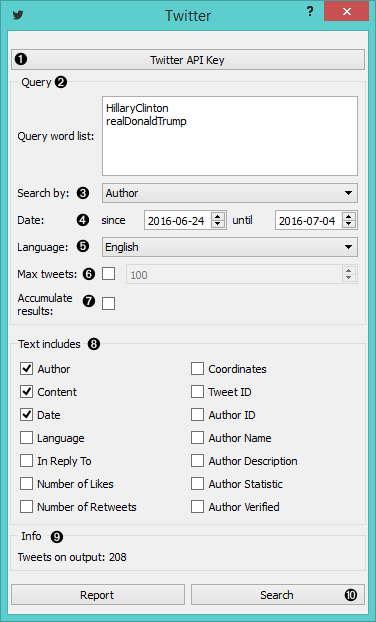
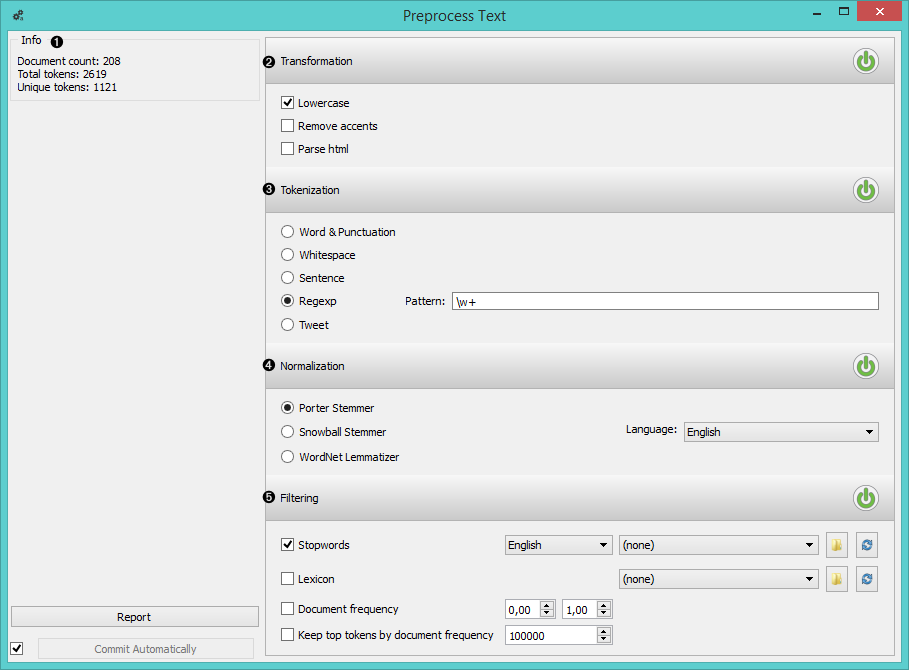
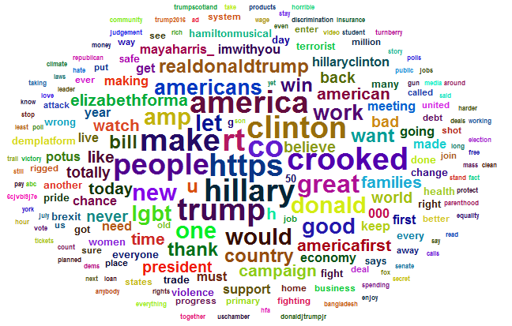
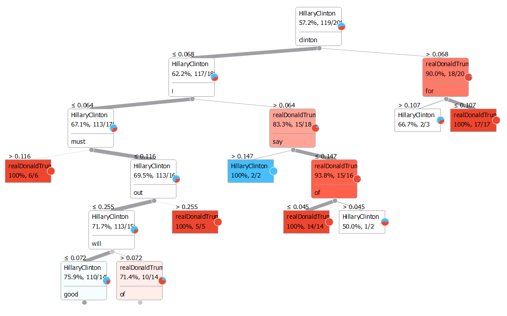
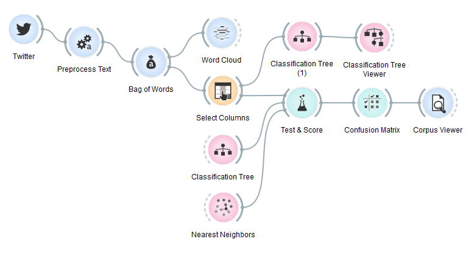

Google Summer of Code is progressing nicely and some major improvements are already live! Our students have been working hard and today we're thanking Alexey for his work on Text Mining add-on. Two major tasks before the midterms were to introduce Twitter widget and rehaul Preprocess Text. Twitter widget was designed to be a part of our summer school program and it worked beautifully. We've introduced youngsters to the world of data mining through social networks and one of the most exciting things was to see whether we can predict the author from the tweet content.

Twitter widget offers many functionalities. Since we wanted to get tweets from specific authors, we entered their Twitter handles as queries and set 'Search by Author'. We only included Author, Content and Date in the query parameters, as we want to predict the author only on the basis of text.

1. Provide API keys.
2. Insert queries separated by newline.
3. Search by content, author or both.
4. Set date (1 week limit from tweepy module).
5. Select language you want your tweets to be in.
6. If ‘Max tweets’ is checked, you can set the maximum number of tweets you want to query. Otherwise the widget will provide all tweets matching the query.
7. If ‘Accumulate results’ is checked, new queries will be appended to the old ones.
8. Select what kind of data you want to retrieve.
9. Tweet count.
10. Press ‘Search’ to start your query.

We got 208 tweets on the output. Not bad. Now we need to preprocess them first, before we do any predictions. We transformed all the words into lowercase and split (tokenized) them by words. We didn't use any normalization (below turned on just as an example) and applied a simple stopword removal.

1. Information on the input and output.
2. Transformation applies basic modifications of text.
3. Tokenization splits the corpus into tokens according to the selected method (regexp is set to extract only words by default).
4. Normalization lemmatizes words (do, did, done –> do).
5. Filtering extracts only desired tokens (without stopwords, including only specified words, or by frequency).

Then we passed the tokens through a Bag of Words and observed the results in a Word Cloud.

Then we simply connected Bag of Words to Test & Score and used several classifiers to see which one works best. We used Classification Tree and Nearest Neighbors since they are easy to explain even to teenagers. Especially Classification Tree offers a nice visualization in Classification Tree Viewer that makes the idea of the algorithm easy to understand. Moreover we could observe the most distinctive words in the tree.

Do these make any sense? You be the judge. :)

We checked classification results in Test&Score, counted misclassifications in Confusion Matrix and finally observed them in Corpus Viewer. k-NN seems to perform moderately well, while Classification Tree fails miserably. Still, this was trained on barely 200 tweets. Perhaps accumulating results over time might give us much better results. You can now certainly try it on your own! Update your Orange3-Text add-on or install it via 'pip install Orange3-Text'!

Above is the final workflow. Preprocessing on the left. Testing and scoring on the right bottom. Construction of classification tree right and above.
