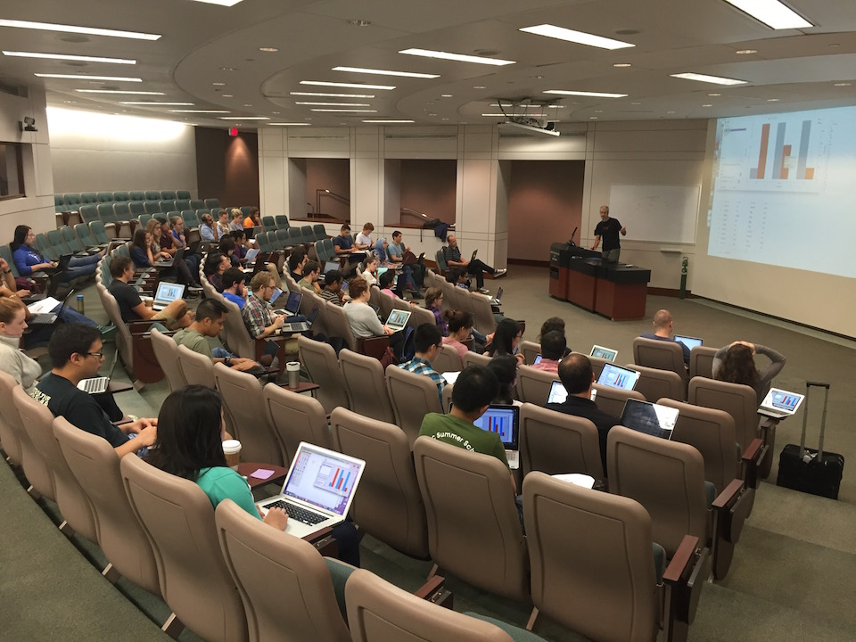
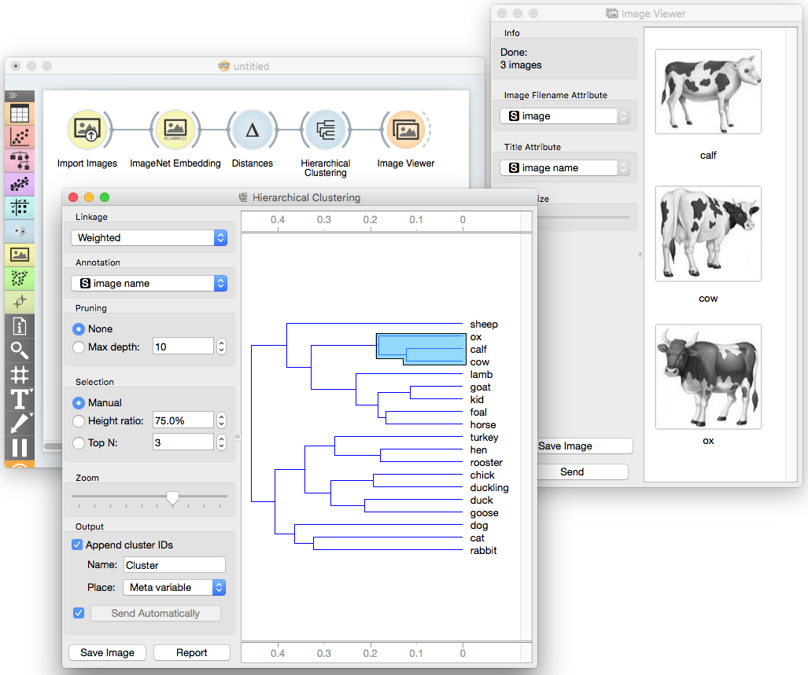

This was already the second installment of Introduction to Data Mining Course at [Baylor College of Medicine in Houston, Texas](https://www.bcm.edu). Just [like the last year](/blog/2015/10/09/data-mining-course-in-houston/), the course was packed. About 50 graduate students, post-docs and a few faculty attended, making the course one of the largest elective PhD courses from over a hundred offered at this prestigious medical school.

The course was designed for students with little or no experience in data science. It consisted of seven two-hour lectures, each followed by a homework assignment. We (Blaz and Janez) lectured on data visualization, classification, regression, clustering, data projection and image analytics. We paid special attention to the problems of overfitting, use of regularization, and proper ways of testing and scoring of modeling methods.

The course was hands-on. The lectures were practical. They typically started with some data set and explained data mining techniques through designing data analysis workflows in Orange. Besides some standard machine learning and bioinformatics data sets, we have also [painted the data](/blog/2013/12/20/paint-your-data/) to explore, say, the benefits of different classification techniques or design data sets where k-means clustering would fail.

This year, the course benefited from several new Orange widgets. The recently published [interactive k-means](/blog/2016/08/12/interactive-k-means/) widget was used to explain the inner working of this clustering algorithm, and polynomial classification widget was helpful in discussion of [decision boundaries of classification algorithms](/blog/2016/08/16/polynomial-classification/). [Silhouette plot](/blog/2016/03/23/all-i-see-is-silhouette/) was used to show how to evaluate and explore the results of clustering. And finally, we explained concepts from deep learning using image embedding to show how already trained networks can be used for clustering and classification of images.

