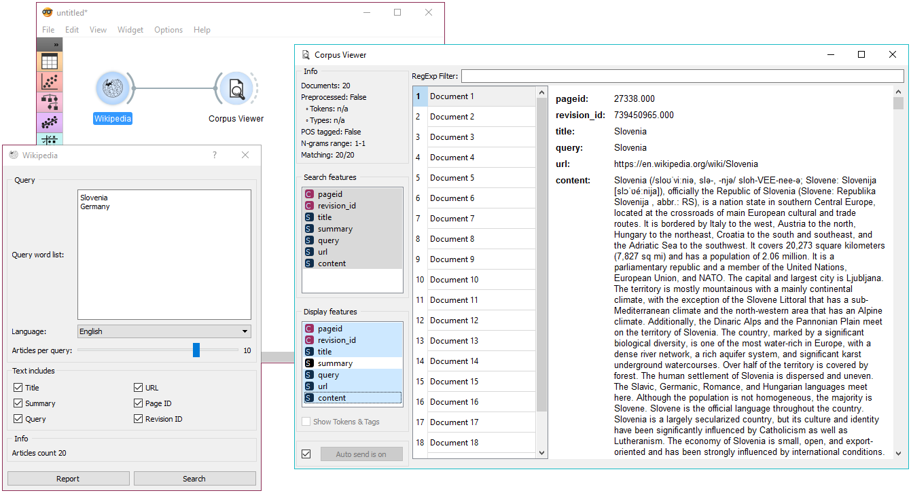
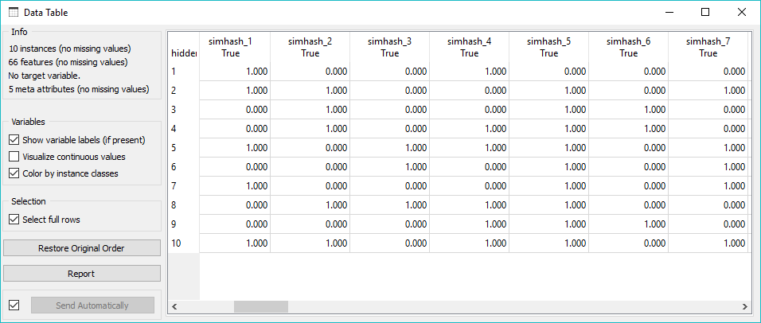
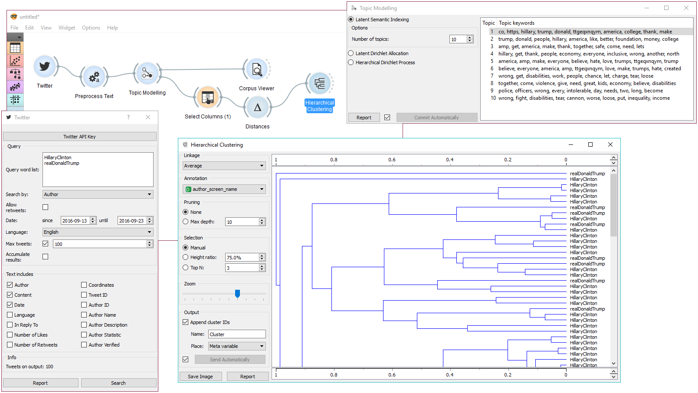
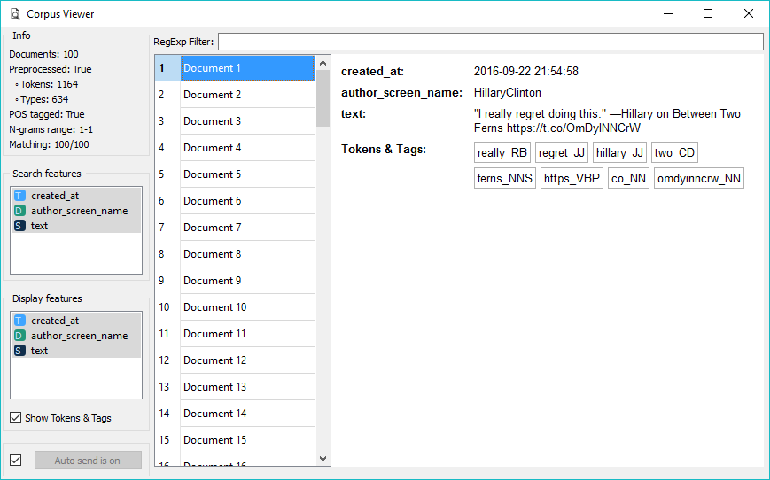

[Orange3-Text](https://github.com/biolab/orange3-text) has just recently been polished, updated and enhanced! Our GSoC student Alexey has [helped us greatly](/blog/2016/07/05/rehaul-of-text-mining-add-on/) to achieve another milestone in Orange development and release the latest 0.2.0 version of our text mining add-on. The new release, which is already available on PyPi, includes Wikipedia and SimHash widgets and a rehaul of Bag of Words, Topic Modeling and Corpus Viewer.

Wikipedia widget allows retrieving sources from Wikipedia API and can handle multiple queries. It serves as an easy data gathering source and it's great for exploring text mining techniques. Here we've simply queried Wikipedia for articles on Slovenia and Germany and displayed them in Corpus Viewer.

Query Wikipedia by entering your query word list in the widget. Put each query on a separate line and run Search.

[Similarity Hashing](http://matpalm.com/resemblance/simhash/) widget computes similarity hashes for the given corpus, allowing the user to find duplicates, plagiarism or textual borrowing in the corpus. Here's an example from Wikipedia, which has a pre-defined structure of articles, making our corpus quite similar. We've used Wikipedia widget and retrieved 10 articles for the query 'Slovenia'. Then we've used Similarity Hashing to compute hashes for our text. What we got on the output is a table of 64 binary features (predefined in the SimHash widget), which denote a 64-bit hash size. Then we computed similarities in text by sending Similarity Hashing to Distances. Here we've selected cosine row distances and sent the output to Hierarchical Clustering. We can see that we have some similar documents, so we can select and inspect them in Corpus Viewer.

Output of Similarity Hashing widget.

We've selected the two most similar documents in Hierarchical Clustering and displayed them in Corpus Viewer.

Topic Modeling now includes three modeling algorithms, namely [Latent Semantic Indexing (LSP)](https://en.wikipedia.org/wiki/Latent_semantic_analysis), [Latent Dirichlet Allocation (LDA)](https://en.wikipedia.org/wiki/Latent_Dirichlet_allocation), and [Hierarchical Dirichlet Process (HDP)](https://en.wikipedia.org/wiki/Hierarchical_Dirichlet_process). Let's query Twitter for the latest tweets from Hillary Clinton and Donald Trump. First we preprocess the data and send the output to Topic Modeling. The widget suggests 10 topics, with the most significant words denoting each topic, and outputs topic probabilities for each document.

We can inspect distances between the topics with Distances (cosine) and Hierarchical Clustering. Seems like topics are not extremely author specific, since Hierarchical Clustering often puts Trump and Clinton in the same cluster. We've used Average linkage, but you can play around with different linkages and see if you can get better results.

Example of comparing text by topics.

Now we connect Corpus Viewer to Preprocess Text. This is nothing new, but Corpus Viewer now displays also tokens and POS tags. Enable POS Tagger in Preprocess Text. Now open Corpus Viewer and tick the checkbox Show Tokens & Tags. This will display tagged token at the bottom of each document.

Corpus Viewer can now display tokens and POS tags below each document.

This is just a brief overview of what one can do with the new Orange text mining functionalities. Of course, these are just exemplary workflows. If you did textual analysis with great results using any of these widgets, feel free to share it with us! :)
