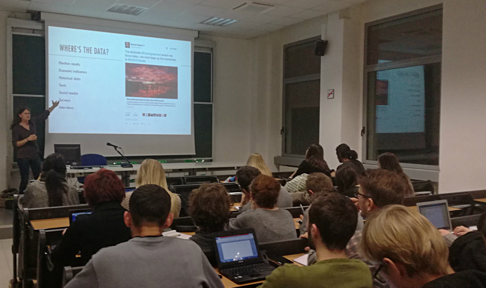
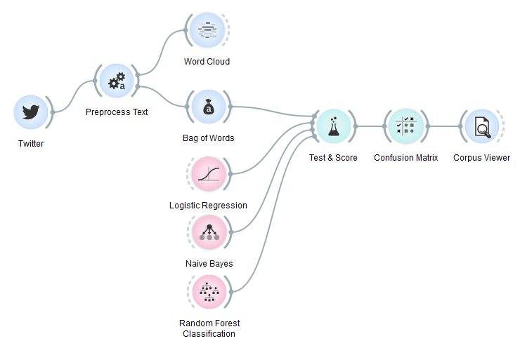
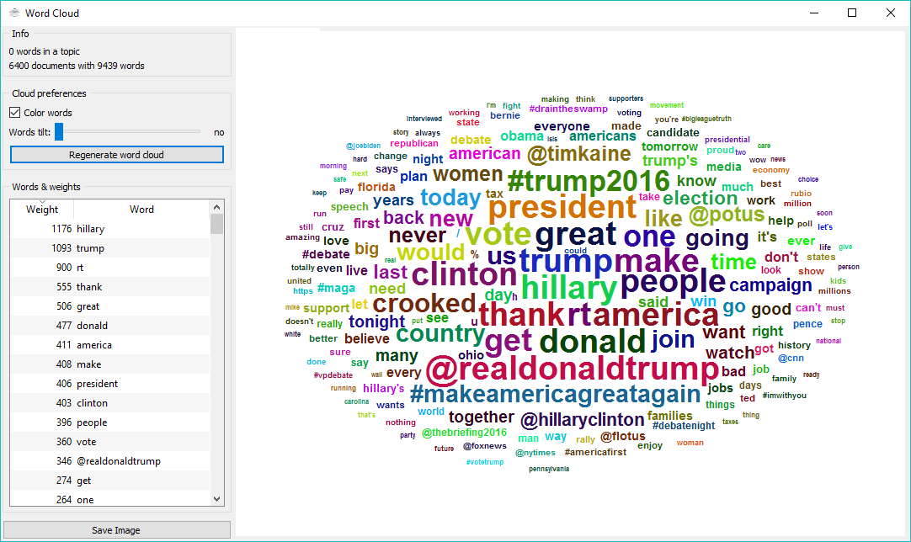
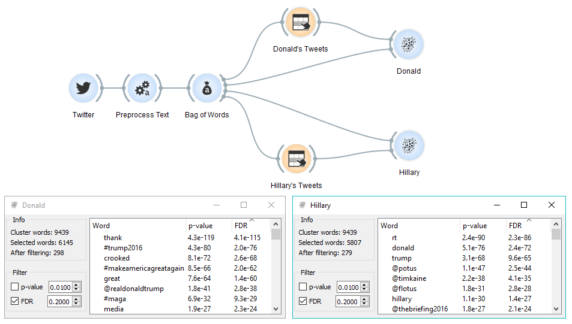
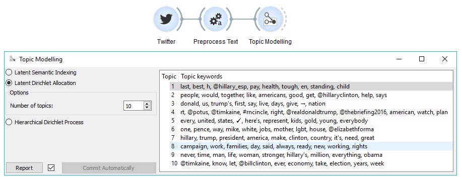
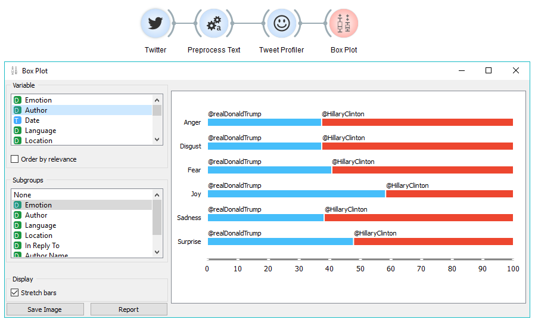

Being a political scientist, I did not even hear about data mining before I've joined [Biolab](https://www.facebook.com/biolab.si). And naturally, as with all good things, data mining started to grow on me. Give me some data, connect a bunch of widgets and see the magic happen!

But hold on! There are still many social scientists out there who haven't yet heard about the wonderful world of data mining, text mining and machine learning. So I've made it my mission to spread the word. And that was the spirit that led me back to my former university - [School of Political Sciences, University of Bologna](http://www.politicalsciences.unibo.it/en/index.htm).

University of Bologna is the oldest university in the world and has one of the best departments for political sciences in Europe. I held a lecture _Digital Research - Data Mining for Political Scientists_ for [MIREES](http://corsi.unibo.it/2Cycle/mirees/Pages/default.aspx) students, who are specializing in research and studies in Central and Eastern Europe.

Lecture at University of Bologna

The main goal of the lecture was to lay out the possibilities that contemporary technology offers to researchers and to showcase a few simple text mining tasks in Orange. We analysed Trump's and Clinton's Twitter timeline and discovered that their tweets are highly distinct from one another and that you can easily find significant words they're using in their tweets. Moreover, we've discovered that Trump is much better at social media than Clinton, creating highly likable and shareable content and inventing his own hashtags. Could that be a tell-tale sign of his recent victory?

Perhaps. Our future, data-mining savvy political scientists will decide. Below, you can see some examples of the workflows presented at the workshop.

Author predictions from Tweet content. Logistic Regression reports on 92% classification accuracy and AUC score. Confusion Matrix can output misclassified tweets to Corpus Viewer, where we can inspect these tweets further.

Word Cloud from preprocessed tweets. We removed stopwords and punctuation to find frequencies for meaningful words only.

Word Enrichment by Author. First we find Donald's tweets with Select Rows and then compare them to the entire corpus in Word Enrichment. The widget outputs a ranked list of significant words for the provided subset. We do the same for Hillary's tweets.

Finding potential topics with LDA.

Finally, we offered a sneak peek of our recent Tweet Profiler widget. Tweet Profiler is intended for sentiment analysis of tweets and can output classes. probabilities and embeddings. The widget is not yet officially available, but will be included in the upcoming release.
