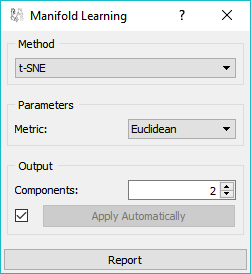
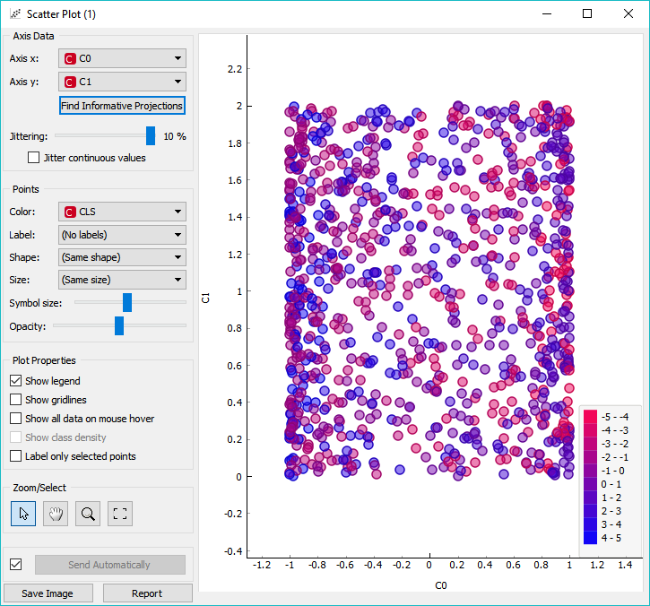
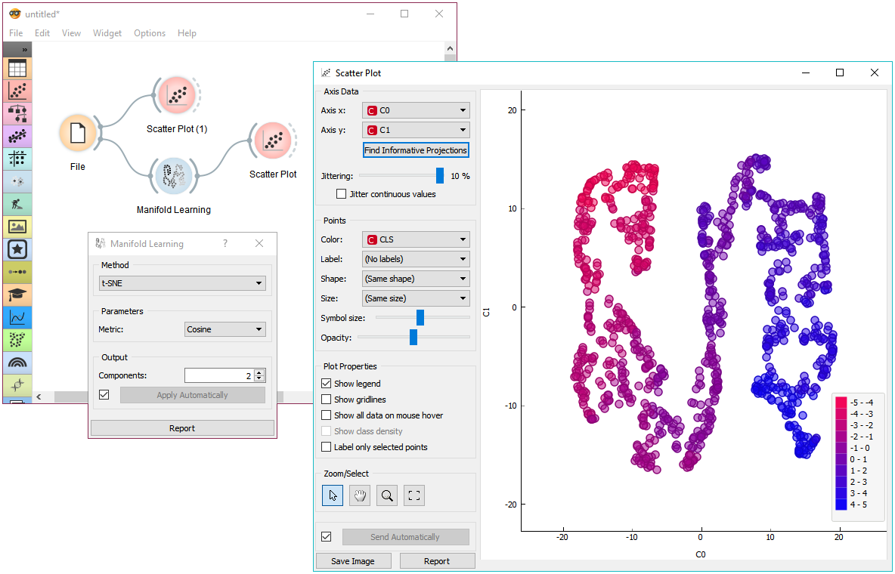
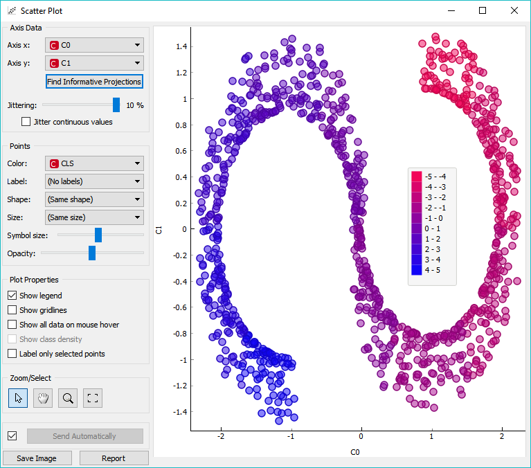

The new Orange release (v. 3.3.9) welcomed a few wonderful additions to its widget family, including Manifold Learning widget. The widget reduces the dimensionality of the high-dimensional data and is thus wonderful in combination with visualization widgets.

Manifold Learning widget has a simple interface with powerful features.

Manifold Learning widget offers five embedding techniques based on [scikit-learn library](http://scikit-learn.org/stable/modules/manifold.html): t-SNE, MDS, Isomap, Locally Linear Embedding and Spectral Embedding. They each handle the mapping differently and also have a specific set of parameters.

**Related:** [Principal Component Analysis (video)](https://www.youtube.com/watch?v=OmaAC8a52YI)

For example, a popular t-SNE requires only a metric (e.g. cosine distance). In the demonstration of this widget, we output 2 components, since they are the easiest to visualize and make sense of.

First, let's load [the data](https://raw.githubusercontent.com/ajdapretnar/datasets/master/data/s-manifold.tab) and open it in Scatter Plot. Not a very informative visualization, right? The dots from an unrecognizable square in 2D.

S-curve data in Scatter Plot. Data points form an uninformative square.

Let's use embeddings to make things a bit more informative. This is how the data looks like with a t-SNE embedding. The data is starting to have a shape and the data points colored according to regression class reveal a beautiful gradient.

t-SNE embedding shows an S shape of the data.

Ok, how about MDS? This is beyond our expectations!

There's a plethora of options with embeddings. You can play around with ImageNet embeddings and plot them in 2D or use any of your own high-dimensional data and discover interesting visualizations! Although t-SNE is nowadays probably the most popular dimensionality reduction technique used in combination with scatterplot visualization, do not underestimate the value of other manifold learning techniques. For one, we often find that MDS works fine as well.

Go, experiment!
