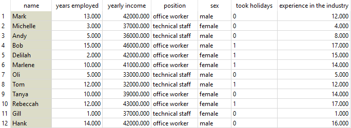
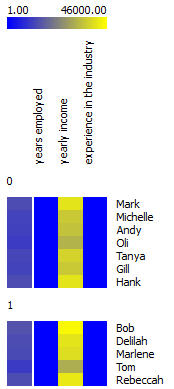
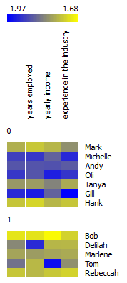
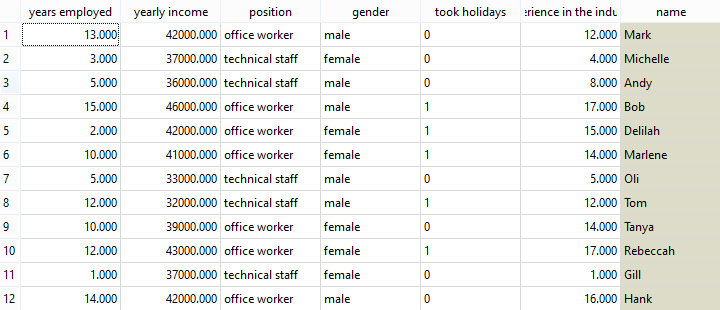
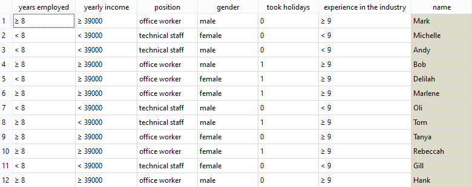
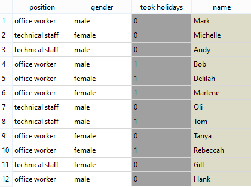
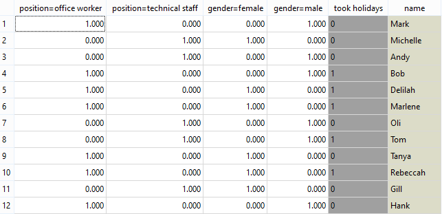

We've said it numerous times and we're going to say it again. Data preparation is crucial for any data analysis. If your data is messy, there's no way you can make sense of it, let alone a computer. Computers are great at handling large, even enormous data sets, speedy computing and recognizing patterns. But they fail miserably if you give them the wrong input. Also some classification methods work better with binary values, other with continuous, so it is important to know how to treat your data properly.

Orange is well equipped for such tasks.

**Widget no. 1: Preprocess**

[Preprocess](/widget-catalog/data/preprocess/) is there to handle a big share of your preprocessing tasks.

 * It can normalize numerical data variables. Say we have a fictional data set of people employed in your company. We want to know which employees are more likely to go on holiday, based on the yearly income, years employed in your company and total years of experience in the industry. If you plot this in heat map, you would see a bold yellow line at 'yearly income'. This obviously happens because yearly income has much higher values than years of experience or years employed by your company. You would naturally like the wage not to overweight the rest of the feature set, so normalization is the way to go. Normalization will transform your values to relative terms, that is, say (depending on the type of normalization) on a scale from 0 to 1. Now [Heat Map](/widget-catalog/visualize/heatmap/) neatly shows that people who've been employed longer and have a higher wage more often go on holidays. (Yes, this is a totally fictional data set, but you see the point.)

 

 |  
:-------------------------:|:-------------------------:
no normalization  		   |normalized data

* It can impute missing values. Average or most frequent missing value imputation might seem as overly simple, but it actually works most of the time. Also, all the learners that require imputation do it implicitly, so the user doesn't have to configure yet another widget for that.
* If you want to compare your results against a randomly mixed data set, select 'Randomize' or if you want to select relevant features, this is the widget for it.

Preprocessing needs to be used with caution and understanding of your data to avoid losing important information or, worse, overfitting the model. A good example is a case of paramedics, who usually don't record pulse if it is normal. Missing values here thus cannot be imputed by an average value or random number, but as a distinct value (normal pulse). Domain knowledge is always crucial for data preparation.

**Widget no. 2: Discretize**

For certain tasks you might want to resort to binning, which is what [Discretize](/widget-catalog/data/discretize/) does. It effectively distributes your continuous values into a selected number of bins, thus making the variable discrete-like. You can either discretize all your data variables at once, using selected discretization type, or select a particular discretization method for each attribute. The cool thing is the transformation is already displayed in the widget, so you instantly know what you're getting in the end. A good example of discretization would be having a data set of your customers with their age recorded. It would make little sense to segment customers by each particular age, so binning them into 4 age groups (young, young-adult, middle-aged, senior) would be a great solution. Also some visualizations require feature transformation - [Sieve Diagram](/widget-catalog/visualize/sievediagram/) is currently one such widget. Mosaic Display, however, has the transformation already implemented internally.

original data

Discretized data with 'years employed' lower or higher then/equal to 8 (same for 'yearly income' and 'experience in the industry'.

**Widget no. 3: Continuize**

This widget essentially creates new attributes out of your discrete ones. If you have, for example, an attribute with people's eye color, where values can be either blue, brown or green, you would probably want to have three separate attributes 'blue', 'green' and 'brown' with 0 or 1 if a person has that eye color. Some learners perform much better if data is transformed in such a way. You can also only have attributes where you would presume 0 is a normal condition and would only like to have deviations from the normal state recorded ('target or first value as base') or the normal state would be the most common value ('most frequent value as base'). [Continuize](/widget-catalog/data/continuize/) widget offers you a lot of room to play. Best thing is to select a small data set with discrete values, connect it to Continuize and then further to [Data Table](/widget-catalog/data/datatable/) and change the parameters. This is how you can observe the transformations in real time. It is useful for projecting discrete data points in [Linear Projection](/widget-catalog/visualize/linearprojection/).

Original data.

Continuized data with two new columns - attribute 'position' was replaced by attributes 'position=office worker' and 'position=technical staff' (same for 'gender').

**Widget no. 4: Purge Domain**

Get a broom and sort your data! That's what [Purge Domain](/widget-catalog/data/purgedomain/) does. If all of the values of some attributes are constant, it will remove these attributes. If you have unused (empty) attributes in your data, it will remove them. Effectively, you will get a nice and comprehensive data set in the end.

Original data.

Empty columns and columns with the same (constant) value were removed.

Of course, don't forget to include all these procedures into your report with the 'Report' button! :)
