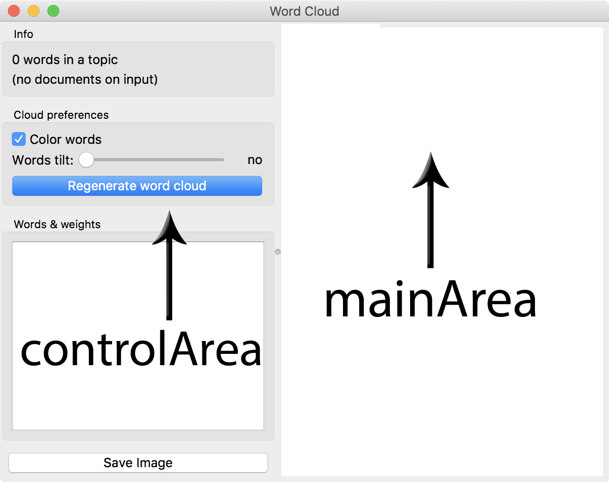
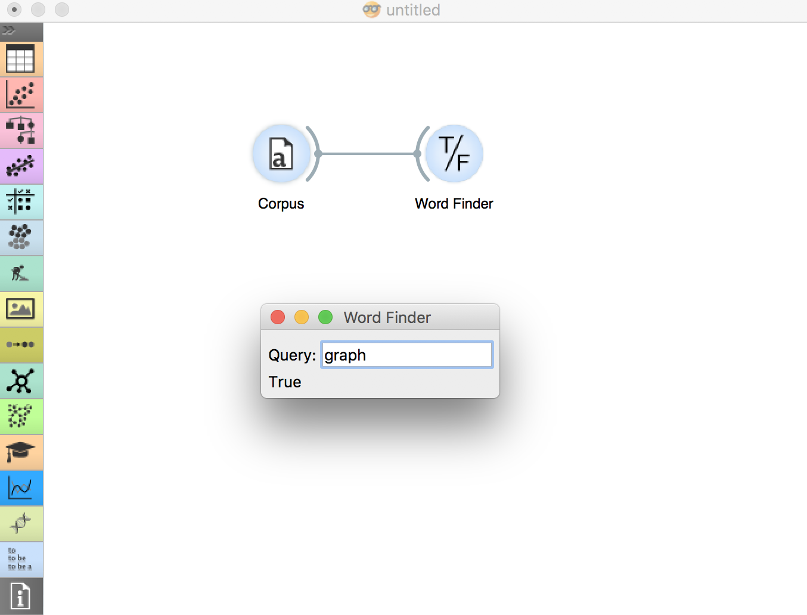

Recently, I took on a daunting task - programming my first widget. I'm not a programmer or a computer science grad, but I've been looking at Orange code for almost two years now and I thought I could handle it.

I set to create a simple [Concordance](https://www.nottingham.ac.uk/alzsh3/acvocab/concordances.htm) widget that displays word contexts in a corpus (the widget will be available in the future release). The widget turned out to be a little more complicated than I originally anticipated, but it was a great exercise in programming.

Today, I'll explain how I got started with my widget development. We will create a very basic Word Finder widget, that just goes through the corpus (data) and tells you whether a word occurs in a corpus or not. This particular widget is meant to be a part of the [Orange3-Text add-on](https://github.com/biolab/orange3-text) (so you need the add-on installed to try it), but the basic structure is the same for all widgets.


First, I have to set the basic widget class.

```
    class OWWordFinder(OWWidget):
        name = "Word Finder"
        description = "Display whether a word is in a text or not."
        icon = "icons/WordFinder.svg"
        priority = 1
    
        inputs = [('Corpus', Table, 'set_data')]
        # This widget will have no output, but in case you want one, you define it as below.
        # outputs = [('Output Name', output_type, 'output_method')]
    
        want_control_area = False
```


This sets up the description of the widget, icon, inputs and so on. `want_control_area` is where we say we only want the main window. Both are on by default in Orange and this simply hides the empty control area on the widget's left side. If your widget has any parameters and controls, leave the control area on and place the buttons there.




In `__init__` we define widget properties (such as data and queried word) and set the view. I decided to go with a very simple design - I just put everything in the `mainArea`. For such a basic widget this might be ok, but otherwise you might want to dig deeper into models and use `QTableView`, `QGraphicsScene` or something similar. Here we will build just the bare bones of a functioning widget.

```
    def __init__(self):
            super().__init__()
    
            self.corpus = None    # input data
            self.word = ""        # queried word
    
            # setting the gui
            gui.widgetBox(self.mainArea, orientation="vertical")
            self.input = gui.lineEdit(self.mainArea, self, '',
                                      orientation="horizontal",
                                      label='Query:')
            self.input.setFocus()
            # run method self.search on every text change
            self.input.textChanged.connect(self.search)
            
            # place a text label in the mainArea
            self.view = QLabel()
            self.mainArea.layout().addWidget(self.view)
```

Ok, this now sets the `__init__`: what the widget remembers and how it looks like. With our buttons in place, the widget needs some methods, too.


The first method will update the self.corpus attribute, when the widget receives an input.

```
    def set_data(self, data=None):
            if data is not None and not isinstance(data, Corpus):
                self.corpus = Corpus.from_table(data.domain, data)
            self.corpus = data
            self.search()
```

At the end we called `self.search()` method, which we already met in `__init__` above. This method is key to our widget, as it will run the search every time the word changes. Moreover, it will run the method on the same query word when the widget is provided with a new data set, which is why we set it also in `set_data()`.


Ok, let's finally write this method.

```
    def search(self):
            self.word = self.input.text()
            # self.corpus.tokens will run a default tokenizer, if no tokens are provided on the input
            result = any(self.word in doc for doc in self.corpus.tokens)
            self.view.setText(str(result))
```


This is it. This is our widget. Good job. Creating a new widget can indeed be lot of fun. You can go from a quite basic widget to very intricate, depending on your sense of adventure.

Finally, you can get the [entire widget code in gist](https://gist.github.com/ajdapretnar/e66e1dbecef3bb59abd4137bf8c2ab77).



Happy programming, everyone! :)


