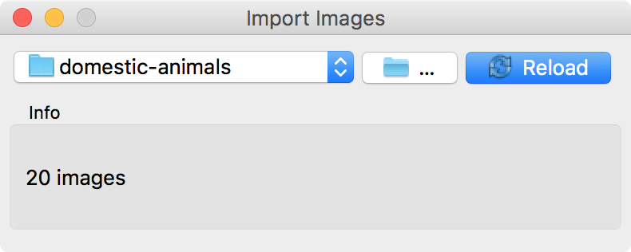
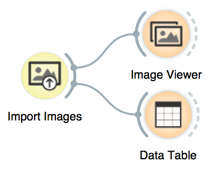
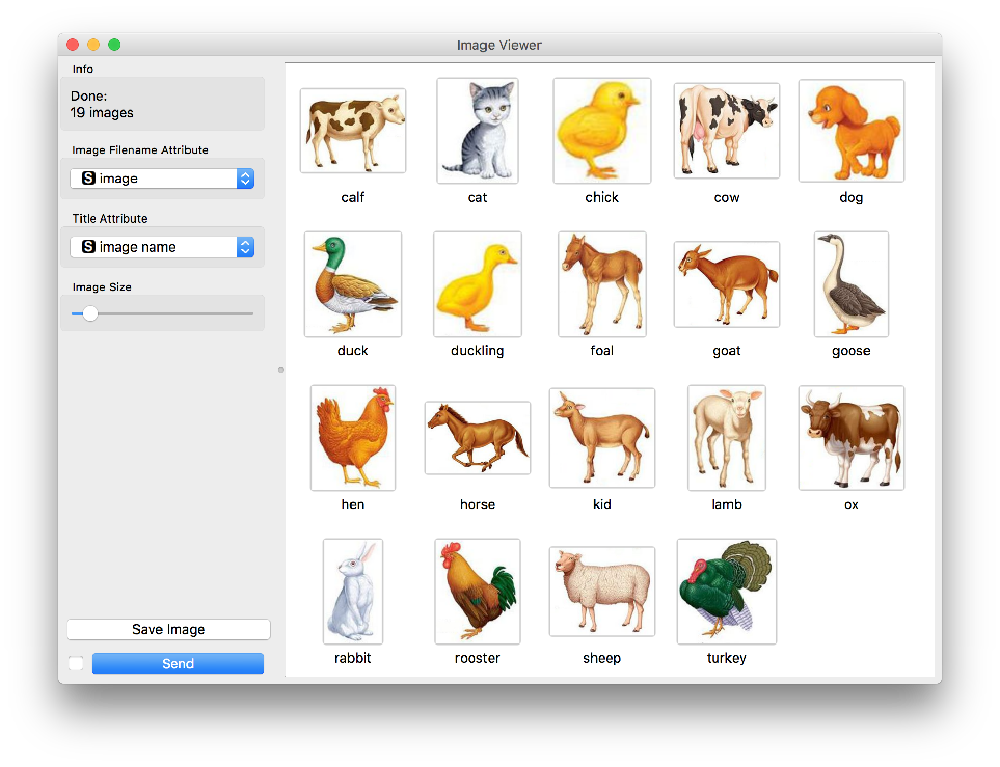
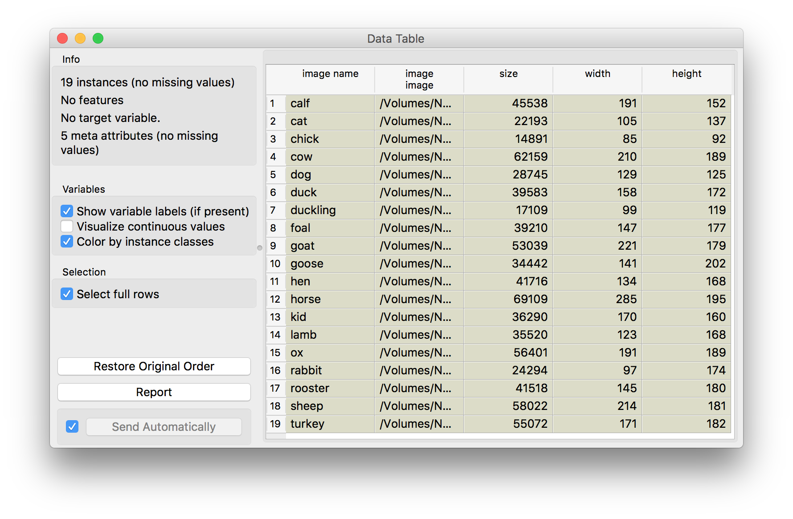
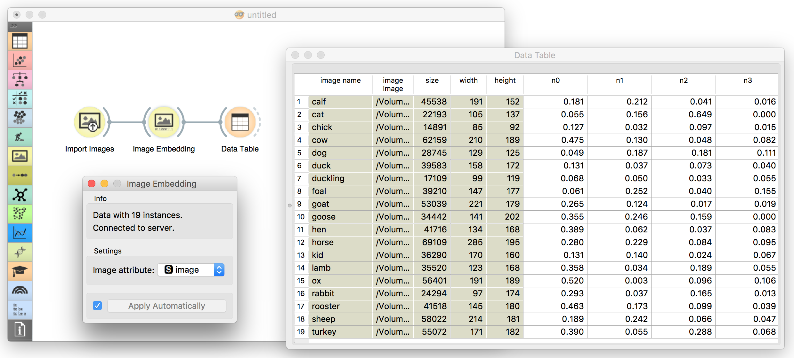
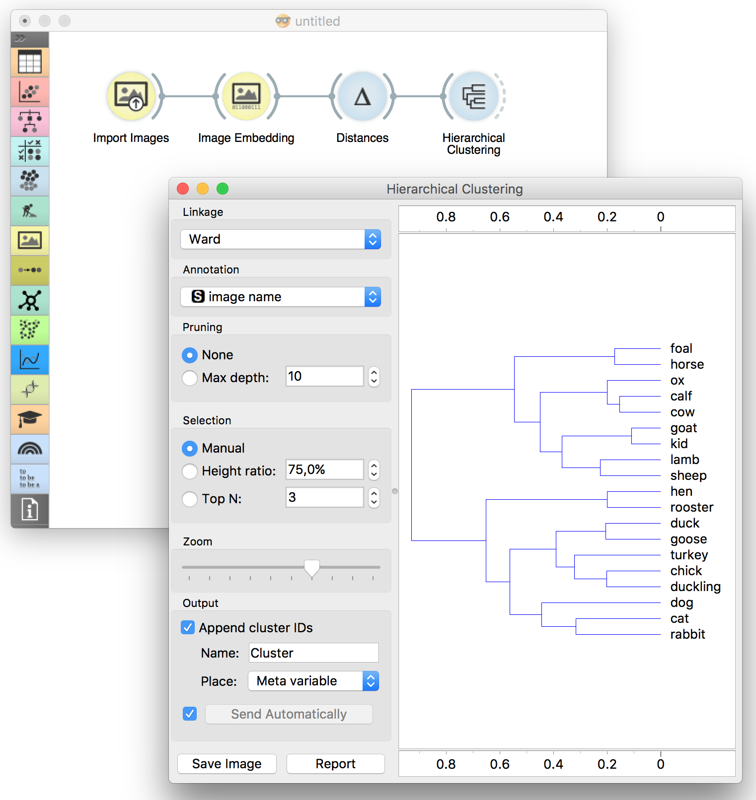
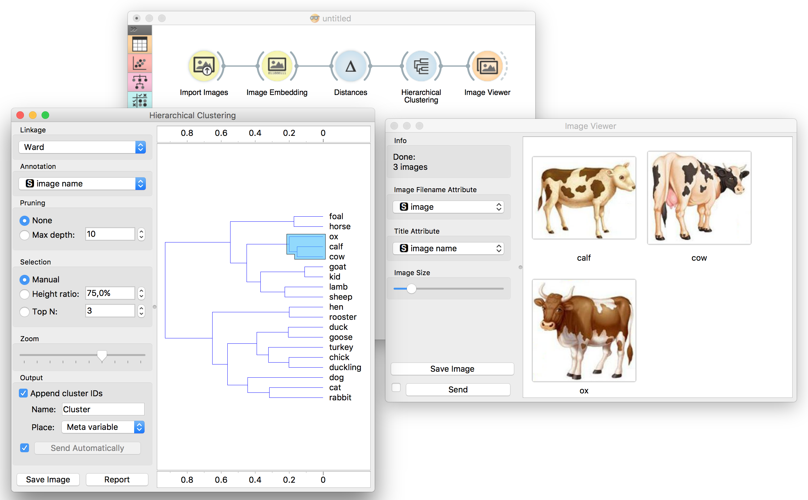
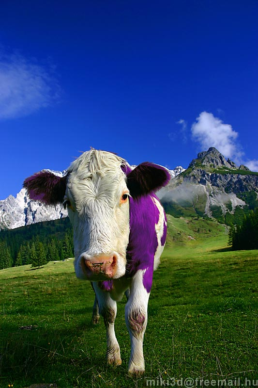
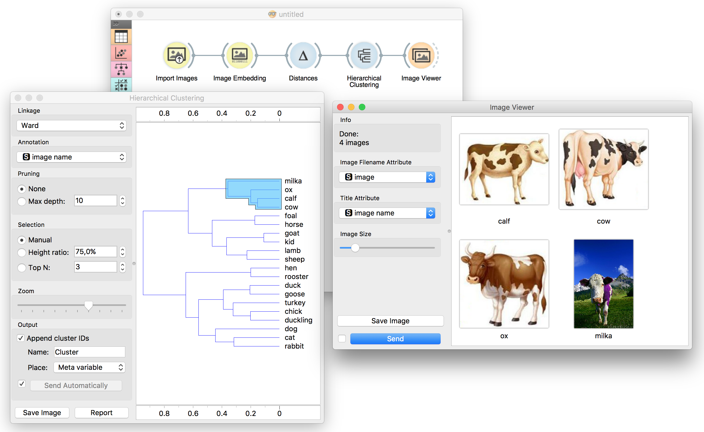

Data does not always come in a nice tabular form. It can also be a collection of text, audio recordings, video materials or even images. However, computers can only work with numbers, so for any data mining, we need to transform such unstructured data into a vector representation.

For retrieving numbers from unstructured data, [Orange](http://orange.biolab.si) can use deep network embedders. We have just started to include various embedders in Orange, and for now, they are available for text and images.

**Related:** [Video on image clustering](https://www.youtube.com/watch?v=Iu8g2Twjn9U)

Here, we give an example of image embedding and show how easy is to use it in Orange. Technically, Orange would send the image to the server, where the server would push an image through a pre-trained deep neural network, like [Google's Inception v3](https://www.tensorflow.org/tutorials/image_recognition). Deep networks were most often trained with some special purpose in mind. Inception v3, for instance, can classify images into any of [1000 image classes](http://image-net.org/challenges/LSVRC/2014/browse-synsets). We can disregard the classification, consider instead the penultimate layer of the network with 2048 nodes (numbers) and use that for image's vector-based representation.

Let's see this on an example.

Here we have 19 [images of domestic animals](http://tinyurl.com/images-domestic-animals). First, download the images and unzip them. Then use Import Images widget from Orange's Image Analytics add-on and open the directory containing the images.

We can visualize images in Image Viewer widget. Here is our workflow so far, with images shown in Image Viewer:

But what do we see in a data table? Only some useless description of images (file name, the location of the file, its size, and the image width and height).

This cannot help us with machine learning. As I said before, we need numbers. To acquire numerical representation of these images, we will send the images to Image Embedding widget.

Great! Now we have the numbers we wanted. There are 2048 of them (columns n0 to n2047). From now on, we can apply all the standard machine learning techniques, say, clustering.

Let us measure the distance between these images and see which are the most similar. We used Distances widget to measure the distance. Normally, cosine distance works best for images, but you can experiment on your own. Then we passed the distance matrix to Hierarchical Clustering to visualize similar pairs in a dendrogram.

This looks very promising! All the right animals are grouped together. But I can't see the results so well in the dendrogram. I want to see the images - with Image Viewer!

So cool! All the cow family is grouped together! Now we can click on different branches of the dendrogram and observe which animals belong to which group.

But I know what you are going to say. You are going to say I am cheating. That I intentionally selected similar images to trick you.

I will prove you wrong. I will take a new cow, say, the most famous cow in Europe - Milka cow.

This image is quite different from the other images - it doesn't have a white background, it's a real (yet photoshopped) photo and the cow is facing us. Will the Image Embedding find the right numerical representation for this cow?

Indeed it has. Milka is nicely put together with all the other cows.

Image analytics is such an exciting field in machine learning and now Orange is a part of it too! You need to install the Image Analytics add on and you are all set for your research!
