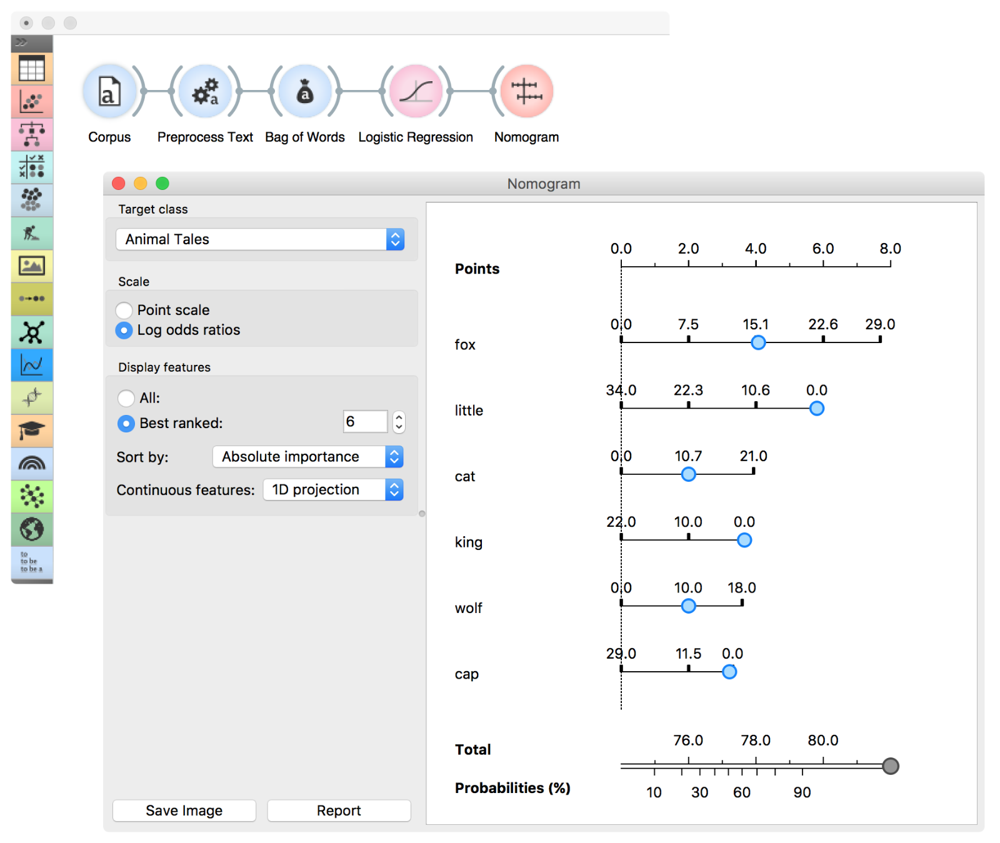
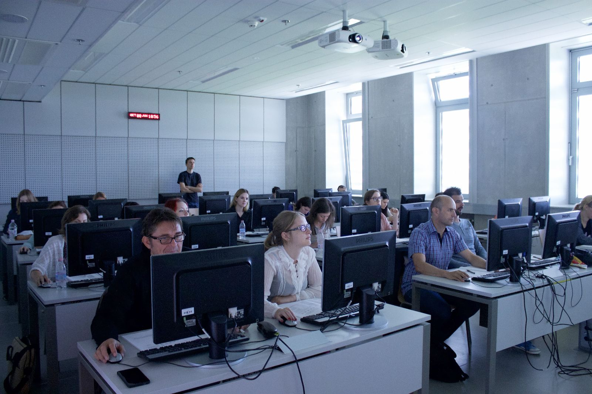

Yesterday was no ordinary day at the Faculty of Computer and Information Science, University of Ljubljana - there was an unusually high proportion of Social Sciences students, researchers and other professionals in our classrooms. It was all because of a Text Analysis for Social Scientists workshop.

**Related:** [Data Mining for Political Scientists](/blog/2016/11/30/data-mining-for-political-scientists/)

Text mining is becoming a popular method across sciences and it was time to showcase what it (and Orange) can do. In this 5-hour hands-on workshop we explained text preprocessing, clustering, and predictive models, and applied them in the analysis of selected Grimm's Tales. We discovered that predictive models can nicely distinguish between animal tales and tales of magic and that foxes and kings play a particularly important role in separating between the two types.

Nomogram displays 6 most important words (attributes) as defined by Logistic Regression. Seems like the occurrence of the word 'fox' can tell us a lot about whether the text is an animal tale or a tale of magic.

**Related:** [Nomogram](/blog/2017/06/05/nomogram/)

The second part of the workshop was dedicated to the analysis of tweets - we learned how to work with thousands of tweets on a personal computer, we plotted them on a map by geolocation, and used Instagram images for image clustering.

**Related:** [Image Analytics: Clustering](/blog/2017/04/03/image-analytics-clustering/)

Five hours was very little time to cover all the interesting topics in text analytics. But Orange came to the rescue once again. Interactive visualization and the possibility of close reading in Corpus Viewer were such a great help! Instead of reading 6400 tweets 'by hand', now the workshop participants can cluster them in interesting groups, find important words in each cluster and plot them in a 2D visualization.

Participants at work.

Here, we'd like to thank [NumFocus](https://www.numfocus.org/) for providing financial support for the course. This enabled us to bring in students from a wide variety of fields (linguists, geographers, marketers) and prove (once again) that you don't have to be a computer scientists to do machine learning!

