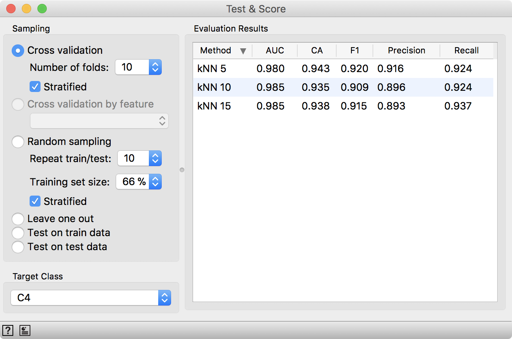
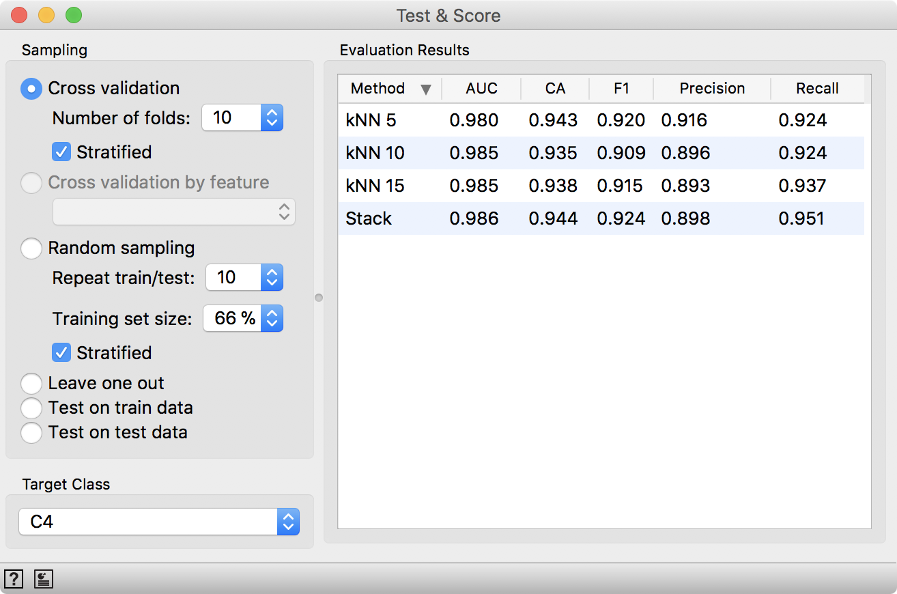
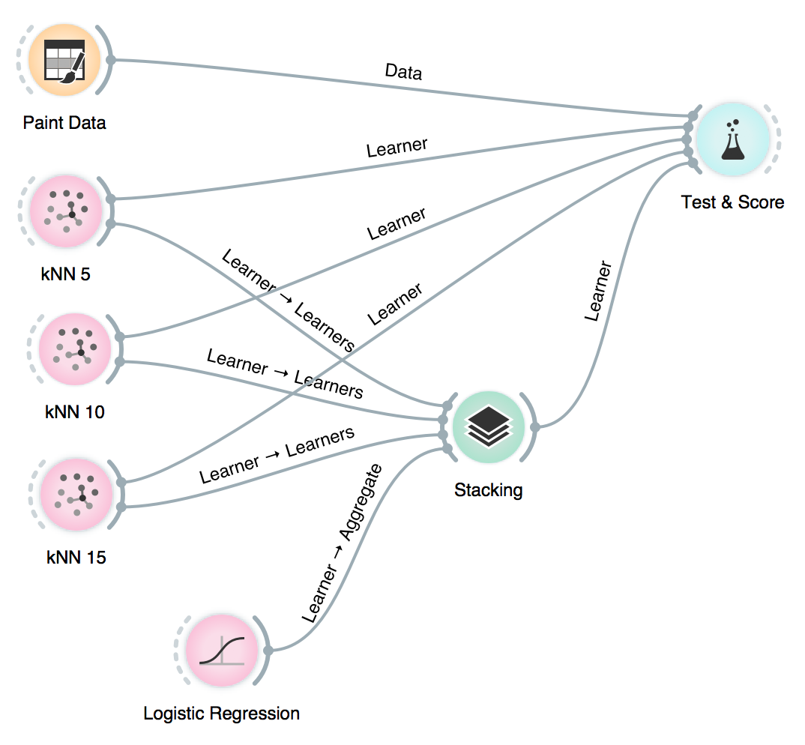

We all know that sometimes many is better than few. Therefore we are happy to introduce the Stack widget. It is available in [Prototypes add-on](https://github.com/biolab/orange3-prototypes) for now.

[Stacking](https://www.kdnuggets.com/2017/02/stacking-models-imropved-predictions.html) enables you to combine several trained models into one meta model and use it in Test&Score just like any other model. This comes in handy with complex problems, where one classifier might fail, but many could come up with something that works. Let's see an example.

We start with something as complex as this. We used Paint Data to create a complex data set, where classes somewhat overlap. This is naturally an artificial example, but you can try the same on your own, real life data.

We used 4 classes and painted a complex, 2-dimensional data set.

Then we add several kNN models with different parameters, say 5, 10 and 15 neighbors. We connect them to Test&Score and use cross validation to evaluate their performance. Not bad, but can we do even better?

Scores without staking, using only 3 different kNN classifiers.

Let us try stacking. We will connect all three classifiers to the Stacking widget and use Logistic Regression as an aggregate, a method that aggregates the three models into a single meta model. Then we connect connect the stacked model into Test&Score and see whether our scores improved.

Scores with stacking. Stack reports on improved performance.

And indeed they have. It might not be anything dramatic, but in real life, say medical context, even small improvements count. Now go and try the procedure on your own data. In Orange, this requires only a couple of minutes.

Final workflow with channel names. Notice that Logistic Regression is used as Aggregate, not a Learner.
