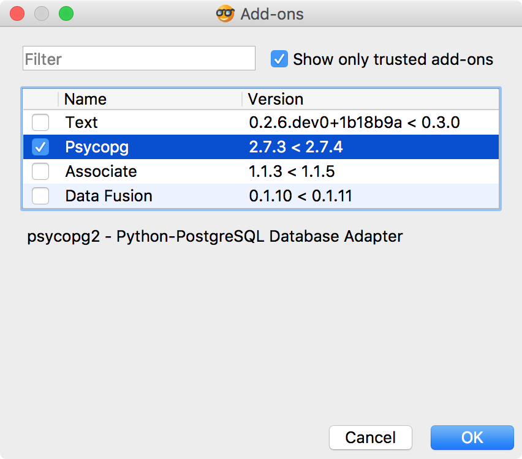

A lot of you have been interested in enabling SQL widget in Orange, especially regarding the installation of a psycopg backend that makes the widget actually work. This post will be slightly more technical, but I will try to keep it to a minimum. Scroll to the bottom for installation instructions.

Related: [SQL for Orange](/blog/2015/10/19/sql-for-orange/)

#### 

## Why won't Orange recognize psycopg?

The main issue for some people was that despite having installed the psycopg module in their console, the SQL widget still didn't work. This is because Orange uses a separate [virtual environment](https://python-guide-cn.readthedocs.io/en/latest/dev/virtualenvs.html) and most of you installed psycopg in the default (system) Python environment. For psycopg to be recognized in Orange, it needs to be installed in the same virtual environment, which is normally located in `C:\Users\<usr>\Anaconda3\envs\orange3` (on Windows). For the installation to work, you'd have to run it with the proper pip, namely:

`C:\Users\<usr>\Anaconda3\envs\orange3\Scripts\pip.exe install psycopg2`

#### 

## Installation instructions

But there is a much easier way to do it. Head over to psycopg's [pip website](https://pypi.python.org/pypi/psycopg2) and download the latest [wheel](https://pythonwheels.com/) for your platform. Py version has to be cp34 or higher (latest Orange from Anaconda comes with Python 3.6, so look for cp36).

For OSX, you would for example need: [psycopg2-2.7.4-cp36-cp36m-macosx_10_6_intel.macosx_10_9_intel.macosx_10_9_x86_64.macosx_10_10_intel.macosx_10_10_x86_64.whl](https://pypi.python.org/packages/8c/a5/0e61d6f4a140a6e06a9ba40266c4b49123d834f1f97fe9a5ae0b6e45112b/psycopg2-2.7.4-cp36-cp36m-macosx_10_6_intel.macosx_10_9_intel.macosx_10_9_x86_64.macosx_10_10_intel.macosx_10_10_x86_64.whl#md5=1f2b2137c65dc50c16b341774cd822eb)

For 64-bit Windows: [psycopg2-2.7.4-cp36-cp36m-win_amd64.whl](https://pypi.python.org/packages/f9/77/e29b792740ddec37a2d49431efa6c707cf3869c0cc7f28c7411bb6e96d91/psycopg2-2.7.4-cp36-cp36m-win_amd64.whl#md5=119eb3ab86ea8486ab10ef4ea3f67f15)

And for Linux: [psycopg2-2.7.4-cp36-cp36m-manylinux1_x86_64.whl](https://pypi.python.org/packages/92/15/92b5c363243376ce9cb879bbec561bba196694eb663a6937b4cb967e230e/psycopg2-2.7.4-cp36-cp36m-manylinux1_x86_64.whl#md5=8288ce1eedf0b70e5f1d8c982fad5a41)

Then open the add-on dialog in Orange (Options --> Add-ons) and drag and drop the downloaded wheel into the add-on list. At the bottom, you will see psycopg2 with the tick next to it.

Click OK to run the installation. Then re-start Orange and connect to your database with SQL widget. If you have any questions, drop them in the comment section!
