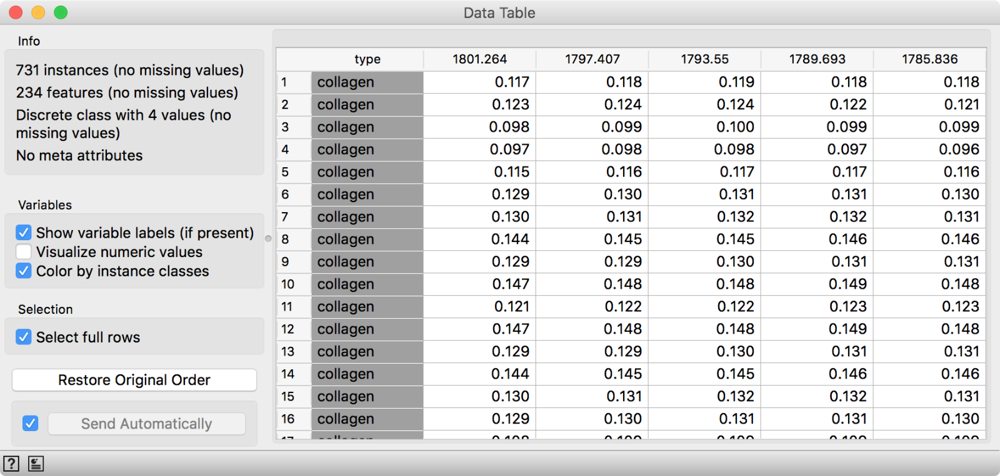
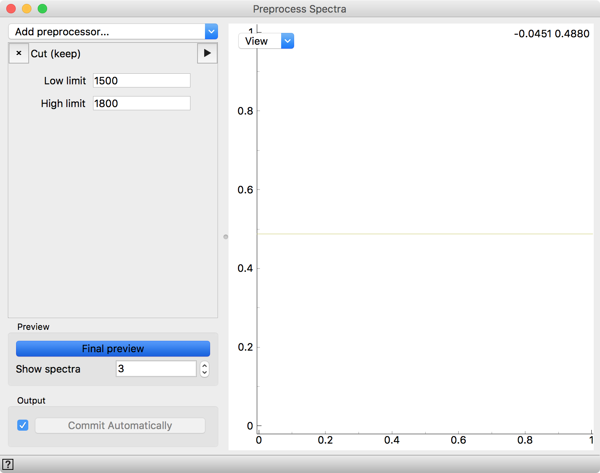
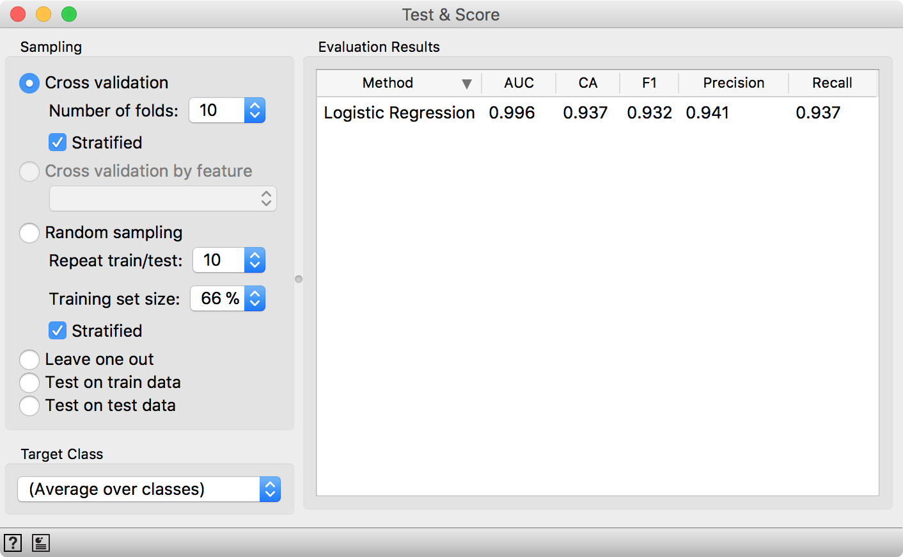
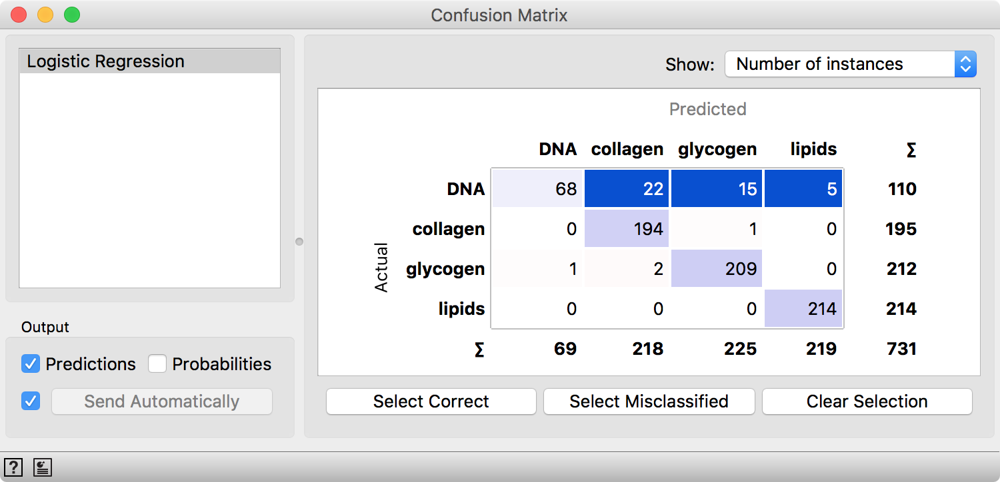
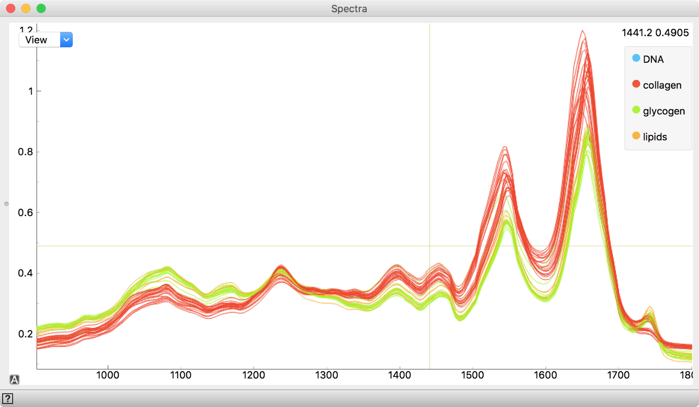

We have just concluded our enhanced Introduction to Data Science workshop, which included several workflows for spectroscopy analysis. [Spectroscopy add-on](https://www.tandfonline.com/doi/full/10.1080/08940886.2017.1338424?src=recsys) is intended for the analysis of spectral data and it is just as fun as our other add-ons (if not more!).

We will prove it with a simple classification workflow. First, install Spectroscopy add-on from Options - Add-ons menu in Orange. Restart Orange for the add-on to appear. Great, you are ready for some spectral analysis!

Use Datasets widget and load _Collagen spectroscopy_ data. This data contains cells measured with [FTIR](https://en.wikipedia.org/wiki/Fourier-transform_infrared_spectroscopy) and annotated with the major chemical compound at the imaged part of a cell. A quick glance in a Data Table will give us an idea how the data looks like. Seems like a very standard spectral data set.

Collagen data set from Datasets widget.

Now we want to determine, whether we can classify cells by type based on their spectral profiles. First, connect Datasets to Test & Score. We will use 10-fold cross-validation to score the performance of our model. Next, we will add Logistic Regression to model the data. One final thing. Spectral data often needs some preprocessing. Let us perform a simple preprocessing step by applying Cut (keep) filter and retaining only the wave numbers between 1500 and 1800. When we connect it to Test & Score, we need to keep in mind to connect the Preprocessor output of Preprocess Spectra.

Preprocessor that keeps a part of the spectra cut between 1500 and 1800. No data is shown here, since we are using only the preprocessing procedure as the input for Test & Score.

Let us see how well our model performs. Not bad. A 0.99 AUC score. Seems like it is almost perfect. But is it really so?

10-fold cross-validation on spectral data. Our AUC and CA scores are quite impressive.

Confusion Matrix gives us a detailed picture. Our model fails almost exclusively on DNA cell type. Interesting.

Confusion Matrix shows DNA is most often misclassified. By selecting the misclassified instances in the matrix, we can inspect why Logistic Regression couldn't model these spectra

We will select the misclassified DNA cells and feed them to Spectra to inspect what went wrong. Instead of coloring by type, we will color by prediction from Logistic Regression. Can you find out why these spectra were classified incorrectly?

Misclassified DNA spectra colored by the prediction made by Logistic Regression.

This is one of the simplest examples with spectral data. It is basically the same procedure as with standard data - data is fed as data, learner (LR) as learner and preprocessor as preprocessor directly to Test & Score to avoid overfitting. Play around with Spectroscopy add-on and let us know what you think! :)
