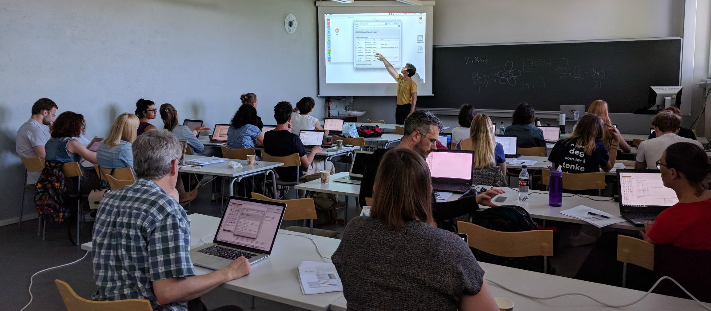
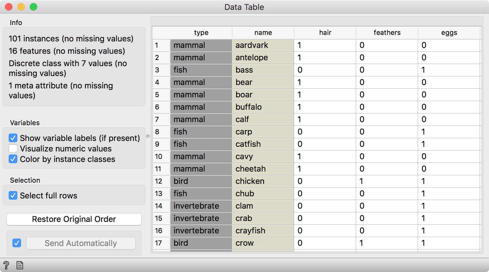
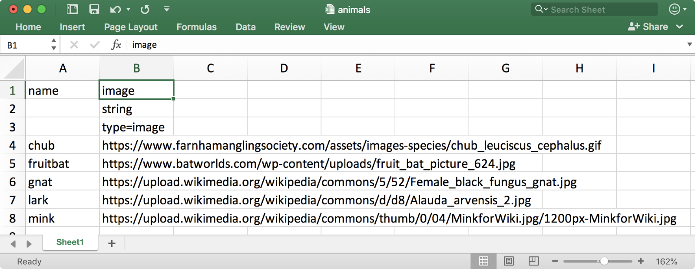
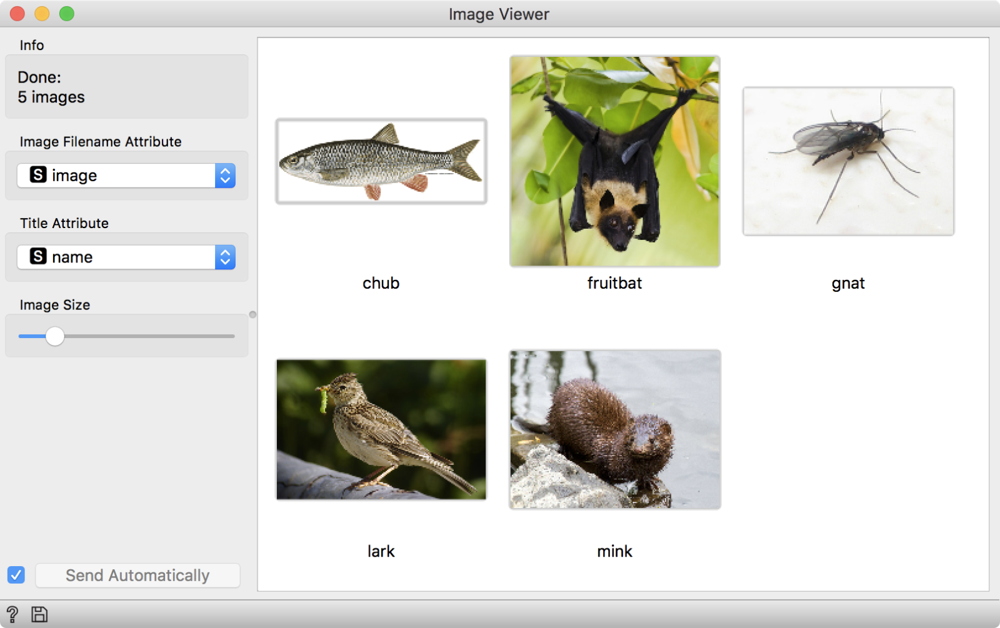
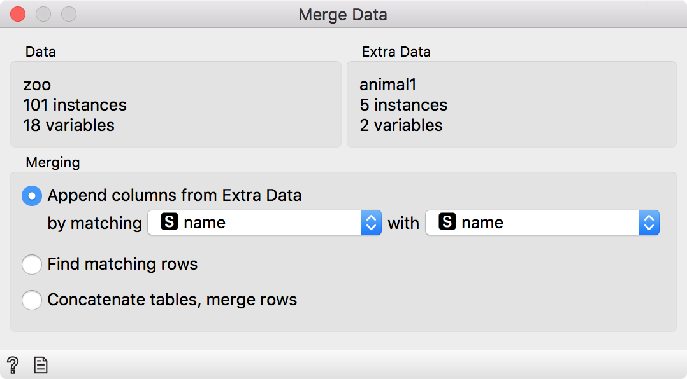
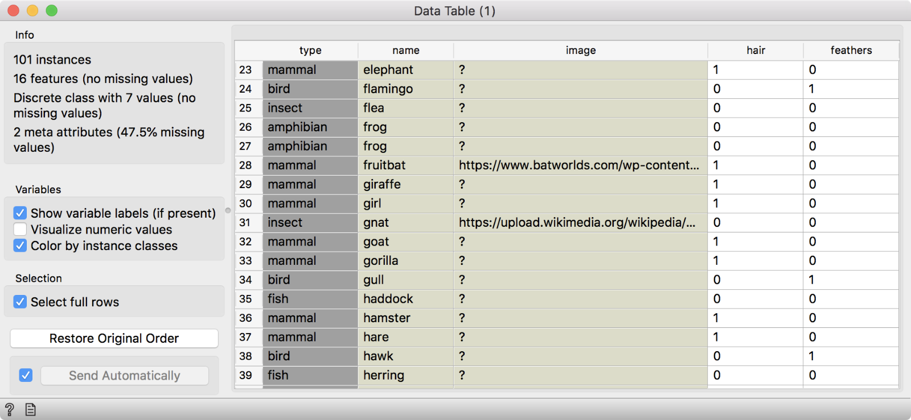
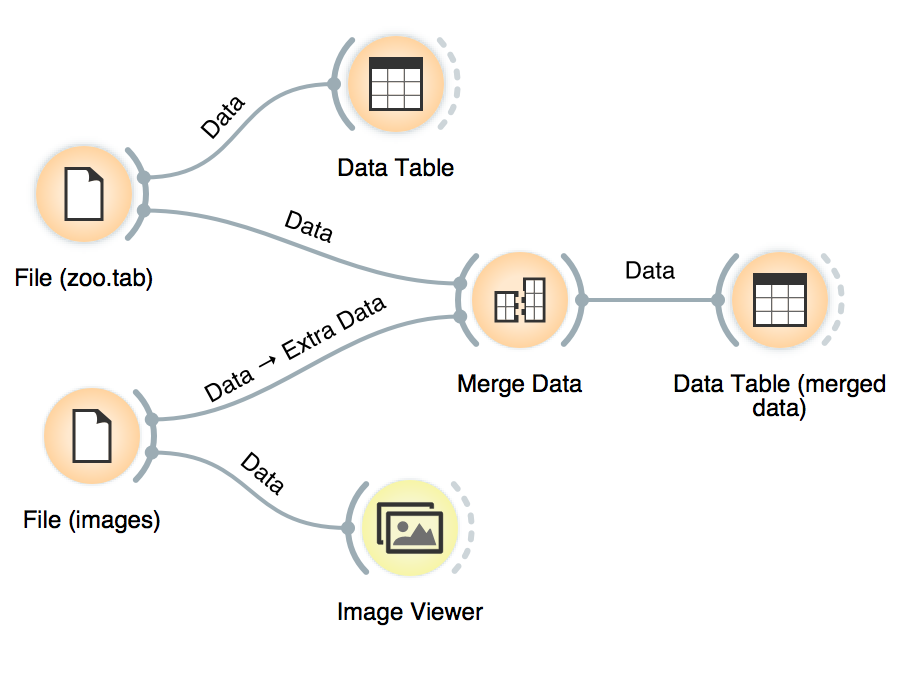

Last week Marko and I visited the land of the midnight sun - Norway! We held a two-day workshop on spectroscopy data analysis in Orange at the [Norwegian University of Life Sciences](https://www.nmbu.no/en). The students from [BioSpec](https://www.nmbu.no/en/faculty/realtek/research/groups/biospectroscopy) lab were yet again incredible and we really dug deep into Orange.

**Related:** [Orange with Spectroscopy Add-on](/blog/2018/03/28/orange-with-spectroscopy-add-on-workshop/)

A class full of dedicated scientists.

One thing we did was see how to join data from two different sources. It would often happen that you have measurements in one file and the labels in the other. Or in our case, we wanted to add images to our _zoo.tab_ data. First, find the _zoo.tab_ in the File widget under Browse documentation datasets. Observe the data in the Data Table.

Original zoo data set.

This data contains 101 animal described with 16 different features (hair, aquatic, eggs, etc.), a name and a type. Now we will manually create the second table in Excel. The first column will contain the names of the animals as they appear in the original file. The second column will contain links to images of animals. Open your favorite browser and find a couple of images corresponding to selected animals. Then add links to images below the image column. Just like that:

Extra data that we want to add to the original data.

Remember, you need a three-row header to define the column that contains images. Under the image column add _string_ in the second and _type=image_ in the third row. This will tell Orange where to look for images. Now, we can check our animals in Image Viewer.

A quick glance at an Image Viewer will tell us whether our images got loaded correctly.

Finally, it is time to bring in the images to the existing _zoo_ data set. Connect the original File to Merge Data. Then add the second file with animal images to Merge Data. The default merging method will take the first data input as original data and the second data as extra data. The column to match by is defined in the widget. In our case, it is the _name_ column. This means Orange will look at the first name column and find matching instances in the second name column.

A quick look at the merged data shows us an additional _image_ column that we appended to the original file.

Merged data with a new column.

This is the final workflow. Merge Data now contains a single data table on the output and you can continue your analysis from there.

Find out more about spectroscopy for Orange on our [YouTube channel](https://www.youtube.com/playlist?list=PLmNPvQr9Tf-bPWjDJvJBPZJ6us_KTAD5T) or contribute to the project on [Github](https://github.com/Quasars/orange-spectroscopy).
