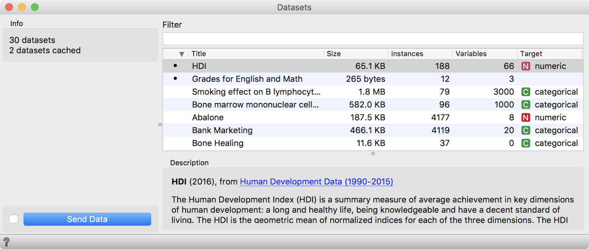
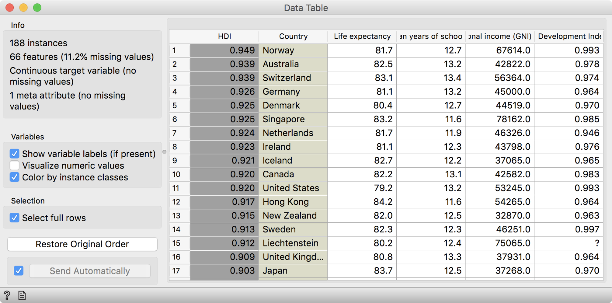
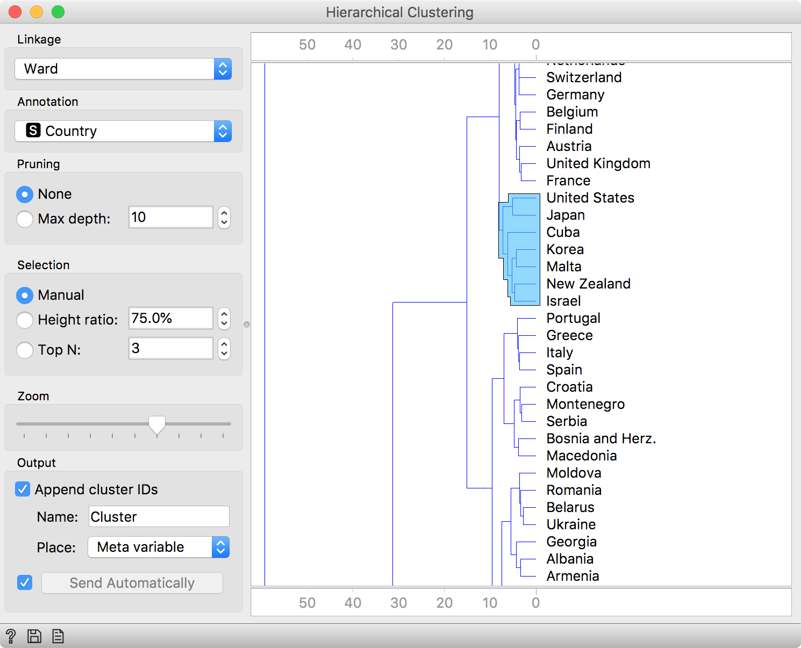
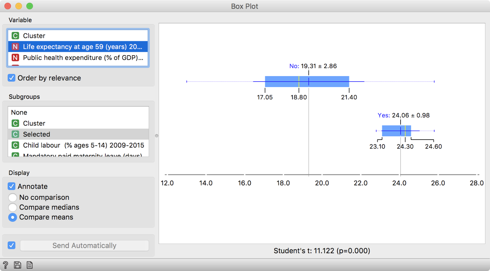
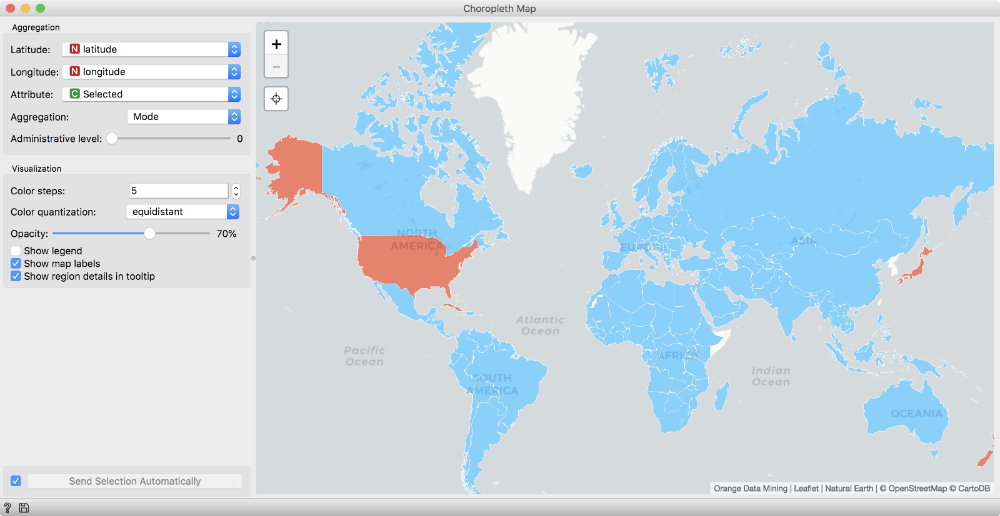

Last week Blaž, Marko and I held a week long introductory Data Mining and Machine Learning course at the Ljubljana Doctoral Summer School 2018. We got a room full of dedicated students and we embarked on a journey through standard and advanced machine learning techniques, all presented of course in Orange. We have covered a wide array of topics, from different clustering techniques (hierarchical clustering, k-means) to predictive models (logistic regression, naive Bayes, decision trees, random forests), regression and regularization, projections, text mining and image analytics.

**Related:** [Data Mining for Business and Public Administration](/blog/2017/11/17/data-mining-business-public-administration/)

Definitely the biggest crowd-pleaser was the Geo add-on in combination with the HDI data set. First, we got the HDI data from Datasets. A quick glimpse into a data table to check the output. We have information on some key performance indicators gathered by the United Nations for 188 countries. Now we would like to know which countries are similar based on the reported indicators. We will use Distances with Euclidean distance and use Ward linkage in Hierarchical Clustering.

In Datasets widget we have selected the HDI data set.

 
The HDI data set contains information on 188 countries, which are described with 66 features. The data set can be used for regression, but we will perform clustering to discover countries, similar by the proposed parameters.

We got our results in a dendrogram. Interestingly, the United States seems similar to Cuba. Let us select this cluster and inspect what the most significant feature for this cluster. We will use the Data output of Hierarchical Clustering which append a column indicating whether the data instances was selected or not. Then we will use Box Plot, group by Selected and check Order by relevance. It seems like these countries have the longest life expectancy at age 59. Go ahead and inspect other clusters by yourself!

Select an interesting cluster in Hierarchical Clustering.

And inspect the results in a box plot. Seems like the selected cluster stands out from the other countries by high life expectancy.

Of course, when we are talking about countries one naturally wants to see them on a map! That is easy. We will use the Geo add-on. First, we need to convert all the country names to geographical coordinates. We will do this with Geocoding, where we will encode column Country to latitude and longitude. Remember to use the same output as before, that is Data to Data.

<Figure src="Screen-Shot-2018-07-17-at-10.52.29.png" width="500" />
\

Use Encode to convert a column with region identifiers (in our case Country) to latitude/longitude pairs.

Now, let us display these countries on a map with Choropleth widget. Beautiful. It is so easy to explore country data, when you see it on a map. You can try coloring also by HDI or any other feature.

Choropleth shows us which countries were in the selected cluster (red). We used Selected as attribute and colored by Mode.

The final workflow:

We always try to keep our workshops fresh and interesting and visualizations are the best way to achieve this. Till the next workshop!

