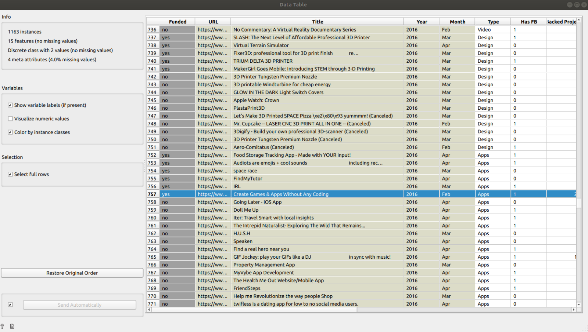
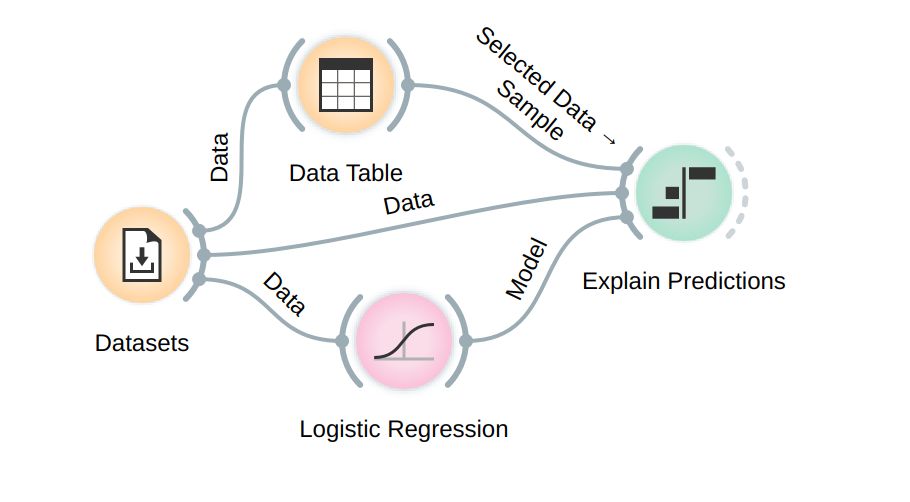
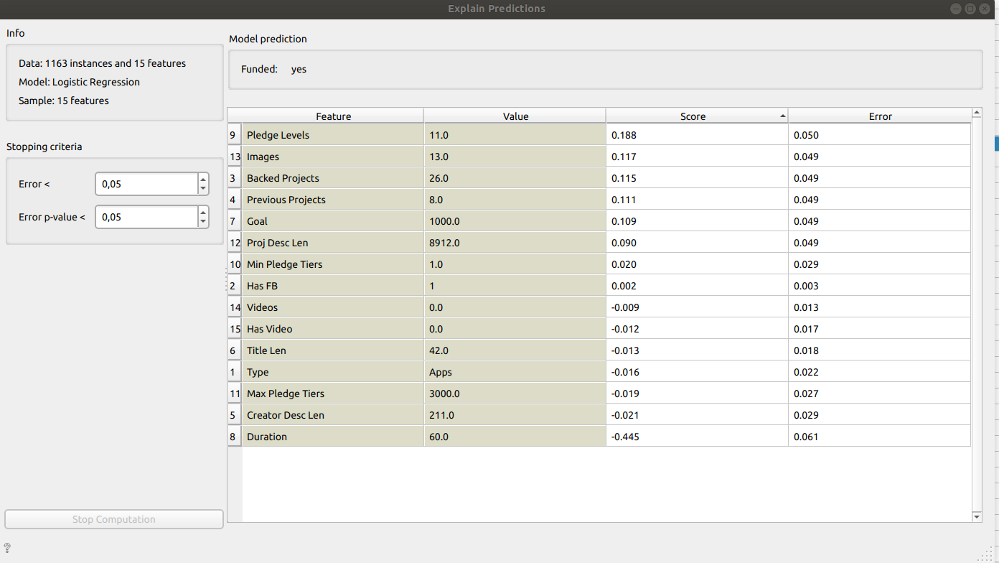

On Kickstarter most app ideas don't get funded. But why is that? When we are looking for possible explanations, it is easy to ascribe the failure to the type of the idea.

But what about those rare cases, where an app idea gets funded? Can we figure out why a particular idea succeeded? Our new widget Explain Predictions can do just that - explain why they will succeed. Or at least, explain why the classifier thinks they will.

First, let us load the Kickstarter data from the Datasets widget and inspect it in a Data Table.

Select the data instance you wish to explore in a Data Table.

Now, let's see why the app _Create Games & Apps Without Any Coding_ got funded.

Explain Predictions needs 3 inputs. Our data set, a classifier and a data sample that we wish to inspect. Connect File widget with Explain Predictions. Then add the classifier, say, Logistic Regression. Finally, select Create Games & Apps Without Any Coding in the Data Table and connect it to the widget.

Explain Predictions needs three inputs.

The highest ranking attributes are those that contributed the most (high Score value). The fact that there were 11 pledge levels, 13 images, many connections to other projects and the length of the project description - all of these attributes add something positive to the funding. On the other side, we see how the duration of the project, description length, maximal pledge tiers and the type of the idea work against the decision to fund the project. Lastly, not having a Facebook page or a video amounts to almost nothing in the making of the final prediction.

High score means the attribute contributed positively to the the final decision (Funded: yes), while low scores contributed negatively.

When explaining the decision of the classifier, we look at the values of the attributes for our sample and how they interact. We do that by approximating [Shapely value](https://en.wikipedia.org/wiki/Shapley_value), since calculating it exactly would sometimes take more then a lifetime. That means customized explanations for every individual case, while treating classifier like a black box. You could do the same for any model the Orange offers, including Neural Networks!

And there you have it, an easy way to know what makes your Kickstarter campaign succeed, cell be classified as healthy, or a bank loan approved.
