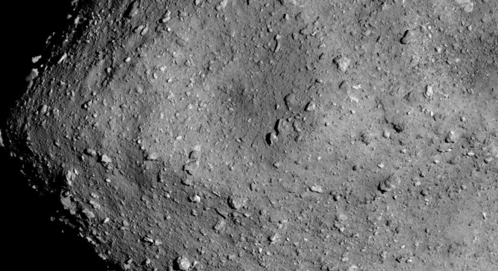
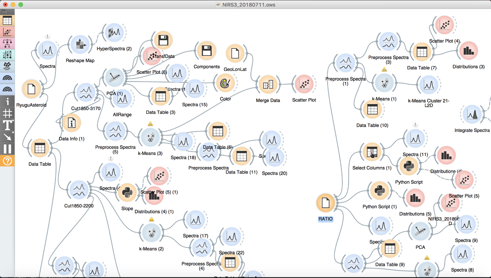
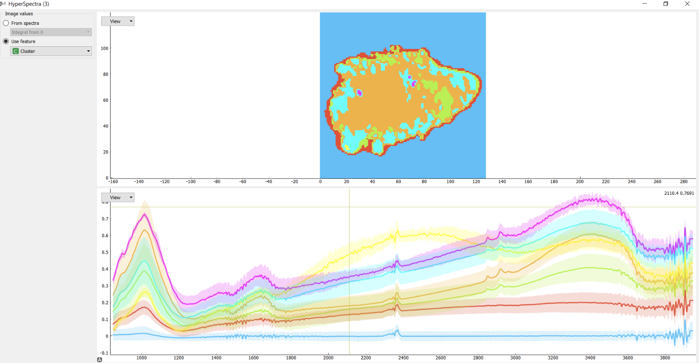

Did you know that Orange has already been to space? [Rosario Brunetto](https://www.ias.u-psud.fr/en/content/team-members-0) ([IAS-Orsay](https://www.ias.u-psud.fr/), France) has been working on the analysis of infrared images of asteroid Ryugu as a member of the [JAXA Hayabusa2](http://global.jaxa.jp/projects/sat/hayabusa2/) team. The [Hayabusa2](https://en.wikipedia.org/wiki/Hayabusa2) asteroid sample-return mission aims to retrieve data and samples from the near-Earth Ryugu asteroid and analyze its composition. Hayabusa2 arrived at Ryugu on June 27 and while the spacecraft will return to Earth with a sample only in late 2020, the mission already started collecting and sending back the data. And of course, a part of the analysis of Hayabusa's space data has been done in Orange!

An image of the asteroid Ryugu acquired by the Hayabusa2 (_[©JAXA](http://global.jaxa.jp/))_.

Within the Hayabusa2 project, near-infrared spectral data will be collected in three series: the first part is the macro data from remote sensing measurements that are being collected at different altitudes from the asteroid by the Japanese spectrometer NIRS3 (_[©JAXA](http://global.jaxa.jp/))._ The second part is surface infrared imaging at the micron scale that will soon be performed (October 2018) by the French [MicrOmega](https://en.wikipedia.org/wiki/MicrOmega-IR) instrument on the lander MASCOT ([DLR-CNES](https://www.dlr.de/irs/en/desktopdefault.aspx/tabid-11302/#gallery/28470)). The third part are the samples that will be analyzed upon return. Among the techniques that will be used in different laboratories around the world in 2021 to analyze the returned samples are the hyperspectral imaging and micro-tomography with an infrared imaging FPA microscope, that will be performed by the IAS team at [SMIS-SOLEIL](https://www.synchrotron-soleil.fr/en/beamlines/smis). This means the data will contain satellite spectral images as well as microscope measurements.

Dr. Brunetto is currently working with the first part of the data, namely the macro hyperspectral images of the asteroid. Several tens of thousands of spectra over 70 spectral channels have already been acquired. The main goal of this initial exploration was to constrain the surface composition.

Once the data was preprocessed and cleaned in Python, separate surface regions were extracted in Orange with k-Means and PCA and plotted with the HyperSpectra widget, which comes as a part of the [Spectroscopy package](https://github.com/Quasars/orange-spectroscopy). So why was Orange chosen over other tools? Dr. Brunetto says Orange is an easy and friendly tool for complicated things, such as exploring the compositional diversity of the asteroid at the different scales. There are many clustering techniques he can use in Orange and he likes how he can interactively change the number of clusters and the changes immediately show in the plot. This enables the researchers to determine the level of granularity of the analysis, while they can also immediately inspect how each cluster looks like in a hyperspectra plot.

Moreover, one can quickly test methods and visualize the effects and at the same time have a good overview of the workflow. Workflows can also be reused once the new data comes in or, if the pipeline is standard, used on a completely different data set!

A simple workflow for the analysis of spectral data. 😁 A great thing about Orange is that you can label parts of the workflow and explore a different aspect of the data in each branch!

We would of course love to show you the results of the asteroid analysis, but as the project is still ongoing, the data is not yet available to the public. Instead, we asked Zélia Dionnet, dr. Brunetto's PhD student, to share the results of her work on the [organic and mineralogic heterogeneity of the Paris meteorite](https://onlinelibrary.wiley.com/doi/pdf/10.1111/maps.13178), which were already published.

She analyzed the composition of the Paris meteorite, which was discovered in 2008 in a statue. The story of how the [meteorite was found](https://www.mindat.org/loc-264051.html) is quite interesting in itself, but we wanted to know more on how the sample was analyzed in Orange. Dionnet had a slightly larger data set, with 16,000 spectra and 1600 wavenumbers. Just like dr. Brunetto, she used k-Means to discover interesting regions in the sample and Hyperspectra widget to plot the results.

k-Means clusters plotted in the HyperSpectra widget.

At the top, you can see a 2D map of the meteorite sample showing the distribution of the clusters that were identified with k-Means. At the bottom, you see cluster averages for the spectra. The green region is the most interesting one and it shows crystalline minerals, which formed billions of years ago as the hydrothermal processes in the asteroid parent body of the meteorite turned amorphous silicates into phyllosilicates. The purple, on the contrary, shows different micro-sized minerals.

This is how to easily identify the compositional structure of samples with just a couple of widgets. Orange seems to love going to space and can't wait to get its hands dirty with more astro-data!

