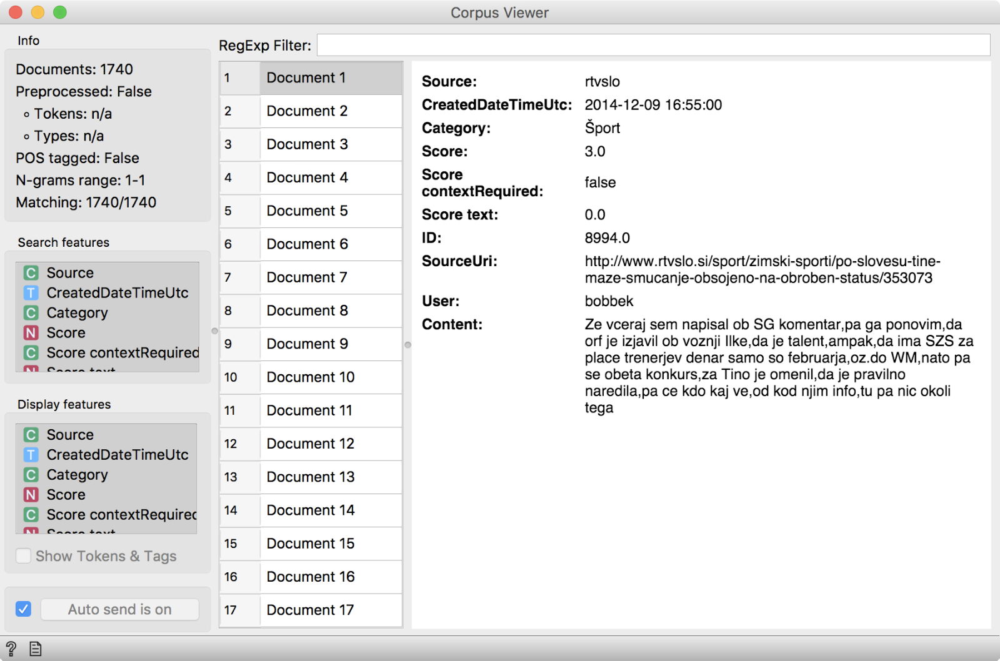
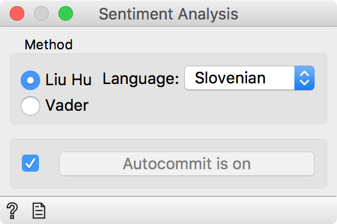
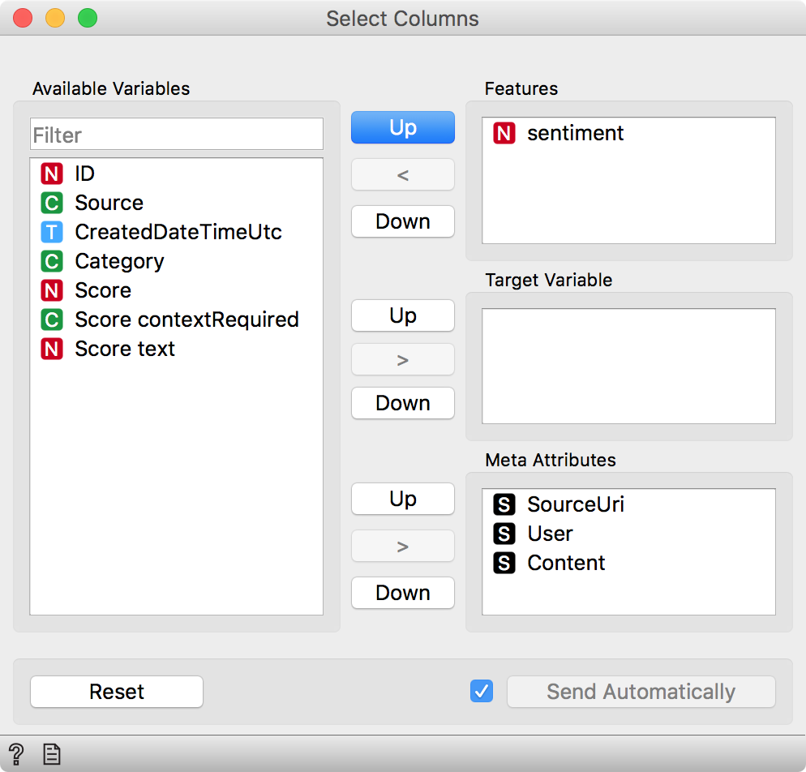
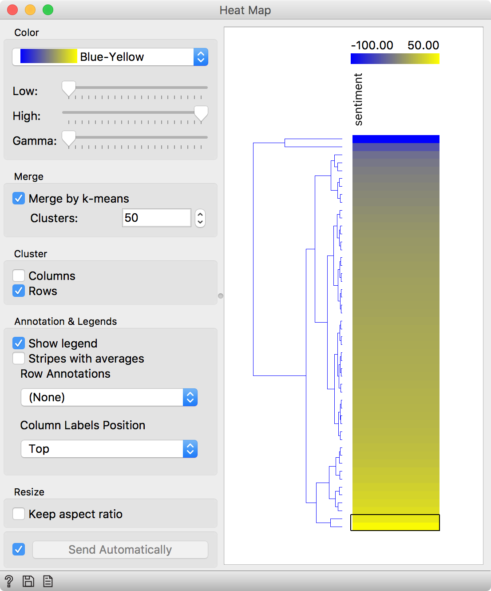
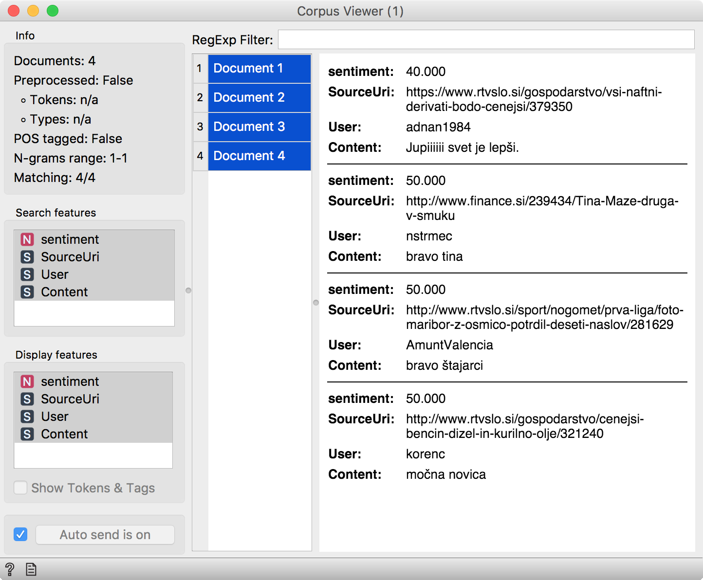

In the past month, we had two workshops that focused on text mining. The first one, [Faksi v praksi](https://www.kc.uni-lj.si/novice/poletna-ola-faksi-v-praksi.html), was organized by the [University of Ljubljana Career Centers](https://kc.uni-lj.si/domov.html), where high school students learned about what we do at the [Faculty of Computer and Information Science](https://fri.uni-lj.si/en). We taught them what text mining is and how to group a collection of documents in Orange. The second one took on a more serious note, as the public sector employees joined us for the third set of workshops from the Ministry of Public Affairs. This time, we did not only cluster documents, but also built predictive models, explored predictions in nomogram, plotted documents on a map and discovered how to find the emotion in a tweet.

These workshops gave us a lot of incentive to improve the Text add-on. We really wanted to support more languages and add extra functionalities to widgets. In the upcoming week, we will release the 0.5.0 version, which introduces support for Slovenian in Sentiment Analysis widget, adds concordance output option to Concordances and, most importantly, implements [UDPipe lemmatization](http://ufal.mff.cuni.cz/udpipe/users-manual#universal_dependencies_20_models), which means Orange will now support about 50 languages! Well, at least for normalization. 😇

Today, we will briefly introduce sentiment analysis for Slovenian. We have added the KKS 1.001 [opinion corpus of Slovene web commentaries](https://www.clarin.si/repository/xmlui/handle/11356/1115#), which is a part of the CLARIN infrastructure. You can access it in the Corpus widget. Go to Browse documentation corpora and look for _slo-opinion-corpus.tab_. Let's have a quick view in a Corpus Viewer.

The data comes from comment sections of Slovenian online media and contains a fairly expressive language. Let us observe, whether a post is negative or positive. We will use Sentiment Analysis widget and select the Liu Hu method for Slovenian. This is a dictionary based method, where the algorithm sums the positive words and subtracts the sum of negative words. This gives a final score of the post.

We will have to adjust the attributes for a nicer view in a Select Columns widget. Remove all attributes other than _sentiment_.

Finally, we can observe the results in a Heat Map. The blue lines are the negative posts, while the yellow ones are positive. Let us select the most positive tweets and see, what they are about.

Looks like Slovenians are happy, when petrol gets cheaper and sports(wo)men are winning. We can relate.

Of course, there are some drawbacks of lexicon-based methods. Namely, they don't work well with phrases, they often don't consider modern language (see 'Jupiiiiiii' or 'Hooooooraaaaay!', where the more the letters, the more expressive the word is) and they fail with sarcasm. Nevertheless, even such crude methods give us a nice glimpse into the corpus and enable us to extract interesting documents.

Stay tuned for the information on the release date and the upcoming post on UDPipe infrastructure!
