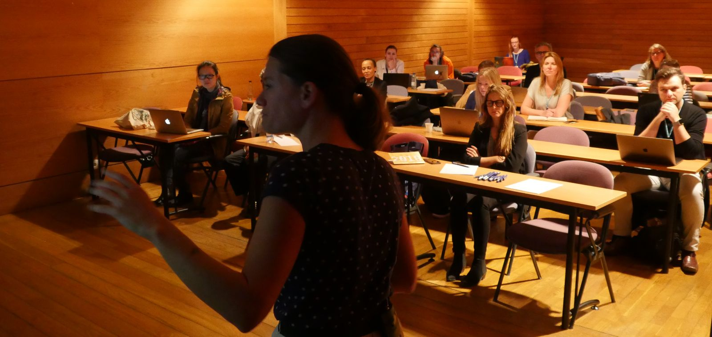

This weekend we were in Lisbon, Portugal, at the [Why the World Needs Anthropologists](https://www.applied-anthropology.com/) conference, an event that focuses on applied anthropology, design, and how soft skills can greatly benefit the industry. I was there to hold a workshop on Data Ethnography, an approach that tries to combine methods from data science and anthropology into a fruitful interdisciplinary mix!

Data Ethnography workshop at this year's Why the World Needs Anthropologists conference.

Data ethnography is a novel methodological approach that tries to view social phenomena from two different points of view - qualitative and quantitative. The quantitative approach is using data mining and machine learning methods on anthropological data (say from sensors, wearables, social media, online fora, field notes and so on) trying to find interesting patterns and novel information. The qualitative approach uses [ethnography](https://en.wikipedia.org/wiki/Ethnography) to substantiate the analytical findings with context, motivations, values, and other external data to provide a complete account of the studied phenomenon.

At the workshop, I presented a couple of approaches I use in my own research, namely text mining, clustering, visualization of patterns, image analytics, and predictive modeling. Data ethnography can be used, not only in its native field of computational anthropology, but also in museology, digital anthropology, medical anthropology, and folkloristics (the list is probably not exhaustive). There are so many options just waiting for the researchers to dig in!

**Related:** [Text Analysis Workshop at Digital Humanities 2017](/blog/2017/08/08/text-analysis-workshop-at-digital-humanities-2017/)

However, having data- and tech-savvy anthropologists does not only benefit the research, but opens a platform for discussing the ethics of data science, human relationships with technology, and overcoming model bias. Hopefully, the workshop inspired some of the participants to join me on a journey through the amazing expanses of data science.

To get you inspired, here are two contributions that present some option for computational anthropological research: [Data Mining Workspace Sensors: A New Approach to Anthropology](http://www.sdjt.si/wp/wp-content/uploads/2018/09/JTDH-2018_Pretnar-et-al_Data-Mining-Workspace-Sensors-A-New-Approach-to-Anthropology.pdf) and [Power of Algorithms for Cultural Heritage Classification: The Case of Slovenian Hayracks](http://www.aiucd2018.uniba.it/content/posters/kozolec-pretnar-final.pdf).

