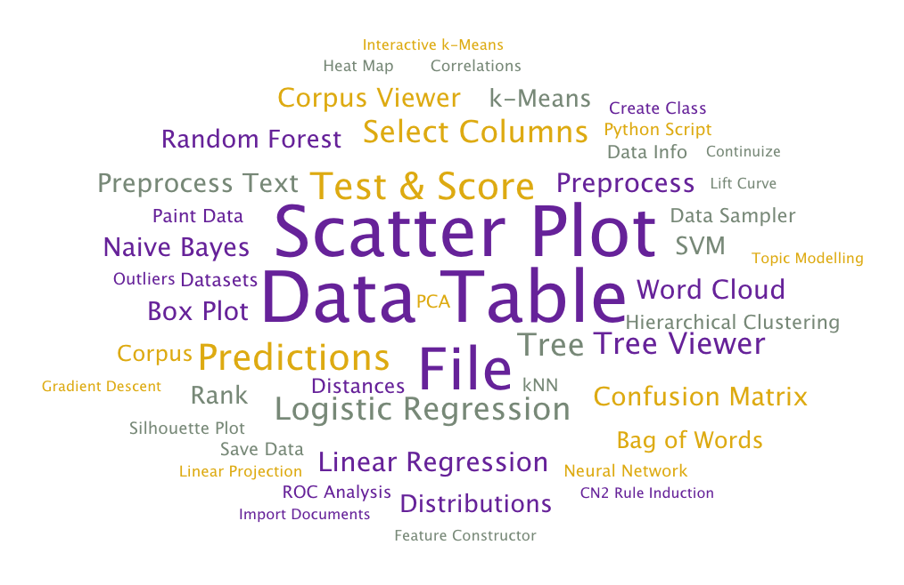
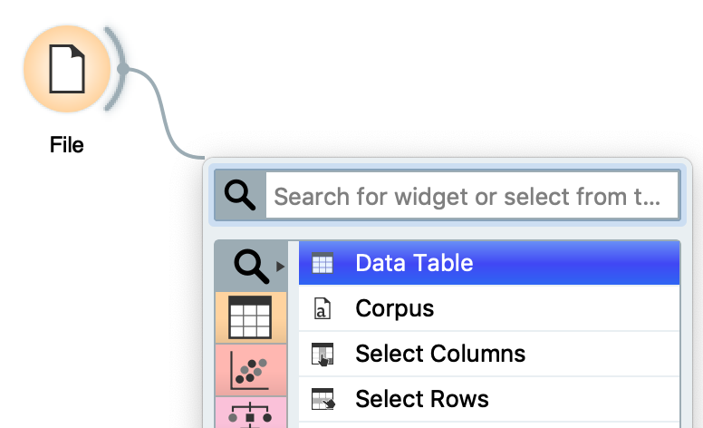
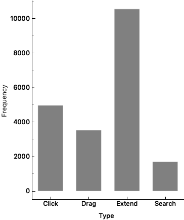
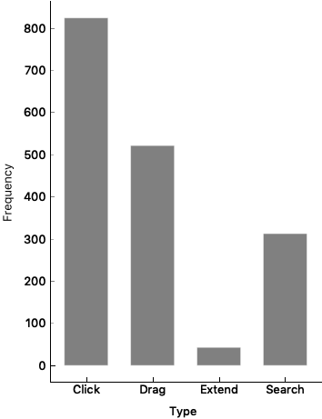
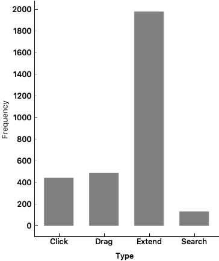
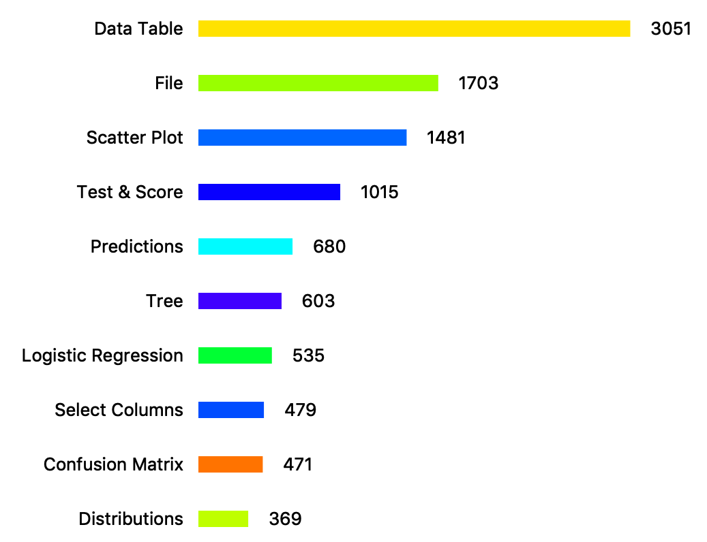

In the past few months, Orange has been getting smarter and sleeker.

Since version 3.15.0, Orange remembers which distinct widgets users like to connect, adjusting the sorting on the widget search menu accordingly. Additionally, there is a new look for the Edit Links window coming soon.

Orange recently implemented a basic form of opt-in usage tracking, specifically targeting how users add widgets to the canvas.

Word cloud of widget popularity in Orange.

The information is collected anonymously for the users that opted-in. We will use this data to improve the widget suggestion system. Furthermore, the data provides us the first insight into how users interact with Orange. Let's see what we've found out from the data recorded in the past few weeks.

**There are four different ways of adding a widget to the canvas,**
* clicking it in the sidebar,
* dragging it from the sidebar,
* searching for it by right-clicking on canvas,
* extending the workflow by dragging the communication channel from a widget.

A workflow extend action.

Among Orange users, the most popular way of adding a new widget is by dragging the communication line from the output widget – we think this is the most efficient way of using Orange too. However, the patterns vary among different widgets.

How users add widgets to canvas, from 20,775 add widget events.

Users tend to add root nodes such as File via a click or drag from the sidebar, while adding leaf nodes such as Data Table via extension from another widget.
<table style={{width: "80%", borderCollapse: "collapse", borderStyle: "hidden"}} border="1" >
<tbody >
<tr >

<td style={{ width: "50%", borderStyle: "hidden"}}>

How users add File to canvas.
</td>

<td style={{width: "50%", borderStyle: "hidden", verticalAlign: "bottom"}}>

How users add Data Table to canvas.
</td>
</tr>
</tbody>
</table>

The widget popularity contest goes to: **Data Table**! Rightfully so, one should always check their data with Data Table.

Widget popularity visualization in Box Plot.

52% of sessions tracked consisted of no widgets being added (the application just being opened and closed). While some people might really like watching the loading screen, most of these are likely due to the fact that usage is not tracked until the user explicitly opts in.

Each bit of collected data comes at a cost to the privacy of the user. Care was put into minimizing the intrusiveness of data collection methods, while maximizing the usefulness of the collected data.

Initially, widget addition events were planned to include a 'time since application start' value, in order to be able to plot a user's actions as a function of time. While this would be cool, it was ultimately decided that its usefulness is outweighed by the privacy cost to users.

**For the keen, data is gathered per canvas session, in the following structure**:

  * Date
  * Orange version
  * Operating system
  * Widget addition events, each entailing:

    * Widget name
    * Type of addition (Click, Drag, Search or Extend)
    * (Other widget name), if type is Extend
    * (Query), if type is Search or Extend

