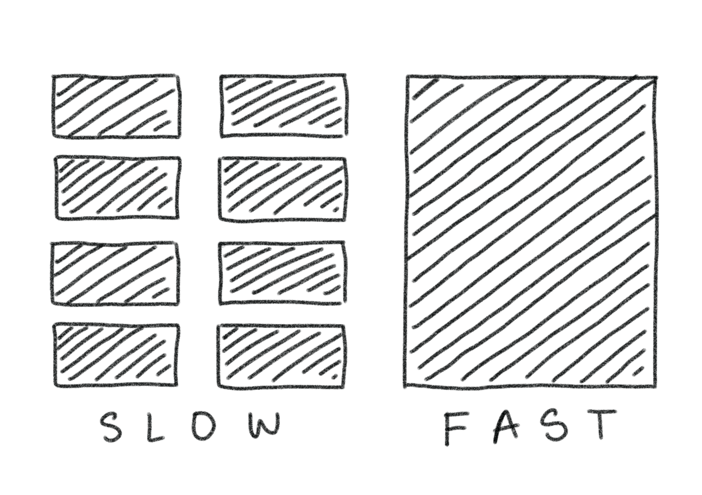

As great as Orange is at simplifying machine learning and bringing it closer to your [everyday regular normal guy](https://www.youtube.com/watch?v=5PsnxDQvQpw), it turns out, there are some major drawbacks that stem from it's very inception. This is because Orange is meant to be run on a laptop. A device with just a handful of CPU cores, and maybe a couple of gigabytes of RAM. Due to this ideology we have so far reasoned that nobody in their right mind would want to throw a very large dataset at it. So most of Orange's components assume they can fit all the data into memory at once, process it on a single core, and expect results fairly quickly.

You might see an issue here. What happens if I give Orange more data than my poor old laptop can handle? Well I'll just say I'm very grateful _force quit_ exists.

The solution to our problem is [dask](https://www.dask.org). Another open-source library that enables efficient scaling of python code. As such, a project is currently under way, that aims to implement dask into Orange. So here I am today, to illustrate the changes that are coming to Orange in the near future.

One particularly fun issue I've been working on recently presents itself in Orange's most commonly used widget, the [Data Table](/widget-catalog/data/datatable/). As it stands Orange keeps all the data it's processing in memory. This means it's readily available and easy to use with little to no overhead. However, the downside of this is that we assume all the data _can_ and _must_ be stored in such a way.

The first steps to fixing these unjust assumptions have already been implemented [under the hood](https://github.com/biolab/orange3/tree/dask). We have created a new way to store data using dask. The main advantage here is that instead of forcing all the data into memory we can instead, keep it on our hard drive until actually required for processing. And even then it won't be read all at once, but in manageable chunks. While this sounds great, tying it into Data Table directly poses more issues. Accessing data from the hard drive can of course be very slow.

One important distinction, as we move towards storing data on a hard drive, is that more than processing the data, the bottleneck tends to be _reading_ the data in the first place. Previously there was little to no overhead when all I wanted to do was read some data from memory and display it without any kind of processing. So the easiest way to do this was to loop over all the necessary cells one by one. But now that my data is not readily available in memory, it turns out that a much faster way to do this, is to replace all of these repeated calls to our hard drive by reading the data in big _chunks_.

This approach does have another drawback though. Previously each element took an equal amount of time to read and display. Now we can quickly display everything from one chunk, but when we scroll past its edge and need to load a new one we have to wait a little while. The problem here is that until now we've been assuming that our data is read and displayed instantly. So each time we have to wait for a new chunk our program gets stuck. From the users perspective this means that instead of a smooth scrolling experience, we get more of a _stuttery_ one. And that's just very unpleasant.

Luckily, there's a simple solution for this one too. In order to achieve a smoother scroll I have to let the table continue scrolling past the edge of my chunk, even though I don't know what it's supposed to display yet. Instead I let it temporarily show some empty cells while I ask dask to read the next chunk for me in the _background_. Once dask is finished preparing my data I can refresh my table with the actual values.

This aproach actually ends up working surprisingly well. Now I can (in theory) use Orange to display arbitrarily large datasets without unwanted crashes or obscenely long wait times. It was also amazingly simple to implement, due to how well dask integrates with existing numpy code.
