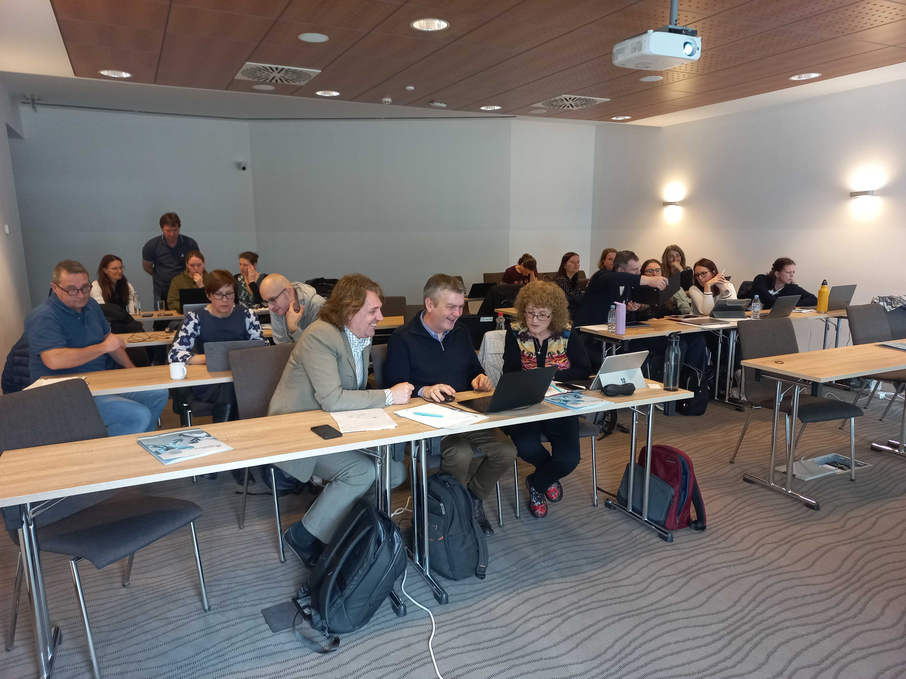

Can the principles behind AI be taught to kids younger than 14? Could this teaching be integrated into other topics, for example the environment, animals, socioeconomic development of different countries, or art? 

Data Literacy in Upper Primary Education ([DALI4US](https://www.dali4us.eu/)) is an Erasmus+ project that aims to do exactly that and use Orange to foster the curiosity of data exploration among the upper primary students in Ireland, Slovenia, and Luxembourg. The goal is to provide teachers, school leaders, and policymakers with a full-fledged package to bring data exploration to primary schools with confidence and enthusiasm, in a scalable way. 

The project focuses on developing: 

-	a web version of Orange, adapted for the needs of data exploartion in primary school 
-	cross-subject, curriculum-linked teaching scenarios accompanied by didactic materials and recommendations
-	professional teacher training and school leader training programme on data literacy
-	evidence-based policy recommendations.

The first experimental sessions inspired by our [Pumice project](https://pumice.si/en/) with about 15 teachers from the participating countries already took place this year in Laško, Slovenia, where we were also visited by Janja Zupančič, the Slovene state secretary responsible for pre-school education, primary and music education, and education of children and adolescents with special needs. She warmly expressed her support for the initiative of the project and also met the teachers taking part in the experimental workshops. 

In the hands-on workshops led by Janez Demšar and Blaž Zupan from the University of Ljubljana, Faculty of Computer and Information Science, the international teachers got to know some basic methods of data exploration and machine learning, such as hierarchical clustering, classification trees, and logistic regression. They also got a brief overview of neural networks and how they are used to analyse images, along with some other related concepts. 

The sessions were followed by a cycle of evaluation giving the teachers the opportunity to reflect on their experience with Orange as a didactic tool and propose ideas how it could be taylored the needs of students aged 12-13. 

Key takeaways? The essence of data exploration is an open-ended approach leading students wherever the inquiry takes them. Therefore, it’s crucial that the teacher is adaptable, reacting to and engaging with the students’ questions, as well as being ready to steer the activity outside and beyond the initial plans or expectations envisioned the night before. That, however, requires a lot more than just a couple intensive workshops. This realisation was crucial for the planning of the next steps in the project. More about that in the upcoming post!

