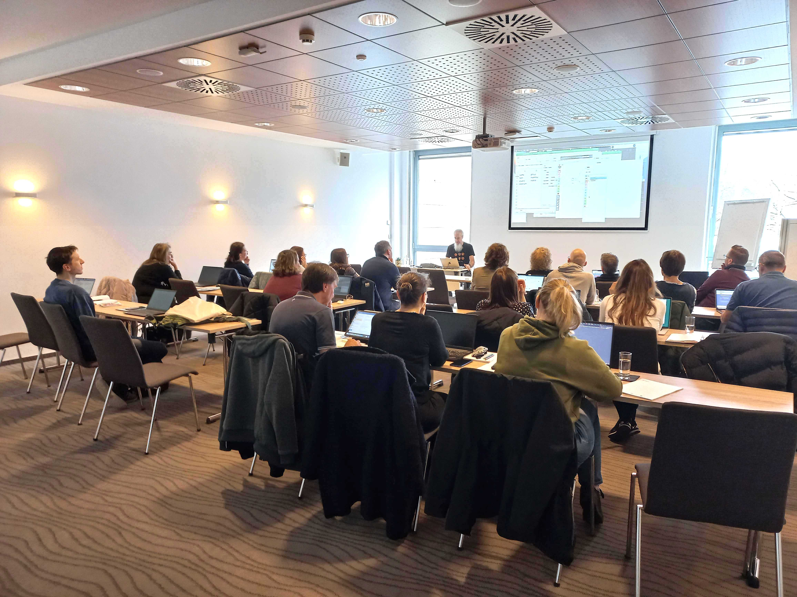
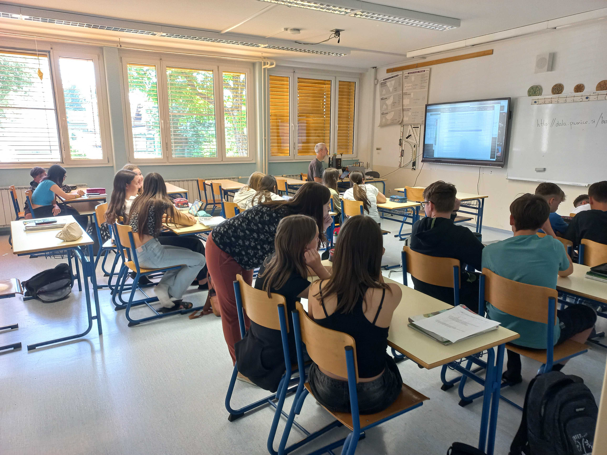

As part of the [DALI4US] project (https://www.dali4us.eu/), Janez Demšar and Blaž Zupan from our team at the University of Ljubljana, Faculty of Computer and Information Science prepared several experimental workshops for a group of teachers from Ireland, Luxembourg, and Slovenia. In one of them, we experimented with learning mathematics through data exploration with Orange.

In the activity, students learn or revise rules for distinguishing between different types of quadrilaterals, while simultaneously learning how to collect data and use it to train a prediction model for classification. The activity that is built on practical experience and insight also opens the floor for a discussion about how AI works. In this way, it helps demystify the mystery surrounding it and bring clarity about the concepts and operations that machinne learning is based on. 

The teachers were encouraged to test this or a similar activity in class, which some of them did in Slovenia, more particularly in the primary schools of[Radenci] (https://pumice.si/en/news/radenci-and-the-power-of-stories/) and [Mislinja] (https://pumice.si/en/news/slovenian-houses-in-mislinja/). Each experience in the classroom and the students' response to the activity interestingly turned out quite different, providing valuable takeaways for reflection and further finetuning and development of the activities and teaching scenariis that will be made publicly available through the DALI4US project.

