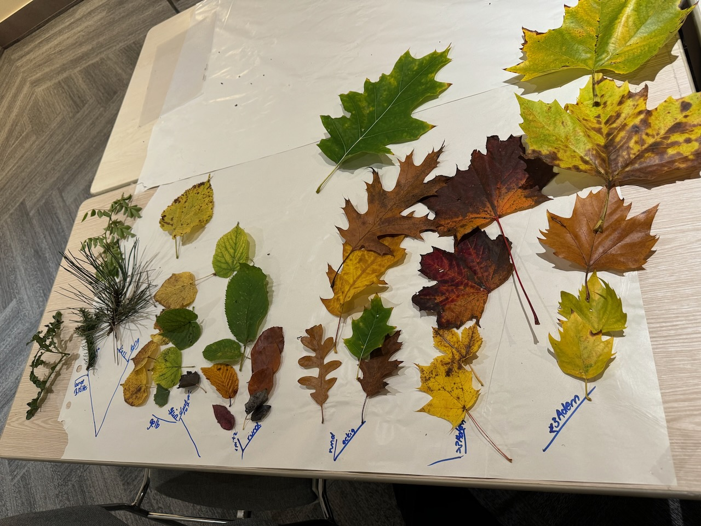

How do we harness children's curiosity about the world and society we live in, with data in its different forms, while also encouraging critical thinking and reflection?

The aim of the [DALI4US] (https://www.dali4us.eu/) project is not to train data scientists, but to equip primary school teachers with the skills, knowledge, confidence, and enthusiasm to bring data exploration into upper primary schools in Ireland, Luxembourg, and Slovenia. With some insightful experimental teacher training sessions behind us, the how of the next steps was at the center of our discussions in the project meeting in Luxembourg. 

The most effective toolset that can support data literacy development through data exploration is Orange, whose huge advantage is that it doesn't require the user to be trained in computer science or statistics. We are currently adapting it to best support the needs of teachers and children in the pedagogical process, and we already have some ideas of what that might look like, starting by creating a web version!

In Luxembourg, Blaž Zupan and Janez Demšar from the University of Ljubljana, Faculty of Computer and Information Science also already carried out an experimental workshop with six local primary school teachers! The session started in the wild, with a walk in the woods, where we collected different types of tree leaves. After the crisp but energising walk, we grouped similar leaves together, performing different levels of clustering. In the second part, we used Orange to show the teachers the technique of classification. 

The workshop concluded with an interactive reflection and evaluation session, where the teachers discussed the potential of Orange for classroom activities. They emphasised the importance of helping students understand, interpret, and use data meaningfully in their everyday lives. The teachers also discussed the potential version of Orange that would be tailored for younger learners. 

We definitely got some valuable feedback and input for our next session that will take place in Ireland!

