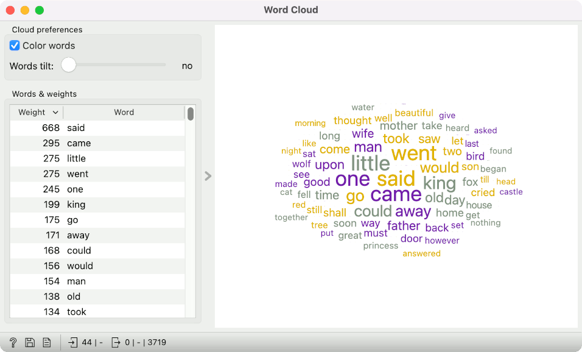
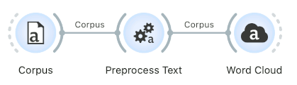
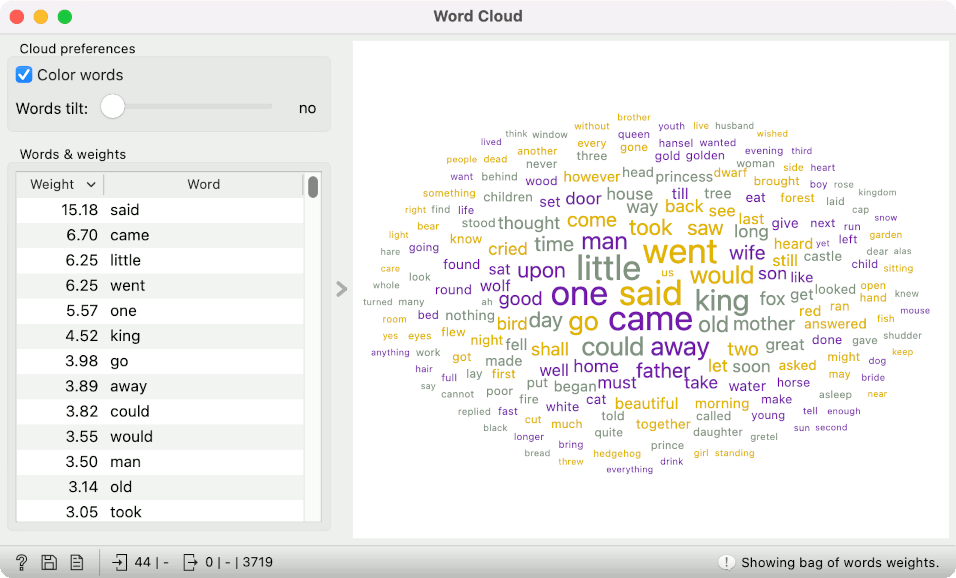
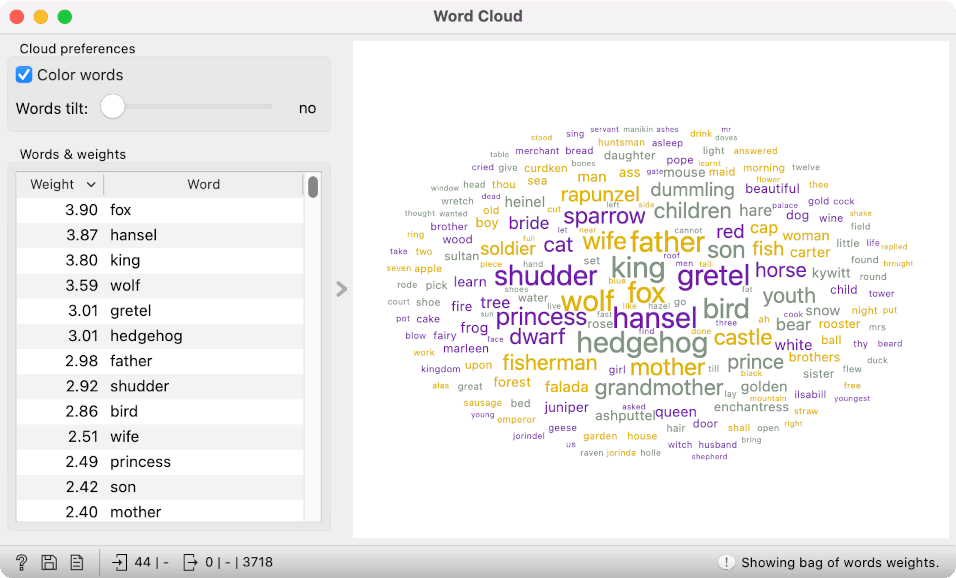
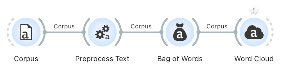

Bag of words is one of the most common vectorization techniques in text mining. It is a simple, language-independent method to convert text into numbers, which can be used downstream for all sorts of analyses. The technique takes pre-defined tokens (commonly words) and ... counts them! Each token is assigned its column, with the value corresponding to the number of occurrences of the token in a document.

The process returns a table of token counts, where each document is represented by how often tokens appear in it. Such a vector describes the content fairly well, and the results are easy to explain. The more wolves there are, the more likely a tale is an animal tale. Makes sense!

Is there any way to visualize the results of the bag of words? Let us see.

The go-to option for visualizing text is word clouds. I loaded the *grimm-tales-selected* corpus from the Corpus widget and connected it to Preprocess Text. I used the default preprocessing pipeline, so we don't have to change anything. When observing the results from the Preprocess Text in a Word Cloud, we see the most commonly used tokens, which we have defined with preprocessing. If we remove some tokens with filtering, they will no longer appear in the visualization.

What happens if I insert the Bag of Words widget between Preprocess Text and Word Cloud? Word Cloud will now display the results of the bag of words. Instead of the absolute token frequency, you will see the average token frequency in the corpus (absolute frequency/number of documents). This number can be interpreted as "the average number of times the word appears in the document".

However, we typically wouldn't use a plain bag of words in text mining. Counting tokens is fine, but the word "said" will be very frequent because it appears in most documents. Thus, it is not very informative. Preferably, we would weigh token frequency by how common it is in the corpus. Tokens that appear very frequently in a small number of documents should have a higher weight than those that appear in all documents.

Such a transformation is called TF-IDF. Let's select it in Bag of Words.

The Word Cloud changes. We no longer see the average token frequency but the TF-IDF score. Tokens with the highest scores are now "fox", "hansel", "king", and "wolf". It is much more informative for our corpus of Grimm's tales!

See our new Bag of Words video tutorial to learn more about the bag-of-words model.

<iframe width="560" height="315" src="https://www.youtube.com/embed/eCdYyaDtjjQ?si=C9W0NvOvyhJakvHD" title="YouTube video player" frameborder="0" allow="accelerometer; autoplay; clipboard-write; encrypted-media; gyroscope; picture-in-picture; web-share" referrerpolicy="strict-origin-when-cross-origin" allowfullscreen></iframe>
