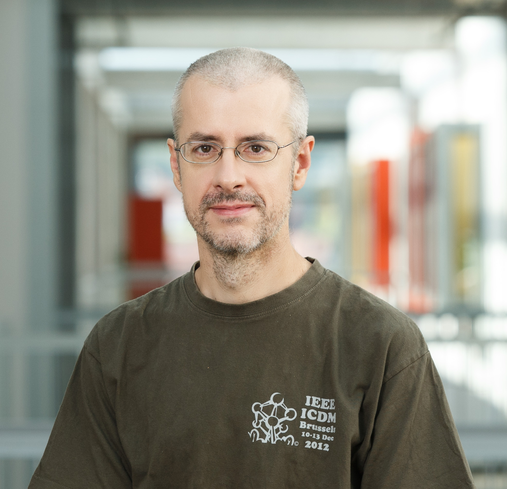
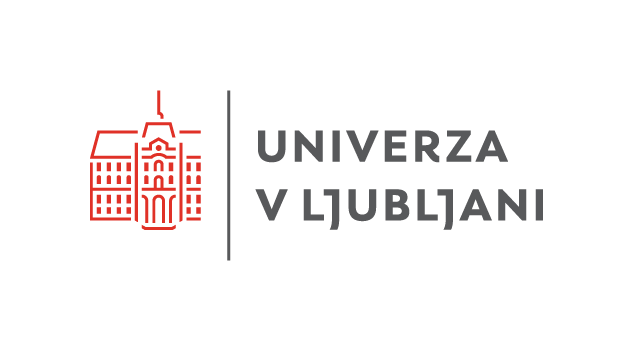

## Komu so tečaji namenjeni?

Tečaji so zasnovani za:
- **odločevalce**, ki potrebujejo strateški vpogled v možnosti uporabe umetne inteligence,
- **inženirje**, ki želijo hitro preizkusiti modele brez obsežnega programiranja,
- **vodje projektov** in **strokovnjake**, ki iščejo konkretne rešitve za analizo podatkov.

## Kaj pridobite?

- Praktične veščine uporabe umetne inteligence z resničnimi podatki  
- Delo z orodjem [Orange Data Mining](http://orangedatamining.com)
- **Mikrodokazilo** in **potrdilo o opravljenem tečaju**, izdano s strani **Univerze v Ljubljani**

Predznanje programiranja ni potrebno, dobro pa je, da znate delati s preglednicami (npr. Excel).

## Tečaji

### Od podatkov do odločitev: Praktična uporaba umetne inteligence za podjetja (1 ECTS)
Umetna inteligenca že danes oblikuje trg in ključne odločitve. Ni več le orodje prihodnosti, temveč nuja za podjetja, ki želijo ostati konkurenčna. Ta tečaj vam ponuja hiter in jasen vpogled v njene ključne koncepte, metode, možnosti uporabe in trende – brez programiranja in zapletenih tehničnih podrobnosti. Spoznali boste temeljne principe umetne inteligence in strojnega učenja, vrste podatkov, ki jih ti pristopi zahtevajo ter pregled osnovnih metod, ki vključujejo gručenje, napovedne modele in njihovo uporabo na slikah in besedilih. Pojasnili bomo tudi, kako iz teh metod izhajajo sodobna orodja generativne umetne inteligence, kot so veliki jezikovni modeli, ter kje v vaših procesih se skrivajo priložnosti za strateško uporabo in premišljeno uporabo teh tehnologij v podjetju ali organizaciji.

**Za koga?**
Posebej primerno za vodje in odločevalce.

### Razložljivost v umetni inteligenci: Kako zgraditi zaupanje v avtomatizirane odločitve  (1ECTS)
Razmišljate o vpeljavi UI v svoje procese in si želite razumeti, kako v resnici sprejema odločitve? Razložljivost umetne inteligence je ključna za krepitev zaupanja, zmanjšanje tveganj in usklajenost z zakonodajo. Na tečaju boste spoznali, kaj pomeni razložljivost umetne inteligence, kdaj je pomembna in kako jo dosežemo v praksi. Primerjali bomo razložljive modele in t. i. "črne škatle" ter pokazali, kako lahko preverimo, zakaj je model sprejel določeno odločitev – na primer pri zavrnitvi kreditne vloge. Razpravljali bomo tudi o razmerju med razložljivostjo in točnostjo modelov ter kako razložljivost pomaga pri sprejemanju boljših odločitev.

**Za koga?**
Posebej primerno za vodilne kadre.

### Kaj se skriva v vaših podatkih? Odkrivanje poslovnih priložnosti z razkrivanjem skupin v podatkih  (2 ECTS)
Podatki skrivajo dragocene informacije. Naučite se, kako jih razkriti in uporabiti s pomočjo umetne inteligence – brez programiranja. Na tečaju se boste preko praktičnega dela s programom Orange naučili prepoznavati skupine, vzorce in skrite povezave v podatkih. Spoznali boste osnovne tehnike gručenja, metode za ocenjevanje rezultatov, pristope za razlago dobljenih skupin in vizualizacijo podatkov v dveh dimenzijah. Gručenje boste uporabili na tabelaričnih podatkih, besedilih in slikah – na primer pri iskanju različnih tipov strank za učinkovitejše ciljno trženje.

**Za koga?**
Tečaj je posebej primeren za tehnične profile, ki želijo umetno inteligenco uporabljati pri reševanju konkretnih izzivov v podjetju.

### Umetna inteligenca v podjetju: Kako zgraditi modele za napovedovanje trendov in obvladovanje poslovnih tveganj  (2 ECTS)
Kako pravočasno prepoznati priložnosti in tveganja v poslovanju? Na tečaju boste spoznali, kako v praksi razviti napovedne modele za različne scenarije, kot so odpovedi naprav, spremembe v prodaji ali odhod strank. Naučili se boste osnov strojnega učenja, uporabe preprostih napovednih metod (klasifikacijska drevesa, logistična regresija), ocenjevanja njihove točnosti in razlage rezultatov. Modele boste preizkusili na atributnih podatkih, besedilih in slikah ter spoznali, kako njihova kompleksnost vpliva na učinkovitost.

**Za koga?**
Tečaj je namenjen tehničnim profilom, ki želijo z umetno inteligenco podpreti bolj strateško usmerjeno odločanje v poslovnem okolju.

### Od mnenj strank do kakovosti izdelkov: Pametna analiza besedil in slik  (2 ECTS)
Umetna inteligenca odpira nove možnosti pri avtomatizirani analizi besedil in slik, kar omogoča hitrejše in natančnejše vpoglede v podatke, kot so povratne informacije strank in kakovost izdelkov s pomočjo analize besedil in slik. Na tečaju boste na praktičen način spoznali, kako s strojnim učenjem, logistično regresijo in nevronskimi mrežami obdelamo besedila in slike ter jih pretvorimo v vektorske predstavitve za nadaljnjo analizo. Metode gručenja in napovedne modele bomo uporabili za reševanje konkretnih nalog, kot so analiza mnenj strank ali avtomatsko razvrščanje slik v kategorije.

**Za koga?**
Tečaj je namenjen zlasti tehničnim profilom, ki želijo umetno inteligenco uporabiti pri razumevanju uporabniških izkušenj in izboljšanju kakovosti izdelkov.

### Gradnja pametnih asistentov: Kako razviti učinkovite pogovorne robote za podjetja  (2 ECTS)
Pogovorni roboti postajajo nepogrešljiv del digitalne komunikacije. Na tem tečaju se boste naučili, kako jih razviti in prilagoditi potrebam podjetja. Spoznali boste ključne metode obdelave naravnega jezika in praktične pristope k razvoju klepetalnikov, ki pomagajo izboljšati uporabniško podporo. Pridobljena znanja boste lahko takoj uporabili za izboljšanje uporabniške izkušnje in poslovnih procesov.

**Za koga?**
Tečaj je namenjen tehničnim profilom.

### Kako deluje ChatGPT? Ključ do boljše uporabe  (2 ECTS)
ChatGPT in sorodne aplikacije ponujajo več, kot si predstavljate. Razumevanje, kaj se skriva v ozadju vam omogoča, da v polnosti izkoristite njihove prednosti, ki segajo preko običajne uporabe. S praktičnimi primeri boste osvojili tehnike, ki vam bodo omogočile hitro in natančno izvajanje raznolikih nalog in sprostitev vašega ustvarjalnega potenciala.

**Za koga?**
Za vse, ki jih zanima, kako učinkovito komunicirati z umetno inteligenco.

### Zgradimo nevronsko mrežo: Od nič do delujočega modela (2 ECTS)
Kaj se v resnici dogaja pod pokrovom sodobnih metod umetne inteligence? Na tem tečaju boste korak za korakom sami, brez pomoči knjižnic, v jeziku Python zgradili lastno nevronsko mrežo. Spoznali boste, kako delujejo računski grafi, gradientni sestop in uporaba gradientov pri učenju modela ter vse skupaj povezali s temelji linearne in logistične regresije. Zaključili bomo s pregledom, kako na teh principih temeljijo sodobne knjižnice za strojno učenje, kot je PyTorch. Poudarek je na izgradnji knjižnice za strojno odvajanje. Matematika? Le toliko, kot jo res potrebujete. Na tečaju bomo napisali kakšno enačbo in odvedli kakšno enostavno funkcijo.

**Za koga?**
Za inženirje, razvijalce in druge tehnične profile z dobrim znanjem Pythona, ki ne želijo ne uporabljati obstoječih rešitev, ampak razumeti, zakaj delujejo.

### Zgradimo (mali) jezikovni model: Od nevronskih mrež do osnov transformerjev (2 ECTS)
Tečaj je nadaljevanje tečaja "Zgradimo nevronsko mrežo." Spoznali boste, kako umetna inteligenca piše besedila, napoveduje naslednje besede in sestavlja stavke. Iz temeljev, brez uporabe specializiranih knjižnic, boste zgradili lasten generativni model za besedilne podatke. Ob tem boste skozi prakso spoznali uporabo nevronskih mrež za napovedovanje zaporedij: začeli bomo z navadnimi mrežami, jih dopolnili z rekurenčnimi (RNN) ter slednje nadgradili z LSTM arhitekturami in se dotaknili osnov transformerjev – vse implementirano v jeziku Python. Fokus je na praktičnem pisanju kode in razumevanju notranjega delovanja generativnih besedilnih modelov, kot jih uporablja ChatGPT in podobni sistemi.

**Za koga?**
Za inženirje, razvijalce ali raziskovalce z odličnim znanjem Pythona, ki ste že uspešno zaključili tečaj »Zgradimo nevronsko mrežo« in želite bolj poglobljeno razumeti, kako nastajajo in delujejo sodobni jezikovni modeli.

## Predavatelji in snovalci tečajev

**Prof. dr. Blaž Zupan** je redni profesor na Fakulteti za računalništvo in informatiko Univerze v Ljubljani in gostujoči profesor na Baylor College of Medicine v Teksasu, ZDA. Leta 2016 se je uvrstil na seznam 100 najvplivnejših inovatorjev srednje in vzhodne Evrope. Predava in raziskuje na področju odkrivanja znanj iz podatkov, strojnega učenja in umetne inteligence. Je prejemnik Puhove nagrade za vrhunske dosežke za razvoj programa Orange, dveh Zlatih plaket Univerze v Ljubljani, Fulbrightove štipendije, Zoisovega priznanja in šestih priznanj naj-učitelj s strani študentov FRI.

**Prof. dr. Janez Demšar** je redni profesor na Fakulteti za računalništvo in informatiko Univerze v Ljubljani, predaval je na Higher School of Economics v Moskvi in Baylor College of Medicine v Teksasu, ZDA. Njegovo osrednje področje je strojno učenje in vizualizacija podatkov. Je prejemnik Puhove nagrade za vrhunske dosežke za razvoj programa Orange, Zlate plakete za zasluge pri razvoju Univerze v Ljubljani, Državne nagrade za izjemne dosežke na področju visokega šolstva in 16 priznanj za najboljšega učitelja po izboru študentov programa Višje strokovne šole na FRI.

**Asist. raz. dr. Ajda Pretnar Žagar** je raziskovalka na Fakulteti za računalništvo in informatiko Univerze v Ljubljani in na Inštitutu za novejšo zgodovino. Doktorirala je na temo kvantitativnih pristopov za raziskovanje v antropologiji. S povezovanjem strojnega učenja in antropologije razvija nove računalniško podprte metodologije za družboslovne vede. Poučuje podatkovno rudarjenje in strojno učenje z orodjem za podatkovno analitiko Orange Data Mining.

## Prijava in kontakt

**Prijavni obrazec:** [https://s.biolab.si/ui-tecaji-interes](https://s.biolab.si/ui-tecaji-interes)

**E-pošta za dodatna vprašanja:** <a href="mailto:erika.funa@fri.uni-lj.si">erika.funa@fri.uni-lj.si</a>

**Izvajalec:** Univerza v Ljubljani, Fakulteta za računalništvo in informatiko (UL FRI)  

**Trajanje tečajev:** 2 do 3 tedne, skupno število ur od 25 do 50

**Način izvedbe:** Kombinirano (v živo na UL FRI in preko spleta)

**Število udeležencev v skupini:** od 10 do 30

**Začetek izvajanja:** jesen/zima 2025

**Potrdilo:** udeleženci za uspešno opravljen tečaj prejmejo potrdilo in mikrodokazila UL (1 ECTS = 25 do 30 pedagoških ur, ki vključujejo tako predavanja kot samostojno delo)

**Cena**: **okoli 500 EUR** na udeleženca

<table>
  <tbody>
  <tr>
    <td>
      
    </td>
    <td>
      
    </td>
    <td>
      
    </td>
  </tr>
  </tbody>
</table>
